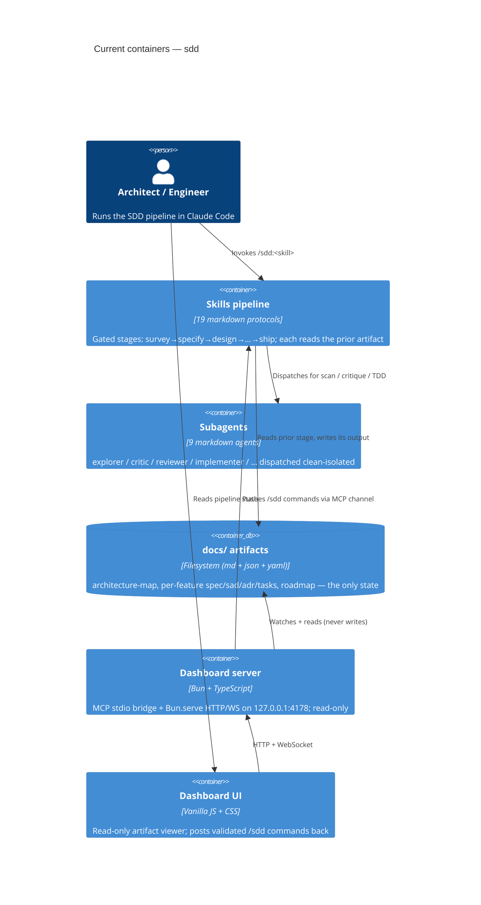

# Architecture map — sdd (spec-driven-development plugin)

> The **current** architecture (what exists today), produced by `survey` and read by
> specify / design / data-model / implement. Refresh with `survey` when the repo drifts past
> `reflects_commit`. This is generated; a hand-maintained `docs/architecture.md`, if present, is
> authoritative and reconciled below — not replaced.

This repo is **not a conventional application** — it is the SDD toolkit itself: a **markdown-driven
pipeline** (19 skills + 9 subagents) plus a small **Bun/TypeScript dashboard server** and a
**vanilla-JS browser UI**. "Modules" here are pipeline stages (markdown protocols), not code packages.

## Stack

- **Language / runtime:** TypeScript 5.5 on **Bun** for the server (`server/package.json:8` — `bun server.ts`); the pipeline itself is **markdown** (`skills/*/SKILL.md` + `templates/` + `references/`).
- **Frameworks / libs:** `@modelcontextprotocol/sdk` ^1.0.0 (MCP transport, `server/package.json:13`); frontend is framework-free — `marked.min.js` for markdown, Mermaid lazy-loaded for diagrams (`dashboard/vendor/`, `dashboard/index.html:11`).
- **Build / test / lint:** `cd server && bun install --no-summary` (build); `cd server && bun test tests/` (test, `server/package.json:9`); `cd server && tsc --noEmit` (typecheck — the only lint gate, no eslint/prettier). Plugin manifests linted by `python3 scripts/validate_plugin.py`.

## C4 — system as it is

## Module inventory

| Module | Path | Layers | Wired at | Responsibility |
|---|---|---|---|---|
| Skills pipeline | `skills/` | SKILL.md / templates/ / references/ (flat) | `.claude-plugin/plugin.json` | 19 gated pipeline stages (one folder each) |
| Shared protocols | `skills/_shared/` | markdown includes | referenced from each `SKILL.md` | 13 cross-cutting rules (handoff, socratic-loop, size-matrix, self-check, mermaid-check, …) |
| Subagents | `agents/` | markdown dispatch contracts | `subagent_type: "sdd:<name>"` | 9 clean-context agents (explorer, critic, reviewer, implementer, …) |
| Dashboard server | `server/` | server.ts / channel.ts / state.ts / paths.ts / http.ts / watch.ts / frontmatter.ts | `.mcp.json:3` | MCP + HTTP/WS bridge; derives pipeline state from disk |
| Dashboard UI | `dashboard/` | index.html / app.js / style.css / vendor/ | served by `server/http.ts` | Read-only viewer + command driver |
| Plugin manifests | `.claude-plugin/` `.codex-plugin/` `.cursor-plugin/` | plugin.json + marketplace.json | host loaders | Multi-host registration (Claude / Codex / Cursor) |
| Scripts | `scripts/` | `validate_plugin.py` | manual / CI | Manifest linting |
| Evals | `evals/` | `run.sh` + `scenarios/` | manual | Pipeline scenario harness |

## Conventions (cited — the rules a new feature must match)

- **Module wiring / registration:** plugin declared once in `.claude-plugin/plugin.json`; MCP server launched via `.mcp.json:3` (`bun run --cwd ${CLAUDE_PLUGIN_ROOT}/server`). Multi-host manifests mirror each other (`.codex-plugin/`, `.cursor-plugin/`).
- **Skill structure:** YAML frontmatter (name/model/effort/agents/description) + numbered markdown protocol + `templates/` + `references/` — e.g. `skills/survey/SKILL.md`.
- **Stage gating:** each skill reads the prior artifact from `docs/features/<slug>/` and hard-refuses if missing (e.g. `design` requires `spec.md`) — the pipeline's core invariant.
- **Handoff:** every stage ends with a 3-part block (What I did / Review / Run next with `/clear` + next command) — `skills/_shared/handoff.md`.
- **Error handling (server):** validate-then-touch — path realpath-containment before any disk read (`server/paths.ts:11,20`), type-guarded command build (`server/channel.ts:50`).
- **IDs / slugs:** kebab-case `^[a-z0-9][a-z0-9-]*$`, validated server-side — `server/channel.ts:61`.
- **Persistence / DB access:** none — all state is files under `docs/`; server reads/watches only (`server/watch.ts`), never writes.
- **Migrations:** N/A — no datastore; `migration_tool` frontmatter stays `""`.
- **Tests:** Bun test (`describe`/`it`/`expect`) with fixtures — `server/tests/channel.test.ts:5`; suites cover channel allowlist, path containment, state derivation.
- **Inter-module communication:** file-based handoff between skills; MCP channel (`notifications/claude/channel`) + HTTP/WS between server, UI, and session — `server/channel.ts:7`.
- **Command-injection guard:** browser commands validated against a `SKILL_NAMES` allowlist + slug regex + depth enum before `buildCommand` emits — `server/channel.ts:15,50`.
- **UI / styling:** plain CSS with custom-property design tokens; no framework — see §Frontend below (`dashboard/style.css:3`).

## Datastores

| Store | Engine | Accessed via | Notes |
|---|---|---|---|
| `docs/` artifact tree | Filesystem (md / json / yaml) | Skills write; `server/paths.ts` + `watch.ts` read-only | The only persistence. Per-feature: `docs/features/<slug>/{spec,sad,data-model,tasks.json,.size,.route,adr/,contracts/}`; repo-wide: `architecture-map.md`, `roadmap.md`, `CONTEXT.md` |
| Git metadata | `.git/` | read-only for `reflects_commit` staleness | Never written by the server |

## Frontend / UI foundation

The dashboard is the repo's only frontend — a read-only pipeline viewer. New UI work **composes these**, never a second design system.

- **Component library / design system:** in-repo, hand-rolled — no 3rd-party kit. Primitives are CSS classes in `dashboard/style.css`.
- **Design tokens:** CSS custom properties on `:root` — terminal palette `--bg:#060a06`, `--green:#3ddc6b` (primary), `--red`, `--blue`, `--amber`, `--muted`, monospace font stack — `dashboard/style.css:3`.
- **Styling approach:** plain CSS, single stylesheet, CSS-grid layout — no Tailwind / CSS-modules / styled-components — `dashboard/style.css`.
- **Shared primitives:** `.ghost` / `.link` / `.run.primary` buttons, `.badge` variants (size / status / pass / changes / shipped), `.step` + `.mini-stepper` steppers, `.feature-item`, `.artifact-tabs`, `.modal` — all in `dashboard/style.css`.
- **State / data-fetching:** vanilla `app.js` state object (`features[]`, `slug`, `detail`, `artifact`, `runs`) over a WebSocket feed; markdown via `marked.min.js`, diagrams via lazy Mermaid — `dashboard/app.js`.
- **Closest UI precedent:** a new panel looks like the feature view (header + badges + stepper + artifact tabs) — `dashboard/index.html:48`.

## Where things live / closest precedents

- A new **pipeline stage** → a new `skills/<name>/` folder (SKILL.md + templates/ + references/), registered implicitly by the plugin; modelled on `skills/survey/SKILL.md` (repo-wide utility) or `skills/specify/SKILL.md` (per-feature, gated).
- A new **subagent** → `agents/<name>.md` with a dispatch contract, dispatched as `subagent_type: "sdd:<name>"`; modelled on `agents/explorer.md`.
- A new **server capability** → a module in `server/` behind the same validate-then-touch discipline; modelled on `server/channel.ts` (allowlist + type guards) with a matching `server/tests/*.test.ts`.
- A new **dashboard view / component** → composed from the existing tokens + primitives (§Frontend), modelled on the feature view (`dashboard/index.html:48`).

## Constraints & known tech-debt

- **No linter/formatter** — `tsc --noEmit` is the only static gate; style is manual. New TS must at minimum typecheck clean.
- **No datastore / migrations** — anything implying a DB is out of this repo's shape; `data-model`/`migration_tool` stay empty here.
- **Dashboard is read-only by design** — all writes go through the terminal pipeline; do not add dashboard-driven artifact edits (`server/server.ts:216` states this contract).
- **Single-project-per-session assumption** — project root resolved via `CLAUDE_PROJECT_DIR` or an upward walk for `docs/`/`.git` (`server/paths.ts:37`); multi-repo sessions aren't modelled.
- **Version pin:** plugin is `1.16.0` across `plugin.json` + `marketplace.json`; keep them in lockstep (`scripts/validate_plugin.py` checks manifests).

## Reconciliation with the authored architecture doc

No authored `docs/architecture.md` / `ARCHITECTURE.md` / root `CLAUDE.md` exists; this map is the current reference. (`README.md` and `CONTRIBUTING.md` describe the product/pipeline narratively but are not an architecture doc — not overwritten.)
