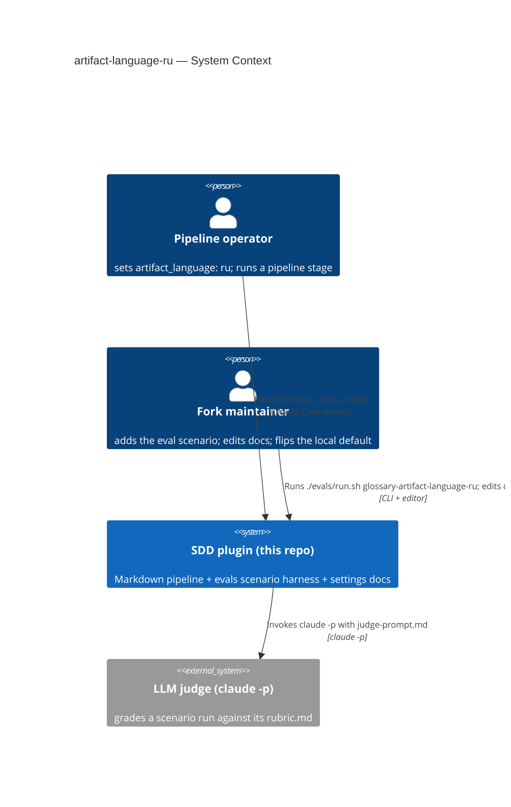
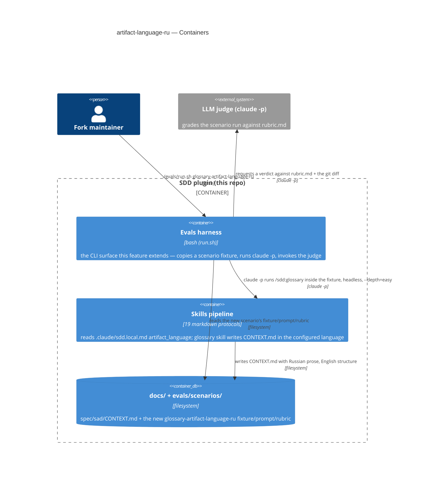
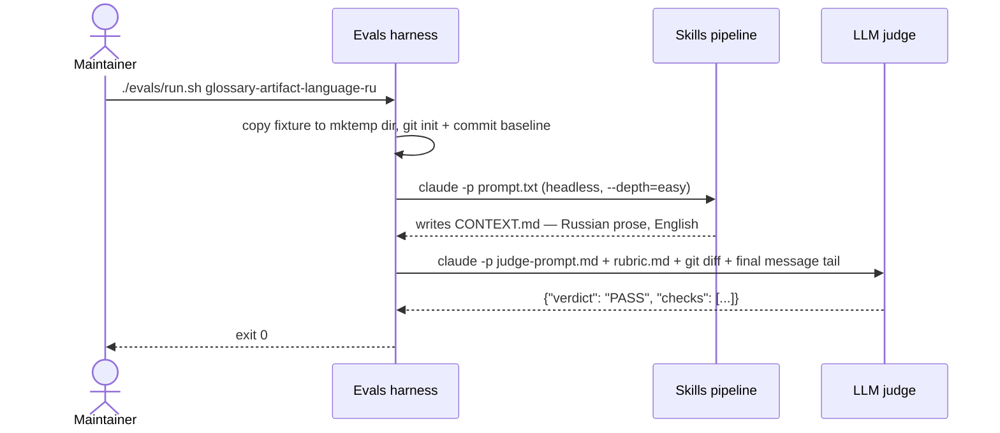

# Software Architecture Document — artifact-language-ru

<!-- 12 Arc42 sections. Empty section → <!-- N/A: <one-line reason> -->. -->
<!-- C4 Context (L1) lives inline in §3. C4 Container (L2) lives inline in §5. -->
<!-- Numbers in §10 come VERBATIM from spec.md §6 NFR — no inventing, no rounding. -->

## 1. Introduction and goals

**Intent.** Prove, with an automated eval, that `artifact_language: ru` makes the SDD pipeline write Russian-language prose while every structural element (headings, frontmatter, machine tokens) stays English — the same guarantee already proven for `uk`. Once proven, name `ru` as a discoverable example in the settings documentation (not an implicit member of a parenthetical "any language tag"), register both the `uk` and `ru` eval scenarios in `evals/README.md`'s Scenarios table, and switch this repo's own local `.claude/sdd.local.md` so future dogfooding runs default to Russian prose.

**Top-3 quality goals (1-liners; full scenarios in §10):**

1. Correctness of the language switch — proven by an automated eval with a Russian-specific rubric marker, not a manual read-through or a plain-Cyrillic check that Ukrainian text would also pass.
2. Discoverability — `ru` named explicitly alongside `en`/`uk` in every doc location that today only shows `en`/`uk`, so the operator doesn't have to trust an unexercised "(any language tag)" note.
3. Non-regression — the existing `uk` eval and the three pre-existing precedence guarantees (malformed-settings fallback, per-developer isolation, per-feature-folder precedence) keep holding exactly as documented; this feature adds no new enforcement code.

**Stakeholders.**

| Role | Interest | Sign-off owner? |
|---|---|---|
| Pipeline operator | Wants to trust `artifact_language: ru` before relying on it for real feature work | No |
| Fork maintainer | Owns the repo's own dogfooding default; keeps `evals/` green after the doc edits | No |
| Tech Lead | SAD approval | Yes |

<!-- Decision overrides (¶4) — populated by the critic resolution loop, empty otherwise. -->

## 2. Constraints

**Technical.**
- TypeScript 5.5 on Bun (`server/`) — untouched by this feature; the artifacts this feature edits are markdown docs, one bash-driven eval fixture folder (`fixture/` + `prompt.txt` + `rubric.md`), and one YAML-frontmatter local settings file.
- Eval harness: `evals/run.sh` (bash) + `jq` + the `claude` CLI — copies a scenario fixture, runs `claude -p` headless inside it, then asks a second `claude -p` call (the LLM judge, `judge-prompt.md`) to grade the result against `rubric.md`.
- No datastore, no migrations — all state is files under `docs/` and `evals/scenarios/` (per `docs/architecture-map.md` "Persistence: none").
- New scenario folder must match the existing `glossary-artifact-language-uk` shape exactly: `fixture/`, `prompt.txt`, `rubric.md` (the explicit precedent named in spec §1).

**Organisational.**
- Effort: 1 PR, ≤1 day (`.size` = XS, `.route` = quick).
- No hard deadline; single-person change (Fork maintainer authors it, Pipeline operator reviews the doc wording).
- Team composition: Fork maintainer only.

**Conventions.**
- Convention file: `evals/README.md` ("Create `scenarios/<name>/`") plus the `glossary-artifact-language-uk` scenario as the literal precedent for folder shape and naming.
- No new module wiring is required for this feature (this SAD's own §5 conclusion, not a cited repo convention) — a docs+eval change registers into existing containers only.

**Regulatory / external.**
- N/A — internal dev-tooling repo, no PII, no user-facing surface (per spec §6.1: "N/A — no new authz boundary, no PII, no user-facing surface").

## 3. Context and scope

This is an internal dev-tooling change to the SDD plugin itself: the Pipeline operator and Fork maintainer want the pipeline's generated documents written in Russian, and this repo is simultaneously the tool being modified and the fixture repo its own eval harness exercises.

<!-- brownfield: docs/architecture-map.md is current (reflects_commit 632a262); this feature touches the existing "Evals" module (`evals/`) and "Skills pipeline" module (`skills/`), introduces no new module. -->

**External systems (in / out):**

| Actor or system | Type | Interaction |
|---|---|---|
| Pipeline operator | Person | Sets `artifact_language: ru`; runs a pipeline stage; reads the settings docs to discover `ru` is supported |
| Fork maintainer | Person | Adds the `ru` scenario, edits the 4 doc locations, runs `./evals/run.sh glossary-artifact-language-ru`, flips this repo's own local `artifact_language` to `ru` |
| LLM judge (`claude -p` + `judge-prompt.md`) | System (external to this feature, internal to the repo's own tooling) | Grades the new scenario's file tree + git diff against `rubric.md`, returns `{"verdict": "PASS"\|"FAIL", "checks": [...]}` |

**C4 Context (L1):**



The Context shows the Pipeline operator and the Fork maintainer both talking to this repo's own SDD plugin — one reading the docs and running stages, the other authoring the new eval scenario and switching the local default — and the plugin's eval harness in turn calling out to an external LLM judge process to grade the new scenario's result.

## 4. Solution strategy

**Top strategic choices (the seeds for ADRs):**

1. **Target surface: `cli`** — the only new testable/runnable artifact this feature introduces is the eval scenario, invoked by name via `./evals/run.sh glossary-artifact-language-ru` (AC-01, AC-08). No new backend/web/mobile container is introduced; the feature extends the existing "Evals" module (`docs/architecture-map.md` — `evals/` = "Pipeline scenario harness").
2. **Reuse the `uk` scenario shape verbatim** — `fixture/` + `prompt.txt` + `rubric.md`, adapted only in content (spec §1 names this the explicit precedent). No new harness code, no new eval mechanism.
3. **Doc edits land in the five locations the spec names, nowhere else** — `settings.md` (both the prose bullet and the auto-create YAML template comment), `README.md`, `artifact-language.md`, `evals/README.md` (the `uk` + `ru` scenario rows), and this repo's own `.claude/sdd.local.md` — matching spec §2/§7 exactly, not a broader documentation sweep.

No decision in this pass scores 2-of-3 on the blast-radius gate (irreversible / multi-module / has legitimate alternatives) — see §9 for the closing note. Each tactical decision in later sections traces to one of the three seeds above.

## 5. Building block view

This feature adds no new module — it extends two existing containers from `docs/architecture-map.md` (the Evals harness and the Skills pipeline) with a new scenario folder and edited doc content; no new layering or sub-package is introduced.

**Internal decomposition (the files this feature touches):**

```
evals/
├── scenarios/glossary-artifact-language-ru/   <new — mirrors glossary-artifact-language-uk>
│   ├── fixture/
│   ├── prompt.txt
│   └── rubric.md
├── README.md                                  <edited — registers uk + ru rows>
skills/
├── implement/references/settings.md           <edited — ru named in both spots>
├── _shared/artifact-language.md                <edited — validated-tags note>
README.md                                       <edited — artifact_language line>
.claude/sdd.local.md                            <edited — artifact_language: ru>
```

**C4 Container (L2):**



The Containers view shows the Fork maintainer driving the Evals harness (the `cli` surface this feature's own scenario runs through), which in turn drives the existing Skills pipeline headlessly to produce a `CONTEXT.md` write, reads/writes the `docs/` + `evals/scenarios/` filesystem tree, and calls out to the external LLM judge for the pass/fail verdict.

## 6. Runtime view

**Critical flow 1: run the `ru` eval scenario**



Flow 1 — run the `ru` eval: the Fork maintainer invokes the Evals harness by scenario name; it stages a throwaway fixture copy, drives the Skills pipeline headlessly to write a Russian-prose `CONTEXT.md` with English structure, then hands the diff to the external LLM judge, which returns a PASS/FAIL verdict the harness surfaces as its exit code.

**Critical flow 2: doc-discovery** — <!-- N/A: the remaining work (editing settings.md/README.md/artifact-language.md/evals/README.md, flipping the local sdd.local.md) is direct file editing by the Fork maintainer with no multi-participant runtime — AC-06's "operator scans the docs and finds ru listed" has no request/response shape a sequence diagram would add value to. -->

**Pre-existing guarantees (AC-02, AC-04, AC-05, AC-07)** — <!-- N/A: none of these are new runtime paths introduced by this feature.
AC-02 (malformed-settings warn-and-fallback): pre-existing settings-reader behavior, unchanged by this feature (spec NFR QG-3) — verified by manual code inspection, not a new eval or flow.
AC-04 (per-developer isolation): enforced by `.claude/*.local.md` being git-ignored — a filesystem/git scoping guarantee, not a request/response interaction a sequence diagram would show.
AC-05 (per-feature-folder precedence): pre-existing precedence rule in the settings reader, unchanged by this feature — verified by manual code inspection (spec NFR QG-3), same as AC-02.
AC-07 (flip this repo's own `.claude/sdd.local.md` to `ru`): a direct one-line file edit by the Fork maintainer, no multi-participant runtime — same reasoning as Flow 2's doc-discovery N/A above. -->

## 7. Deployment view

<!-- N/A: reuses the existing eval harness + docs pipeline — no new deployment unit, no new infra, no new process. The eval still runs the same way (`./evals/run.sh <scenario>`, local, on-demand, NOT CI, per evals/README.md), just with one more scenario folder. -->

## 8. Crosscutting concepts

| Concept | Convention | Where defined |
|---|---|---|
| Logging | Unchanged — the eval harness prints scenario progress + verdict to stdout; no new logging surface | `evals/run.sh` |
| Authentication | N/A — local CLI session only, no new authz surface | — |
| Error handling | Unchanged — malformed `.claude/sdd.local.md` still warns and falls back to all-defaults (AC-02, pre-existing, re-validated by this feature, not re-implemented) | `skills/implement/references/settings.md` |
| ID strategy | N/A — no new entities | — |
| Internationalisation | This feature *is* the i18n surface under test — the existing `artifact_language` prose-switches/structure-stays-English rule, unchanged; this feature only adds a validated tag (`ru`) + a dedicated eval, no new mechanism | `skills/_shared/artifact-language.md` |
| Observability | Unchanged — the eval's own exit code (non-zero on FAIL/unparseable) is the only automated signal this repo has for pipeline-protocol regressions | `evals/README.md` |
| Events | N/A — no async flows | — |

## 9. Architecture decisions

No ADR is spawned by this pass. Every decision walked in §4–§8 — the `cli` target-surface pick, reusing the `uk` fixture shape, the Russian-specific rubric marker, which four doc locations to edit, which two scenario rows to add to `evals/README.md` — scored 0-of-3 on the blast-radius gate (`references/blast-radius.md`): each is reversible in a single file, touches at most the two existing containers named in §5 (not a new cross-module contract), and is dictated by an acceptance criterion already fixed in `spec.md` rather than a genuine open alternative a reader would ask "why not X?" about. Forcing an ADR here would be the "ADR-ify a trivial decision" anti-pattern the gate exists to prevent.

| # | Title | Status | Section |
|---|---|---|---|
| — | (none this pass) | — | — |

ADR files live under `docs/features/artifact-language-ru/adr/NNNN-<title>.md` — none exist yet.

## 10. Quality requirements

**QG-1. Correctness of the language switch**
- **When:** a Pipeline operator sets `artifact_language: ru` and runs `/sdd:glossary` for a fresh feature slug.
- **Then:** the written `CONTEXT.md` has Russian-language definitions carrying a Russian-specific marker (a letter absent from Ukrainian, e.g. «ы»/«э»/«ъ», or a Ukrainian-invalid grammatical construction — spec AC-01), while the `## Glossary` heading and frontmatter stay English exactly as the template defines (spec AC-03).
- **How verify:** `./evals/run.sh glossary-artifact-language-ru`, verdict `PASS` (spec §6 row 1).

**QG-2. Discoverability**
- **When:** a Pipeline operator scans `skills/implement/references/settings.md` (both the "What each key does" bullet and the auto-create YAML template), `README.md`, or their own `.claude/sdd.local.md`.
- **Then:** `ru` is listed explicitly alongside `en` and `uk` in every one of those spots, with the "any other language tag also works" note preserved, and `artifact-language.md` names `ru` as eval-validated (spec AC-06).
- **How verify:** manual read-through of the 4 files (spec §6 row 3 — doc-example coverage is a manual-inspection NFR, not an automated one).

**QG-3. Non-regression**
- **When:** this feature's doc edits land and the repo's `.claude/sdd.local.md` is flipped from `en` to `ru`.
- **Then:** `glossary-artifact-language-uk` still passes unchanged, and the three pre-existing guarantees (malformed-settings warn-and-fallback AC-02, per-developer isolation AC-04, per-feature-folder precedence AC-05) still hold with no new enforcement code added.
- **How verify:** `./evals/run.sh glossary-artifact-language-uk`, verdict `PASS`; manual code inspection of the settings reader / precedence logic — no new automated eval for AC-02/AC-04/AC-05 (spec §6 rows 2 and 4).

## 11. Risks and technical debt

| Risk / debt | Severity | Mitigation | Owner |
|---|---|---|---|
| The `ru` eval could false-positive on plain-Cyrillic text that Ukrainian would also produce | Medium | `rubric.md` requires a Russian-specific marker (a letter or construction invalid in Ukrainian), not "text is Cyrillic" — baked into the rubric per AC-01, not left to reviewer judgement | Fork maintainer |
| The eval harness is documented non-deterministic (`claude -p` run + a separate `claude -p` judge call) | Low | Spec §6 explicitly disclaims repeat-stability and spec §7 allows retries; a FAIL is retried before being treated as a real regression | Fork maintainer |
| A third non-Latin-script language tag beyond `ru` has no dedicated eval scenario | Low | Default: `ru` alongside the existing `uk` stands as sufficient precedent that the mechanism is tag-agnostic; revisit only if another operator requests a third language (spec §8, OQ-1) | Fork maintainer |
| This feature's own artifacts (spec.md, this sad.md, tasks.json) stay English throughout, even after AC-07 flips the repo's local default to `ru` | Low | The per-feature-folder precedence rule applies to itself — spec.md was already English, so this sad.md and any ADRs match it; no bootstrap special case (spec §8, OQ-2) | Pipeline operator |

**Accepted debt (acceptable in v1, plan to fix later):**
- `evals/README.md`'s Scenarios table stays incomplete for the 5 pre-existing `*-ios-consultant` scenarios (`design`/`implement`/`plan-tests`/`review`/`sequences`) — that gap predates this feature and is explicitly out of scope (spec §3, non-goal 3).
- The bare `./evals/run.sh` (no arguments) run stays broken for those same 5 scenarios (they have no `fixture/` directory) — a pre-existing, separate bug, not touched by this feature (spec §3, non-goal 4).

## 12. Glossary

| Term | Meaning |
|---|---|
| Pipeline operator, Fork maintainer | See root [`CONTEXT.md`](../../../CONTEXT.md) `## Glossary` — canonical, not restated here (a term lives in exactly one place). |
| Eval scenario | A folder under `evals/scenarios/<name>/` (`fixture/` + `prompt.txt` + `rubric.md`) that drives one real headless `claude -p` pipeline run over a throwaway fixture and grades the result with an LLM judge against the rubric; run by name via `./evals/run.sh <name>` (`evals/README.md`). |
| Validated tag | A language tag for `artifact_language` that has its own dedicated eval scenario proving the prose-switches/structure-stays-English rule for that language — currently `uk` and (after this feature) `ru`; `en` is the default and is not eval-covered (`skills/_shared/artifact-language.md`). |
