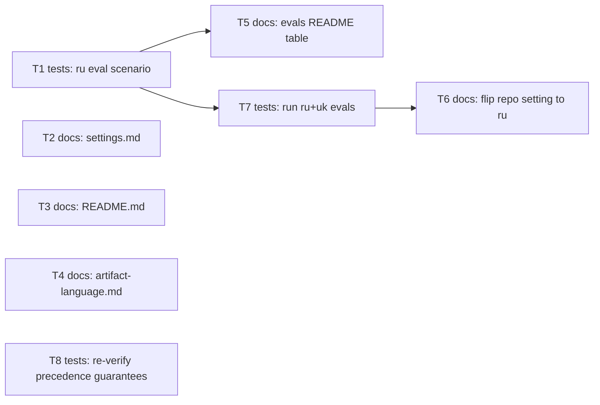

# Epic — artifact-language-ru

> **Spec:** [spec.md](../spec.md) · **Design:** [sad.md](../sad.md) · **ADRs:** [adr/](../adr/) (none spawned — see [sad §9](../sad.md))

## Goal

Prove `artifact_language: ru` works via a Russian-specific automated eval, make `ru` a discoverable
named example everywhere `en`/`uk` are shown today, and switch this repo's own dogfooding pipeline
to Russian prose by default — tied to [spec §2 Goals](../spec.md).

## Scope

- **In:** a new eval scenario (`evals/scenarios/glossary-artifact-language-ru/`); doc edits naming
  `ru` in `settings.md`, `README.md`, `artifact-language.md`; `evals/README.md`'s Scenarios table
  gaining `uk` + `ru` rows; this repo's own `.claude/sdd.local.md` flipped to `ru`; a manual
  re-verification that the three pre-existing precedence guarantees still hold.
- **Out:** retro-translating existing artifacts, new language-tag validation/enforcement,
  registering the 5 pre-existing `*-ios-consultant` scenarios, fixing the bare `./evals/run.sh`
  no-args bug — all per [spec §3 Non-goals](../spec.md).

## Task map

## Tasks

See [tracker.md](./tracker.md) for status. Machine contract: [tasks.json](../tasks.json).

| # | Task | Layer | Blocked by | DoD (short) |
|---|---|---|---|---|
| T1 | Add glossary-artifact-language-ru eval scenario | tests | — | scenario folder exists, rubric checks a Russian-specific marker |
| T2 | Name ru in settings.md's allowed-values examples | docs | — | both spots list `ru` |
| T3 | Name ru in README.md's artifact_language line | docs | — | line lists `ru` |
| T4 | Add eval-validated tags note to artifact-language.md | docs | — | one-line note added |
| T5 | Register uk and ru scenarios in evals/README.md's table | docs | T1 | both rows present |
| T6 | Flip this repo's .claude/sdd.local.md to ru | docs | T7 | value reads `ru`, stays git-ignored |
| T7 | Run the new ru eval and the existing uk eval | tests | T1 | both scenarios PASS |
| T8 | Re-verify pre-existing precedence guarantees | tests | — | AC-02/04/05 confirmed unchanged |

## Risks / Hard rules

- The setting must never leak into artifact structure (spec §6.1 abuse case) — no task edits a
  heading, frontmatter key, or machine token to Russian; T1's rubric explicitly asserts this.
- `.claude/*.local.md` stays git-ignored and is never committed (T6) — a hard rule from
  [spec §6.1 AuthZ/AuthN impact](../spec.md).
- This feature's own artifacts (this epic, tasks.json, the task files) stay English throughout,
  per [spec §8 OQ-2](../spec.md) — the per-feature-folder precedence rule applies to itself.
