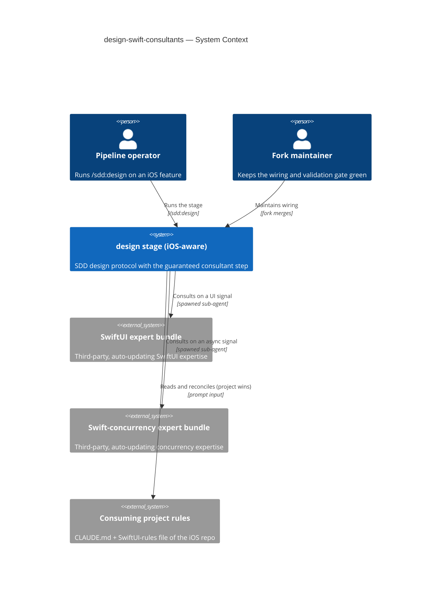

# Software Architecture Document — design-swift-consultants

<!-- 12 Arc42 sections. Empty section → N/A with a one-line reason. -->
<!-- C4 Context (L1) lives inline in §3. C4 Container (L2) lives inline in §5. -->
<!-- Numbers in §10 come VERBATIM from spec.md §6 NFR — no inventing, no rounding. -->

## 1. Introduction and goals

**Intent.** Make iOS domain expertise reach the SDD architecture document **automatically, as a fixed protocol step** of the `design` stage — for any feature whose spec signals a UI or async surface, with no manual second "ask the expert" step. The expertise is injected by a **disposable, situationally-reasoning consultant sub-agent** (loading a third-party expert bundle), **altitude-filtered to structural decisions**, so the SAD's §4/§5 gain iOS-specific structural guidance without code-level noise — and the stage **never blocks** when a consultant cannot be reached.

**Top-3 quality goals (1-liners; full scenarios in §10):**

1. **Deterministic spawn** — the consultant fires on 100 % of runs where the spec trigger signal is present (guaranteed by the protocol, not chosen by the model).
2. **Bounded cost** — added token cost ≤ ~80k per `design` run (≤2 consultants × ~40k), and exactly zero on pure-logic features.
3. **Fallback visibility** — 100 % of expected-but-didn't-fire cases surface a visible marker; a failing consultant degrades gracefully, never halting the stage.

**Stakeholders.**

| Role | Interest | Sign-off owner? |
|---|---|---|
| Pipeline operator | Runs `design`; consumes the iOS-aware SAD from one command | No |
| Fork maintainer | Keeps the wiring + the deterministic validation gate green across upstream merges | No |
| Tech Lead | SAD approval | Yes |

<!-- Decision overrides (¶4) — populated by the critic resolution loop, empty otherwise. -->

## 2. Constraints

**Technical.**
- Markdown skill protocols (the pipeline itself) + Bun / TypeScript 5.5 dashboard server — the repo *is* the SDD toolkit. This feature is **markdown-only**: edits to `skills/design/` (SKILL.md + references) plus a project-local consultant agent definition. No production code, no server change.
- **No datastore, no migrations** — all state is files under `docs/`; `migration_tool` stays empty (architecture-map §Datastores).
- Expert skill bundles are **third-party, auto-updating, and NOT forked** (spec §3, §6.1). The consultant loads them; it never edits them.
- The consultant runs as a **disposable, clean-isolated sub-agent** spawned from the main session; its only channel back is the ≤1-page brief text.

**Organisational.**
- Effort: S feature, `standard` route; one maintainer (frequently the same human as the operator, distinct responsibility).
- SDD is a **hard fork** — losing upstream auto-update is an accepted cost so the trigger is guaranteed, not model-chosen (spec §1).

**Conventions.**
- Skill structure: YAML frontmatter + numbered markdown protocol + `templates/` + `references/` (architecture-map §Conventions).
- Handoff: every stage ends with the 3-part block — `skills/_shared/handoff.md`.
- **Plugin validation gate:** `scripts/validate_plugin.py` must stay green; manifests kept in lockstep at `1.16.0`.
- SDD's **restricted sub-agent roster** (`explorer` / `critic` / `reviewer` / `implementer`) stays bundle-free — the consultant is *not* added to it (spec §3, AC-04).

**Regulatory / external.**
- Internal developer tooling; no personal data, no new authZ/authN boundary (spec §6.1) → security review **N/A**.
- Bundle-trust is an **accepted supply-chain surface**: the expert bundles stay auto-updating and un-forked; a wrong/outdated bundle is mitigated by project-rules-win (AC-05) + observable-trace review, not by pinning.

## 3. Context and scope

The SDD `design` stage produces stack-agnostic architecture with no iOS awareness. This feature wires iOS **structural** expertise into that stage for UI/async features: on a spec trigger signal, `design` consults third-party expert bundles through a disposable sub-agent and folds the resulting structural decisions into the SAD's strategy and building-block sections — with project rules winning at fold time, and a visible marker whenever a consultation was expected but did not land.

<!-- brownfield: SDD toolkit repo — markdown skill pipeline + Bun/TS dashboard server; this feature edits `skills/design/` only, adds no datastore. -->

**Trust boundary.** The consultant runs **locally, in clean isolated context**, and sees only the feature spec + the project rules passed in its prompt. Bundle *content* is trusted (an accepted supply-chain surface, §2); the *brief* it returns is untrusted at the altitude level — every item is re-gated by the Altitude filter and reconciled against project rules before it may enter the SAD.

**External systems (in / out):**

| Actor or system | Type | Interaction |
|---|---|---|
| Pipeline operator | Person | Runs `/sdd:design <slug>`; reads the iOS-aware SAD |
| Fork maintainer | Person | Maintains the wiring; keeps `validate_plugin.py` green across merges |
| SwiftUI expert bundle | System (external) | Loaded by a consultant on a UI signal; returns SwiftUI structural expertise |
| Swift-concurrency expert bundle | System (external) | Loaded by a consultant on an async signal; returns concurrency structural expertise |
| Consuming project rules | System (external) | `CLAUDE.md` + any SwiftUI-rules file, passed into the consultant prompt; project wins at fold |

**C4 Context (L1):**

## 4. Solution strategy

<!-- drafted in-memory; written during the Socratic walk -->

## 5. Building block view

<!-- drafted in-memory; written during the Socratic walk -->

## 6. Runtime view

<!-- drafted in-memory; written during the Socratic walk -->

## 7. Deployment view

<!-- drafted in-memory; written during the Socratic walk -->

## 8. Crosscutting concepts

<!-- drafted in-memory; written during the Socratic walk -->

## 9. Architecture decisions

<!-- drafted in-memory; written during the Socratic walk -->

## 10. Quality requirements

<!-- drafted in-memory; written during the Socratic walk -->

## 11. Risks and technical debt

<!-- drafted in-memory; written during the Socratic walk -->

## 12. Glossary

<!-- drafted in-memory; written during the Socratic walk -->
