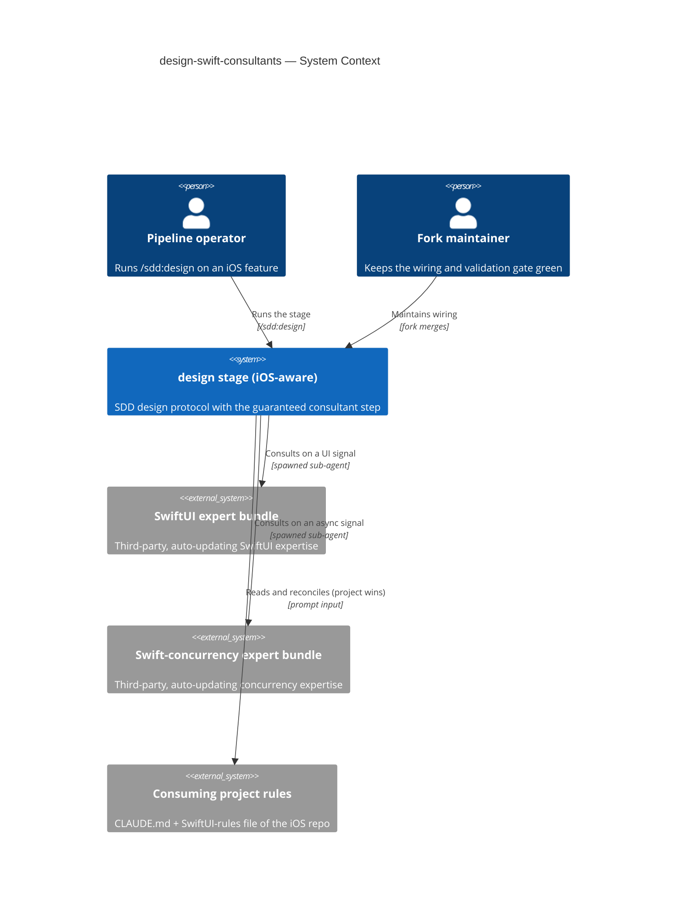
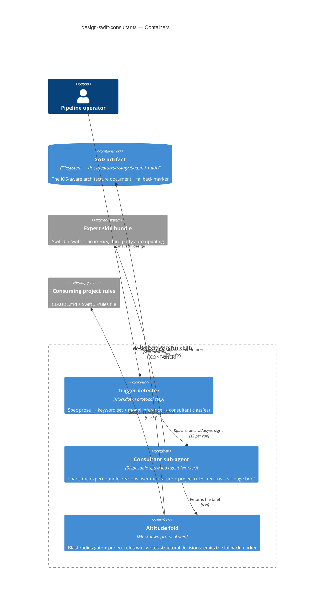

# Software Architecture Document — design-swift-consultants

<!-- 12 Arc42 sections. Empty section → N/A with a one-line reason. -->
<!-- C4 Context (L1) lives inline in §3. C4 Container (L2) lives inline in §5. -->
<!-- Numbers in §10 come VERBATIM from spec.md §6 NFR — no inventing, no rounding. -->

## 1. Introduction and goals

**Intent.** Make iOS domain expertise reach the SDD architecture document **automatically, as a fixed protocol step** of the `design` stage — for any feature whose spec signals a UI or async surface, with no manual second "ask the expert" step. The expertise is injected by a **disposable, situationally-reasoning consultant sub-agent** (loading a third-party expert bundle), **altitude-filtered to structural decisions**, so the SAD's §4/§5 gain iOS-specific structural guidance without code-level noise — and the stage **never blocks** when a consultant cannot be reached.

**Top-3 quality goals (1-liners; full scenarios in §10):**

1. **Deterministic spawn** — the consultant fires on 100 % of runs where the spec trigger signal is present (guaranteed by the protocol, not chosen by the model).
2. **Bounded cost** — added token cost ≤ ~80k per `design` run (≤2 consultants × ~40k), and exactly zero on pure-logic features.
3. **Fallback visibility** — 100 % of expected-but-didn't-fire cases surface a visible marker; a failing consultant degrades gracefully, never halting the stage.

**Stakeholders.**

| Role | Interest | Sign-off owner? |
|---|---|---|
| Pipeline operator | Runs `design`; consumes the iOS-aware SAD from one command | No |
| Fork maintainer | Keeps the wiring + the deterministic validation gate green across upstream merges | No |
| Tech Lead | SAD approval | Yes |

<!-- Decision overrides (¶4) — populated by the critic resolution loop, empty otherwise. -->

## 2. Constraints

**Technical.**
- Markdown skill protocols (the pipeline itself) + Bun / TypeScript 5.5 dashboard server — the repo *is* the SDD toolkit. This feature is **markdown-only**: edits to `skills/design/` (SKILL.md + references) plus a project-local consultant agent definition. No production code, no server change.
- **No datastore, no migrations** — all state is files under `docs/`; `migration_tool` stays empty (architecture-map §Datastores).
- Expert skill bundles are **third-party, auto-updating, and NOT forked** (spec §3, §6.1). The consultant loads them; it never edits them.
- The consultant runs as a **disposable, clean-isolated sub-agent** spawned from the main session; its only channel back is the ≤1-page brief text.

**Organisational.**
- Effort: S feature, `standard` route; one maintainer (frequently the same human as the operator, distinct responsibility).
- SDD is a **hard fork** — losing upstream auto-update is an accepted cost so the trigger is guaranteed, not model-chosen (spec §1).

**Conventions.**
- Skill structure: YAML frontmatter + numbered markdown protocol + `templates/` + `references/` (architecture-map §Conventions).
- Handoff: every stage ends with the 3-part block — `skills/_shared/handoff.md`.
- **Plugin validation gate:** `scripts/validate_plugin.py` must stay green; manifests kept in lockstep at `1.16.0`.
- SDD's **restricted sub-agent roster** (`explorer` / `critic` / `reviewer` / `implementer`) stays bundle-free — the consultant is *not* added to it (spec §3, AC-04).

**Regulatory / external.**
- Internal developer tooling; no personal data, no new authZ/authN boundary (spec §6.1) → security review **N/A**.
- Bundle-trust is an **accepted supply-chain surface**: the expert bundles stay auto-updating and un-forked; a wrong/outdated bundle is mitigated by project-rules-win (AC-05) + observable-trace review, not by pinning.

## 3. Context and scope

The SDD `design` stage produces stack-agnostic architecture with no iOS awareness. This feature wires iOS **structural** expertise into that stage for UI/async features: on a spec trigger signal, `design` consults third-party expert bundles through a disposable sub-agent and folds the resulting structural decisions into the SAD's strategy and building-block sections — with project rules winning at fold time, and a visible marker whenever a consultation was expected but did not land.

<!-- brownfield: SDD toolkit repo — markdown skill pipeline + Bun/TS dashboard server; this feature edits `skills/design/` only, adds no datastore. -->

**Trust boundary.** The consultant runs **locally, in clean isolated context**, and sees only the feature spec + the project rules passed in its prompt. Bundle *content* is trusted (an accepted supply-chain surface, §2); the *brief* it returns is untrusted at the altitude level — every item is re-gated by the Altitude filter and reconciled against project rules before it may enter the SAD.

**External systems (in / out):**

| Actor or system | Type | Interaction |
|---|---|---|
| Pipeline operator | Person | Runs `/sdd:design <slug>`; reads the iOS-aware SAD |
| Fork maintainer | Person | Maintains the wiring; keeps `validate_plugin.py` green across merges |
| SwiftUI expert bundle | System (external) | Loaded by a consultant on a UI signal; returns SwiftUI structural expertise |
| Swift-concurrency expert bundle | System (external) | Loaded by a consultant on an async signal; returns concurrency structural expertise |
| Consuming project rules | System (external) | `CLAUDE.md` + any SwiftUI-rules file, passed into the consultant prompt; project wins at fold |

**C4 Context (L1):**



## 4. Solution strategy

**Target surface (decided first).** `target_surfaces: [worker]` (frontmatter). The feature introduces exactly one runnable behaviour — the disposable **consultant sub-agent**, a spawned, request/response-less job that loads a bundle and returns a brief. No UI / CLI / HTTP surface is added; the consuming iOS app is a *separate* project, not a surface of this feature. Single surface → no multi-surface ADR.

**Top strategic choices (the ADR seeds):**

1. **Guaranteed-fire consultant spawn, situational reasoning (ADR-0001).** The consultant spawn is a fixed, non-skippable protocol step of `design` (runs alongside the step-3 explorer); the consultant's internal reasoning stays model-driven. Determinism at the trigger, not the reasoning — the honest determinism boundary (spec §3) and the feature's differentiator.
2. **Disposable bundle-loading consultant, not a forked static rules file (ADR-0002).** A discardable sub-agent loads the live third-party expert bundle and reasons over the feature, returning a ≤1-page brief. The bundle stays un-forked + auto-updating; clean isolation bounds context bleed.
3. **Consultant outside SDD's restricted roster (ADR-0003).** Main-session-spawned, project-local, referenced only in prose — never in the validated agent roster. Keeps `validate_plugin.py` green (AC-04) and the merge surface small (US-04).
4. **Non-blocking graceful fallback with a dual visible marker (ADR-0004).** On any consultant failure the stage proceeds and emits a marker in BOTH the handoff and the SAD; never a hard gate (spec §2 goal 3).

**Inline decisions (do not cross the blast-radius gate):**

- **Trigger detection** — a curated keyword set (`views / navigation / screens / SwiftUI / UI` ⇒ UI-class; `async / await / background / concurrency / actors / tasks` ⇒ async-class) **plus** model inference over the spec prose. Mapping: UI ⇒ SwiftUI consultant, async ⇒ Swift-concurrency consultant, both ⇒ both. There are exactly two consultant classes, so the ≤2-per-run cap holds *structurally*. The mechanism is fixed; its *tuning* (false-negatives on UI specs without the "magic words") is an open question → §11.
- **Altitude filter = reuse `design`'s own blast-radius gate.** The fold step admits only structural-altitude brief items (irreversible / cross-module / has legitimate alternatives) into §4/§5; code-level items are denied entry and routed to implement/review (AC-03). Reusing the existing gate makes this a mechanism-reuse, not a new irreversible decision.
- **Concurrent spawn with the step-3 explorer** — the consultant(s) spawn alongside the explorer and complete before the fold step; added latency ≈ 0 when they finish within the explorer window, else the fold waits. A reversible latency choice.
- **Project-rules-win at fold** — the main session reconciles each admitted decision against the consuming project's rules at fold time (project wins); the consultant is not trusted to honour the passed-in rules. The fold is the enforcement point for AC-05.

Every tactical decision in later sections traces to one of these seeds. A tactical decision that contradicts a strategic choice is a red flag → §11.

## 5. Building block view

**Style: extend an existing module, following the repo's markdown-protocol convention.** This feature adds three protocol pieces to the existing `design` skill (a numbered `SKILL.md` + `references/`), plus one project-local consultant definition — it is *not* a new skill (a separate skill could not be a guaranteed step *of* `design`). The only new runnable unit is the consultant (the `worker` surface); the trigger and fold pieces are protocol steps executed by the main session.

**Internal decomposition:**

```
skills/design/
├── SKILL.md                       # +step 3.5 (trigger → spawn, concurrent with the step-3 explorer)
│                                  # +fold step (altitude filter + project-rules-win + marker) in step 6/7
├── references/
│   ├── consultant-trigger.md      # curated signal set + signal→consultant mapping + ≤2-per-run cap
│   └── consultant-fold.md         # altitude filter (blast-radius gate) + project-rules-win + fallback-marker format
└── (project-local) consultant     # spawned from the main session; loads the expert bundle; NOT in the sdd:* validated roster (ADR-0003)
```

- **Trigger detector** — reads the spec prose (curated keyword set + model inference), classifies UI-/async-class, maps to consultant class(es).
- **Consultant sub-agent** — disposable, spawned on a signal; loads the expert bundle, reasons over the feature spec + passed-in project rules, returns a ≤1-page brief. Clean-isolated; its only channel back is the brief.
- **Altitude fold** — applies the blast-radius gate to each brief item (structural admitted, code-level denied → implement/review) and reconciles against project rules (project wins); writes admitted structural decisions into the SAD §4/§5; emits the fallback marker on a missing/degenerate consultation.

**C4 Container (L2):**



## 6. Runtime view

**Critical flow 1: iOS-aware design (happy path, AC-01)**

```mermaid
sequenceDiagram
    actor Operator
    participant Trigger as Trigger detector
    participant Consultant
    participant Bundle as Expert bundle
    participant Fold as Altitude fold
    participant SAD
    Operator->>Trigger: runs design on a UI/async feature
    Trigger->>Consultant: spawns matching consultant(s) (≤2)
    Consultant->>Bundle: loads and reasons over feature + project rules
    Bundle-->>Consultant: structural expertise
    Consultant-->>Fold: returns ≤1-page brief
    Fold->>Fold: blast-radius gate + reconcile project rules (project wins)
    Fold->>SAD: writes iOS structural decisions into §4 / §5
    SAD-->>Operator: iOS-aware SAD; handoff names the consultant(s) that fired
```

**Critical flow 2: consultant unavailable / degenerate brief (fallback, AC-02)**

```mermaid
sequenceDiagram
    actor Operator
    participant Trigger as Trigger detector
    participant Consultant
    participant Bundle as Expert bundle
    participant Fold as Altitude fold
    participant SAD
    Operator->>Trigger: runs design on a UI/async feature
    Trigger->>Consultant: spawns matching consultant(s)
    Note over Consultant,Bundle: bundle fails to load OR brief carries no structural decision
    Consultant-->>Fold: empty / degenerate brief
    Fold->>SAD: writes a fallback marker naming the missing consultant
    Fold-->>Operator: handoff carries the fallback marker; stage proceeds, never blocks
```

## 7. Deployment view

<!-- drafted in-memory; written during the Socratic walk -->

## 8. Crosscutting concepts

<!-- drafted in-memory; written during the Socratic walk -->

## 9. Architecture decisions

<!-- drafted in-memory; written during the Socratic walk -->

## 10. Quality requirements

<!-- drafted in-memory; written during the Socratic walk -->

## 11. Risks and technical debt

<!-- drafted in-memory; written during the Socratic walk -->

## 12. Glossary

<!-- drafted in-memory; written during the Socratic walk -->
