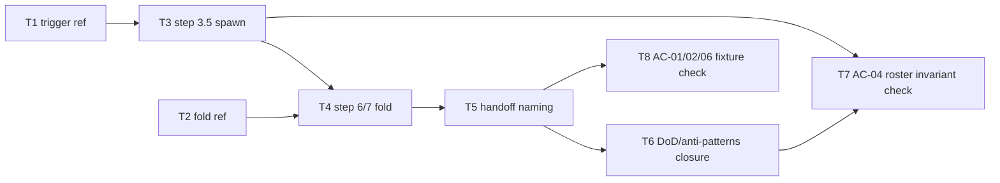

# Epic — design-swift-consultants

> **Spec:** [spec.md](../spec.md) · **Design:** [sad.md](../sad.md) · **ADRs:** [adr/](../adr/)

## Goal

Wire a guaranteed, disposable, altitude-filtered iOS-expertise consultant into the `design` skill's protocol, so any feature whose spec signals a UI/async surface automatically gains SwiftUI/Swift-concurrency structural decisions in its SAD — with a visible fallback marker on failure and zero footprint on pure-logic features (spec §2 Goals).

## Scope

- **In:** `skills/design/references/consultant-trigger.md` + `consultant-fold.md` (new reference files); `skills/design/SKILL.md` protocol edits (step 3.5 spawn, step 6/7 fold + handoff); manual fixture verification of AC-01/AC-02/AC-04/AC-06.
- **Out (spec §3 non-goals):** wiring any stage other than `design`; touching SDD's restricted `agents/` roster; forking/editing the expert bundles; a hard gate that blocks `design` on consultant failure; the automated regression-anchor eval `design-ios-consultant` (deferred — spec §8 OQ, optional for this pass).

## Task map

## Tasks

See [tracker.md](./tracker.md) for status. Machine contract: [tasks.json](../tasks.json).

| # | Task | Layer | Blocked by | DoD (short) |
|---|---|---|---|---|
| T1 | Write the trigger reference (signal set + mapping + cap) | domain | — | keyword sets + UI/async→consultant mapping + ≤2 cap documented |
| T2 | Write the fold reference (altitude filter + rules-win + marker format) | domain | — | blast-radius reuse + project-rules-win + marker text documented |
| T3 | Add step 3.5 — guaranteed concurrent consultant spawn | app | T1 | step fires deterministically on signal, never in `agents:` roster |
| T4 | Extend step 6/7 — altitude fold + project-rules-win + dual marker write | ports | T2, T3 | admitted decisions land in §4/§5; marker in SAD on failure |
| T5 | Extend step 7 handoff — name fired/missing consultant(s) | ports | T4 | handoff names consultant(s) or the fallback marker |
| T6 | Close DoD/anti-patterns/References for the new protocol pieces | docs | T5 | SKILL.md DoD + anti-patterns + References reflect the wiring |
| T7 | Verify AC-04 — plugin-validation roster invariant | tests | T3, T6 | `validate_plugin.py` passes; consultant absent from `agents/` + `agents:` |
| T8 | Verify AC-01/AC-02/AC-06 on fixture specs | tests | T5 | UI/async, pure-logic, and bundle-unavailable fixtures behave per AC |

## Risks / Hard rules

- **AC-04 domain invariant (spec §5, ADR-0003):** the consultant must never be added to `skills/design/SKILL.md`'s `agents:` frontmatter or to `agents/*.md` — it is referenced only in SKILL.md prose. T3, T6, T7 must not violate this.
- **Non-blocking (spec §3 non-goal 4, ADR-0004):** no task may turn a consultant failure into a hard gate — always graceful fallback + dual marker.
- **≤2 consultants per run, ≤~80k added tokens (spec §6 NFR):** T3's spawn logic must respect the cap structurally (exactly two consultant classes).
