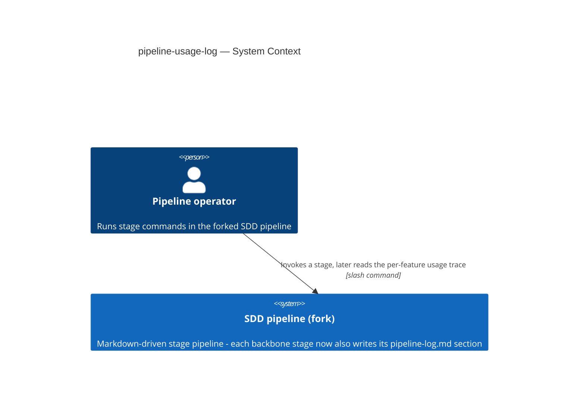
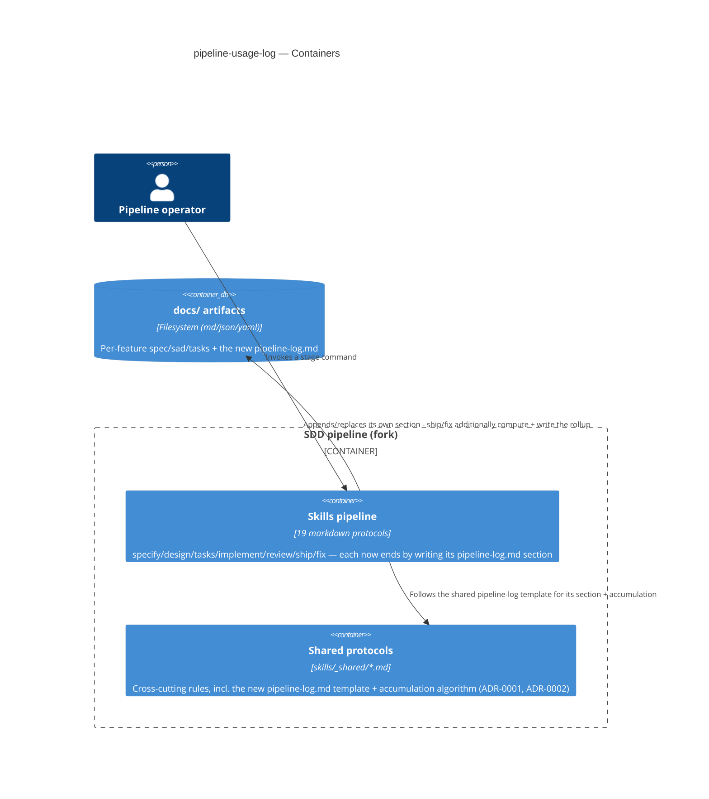
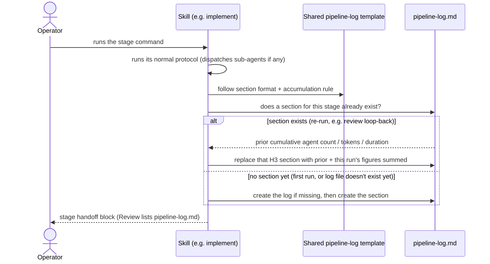
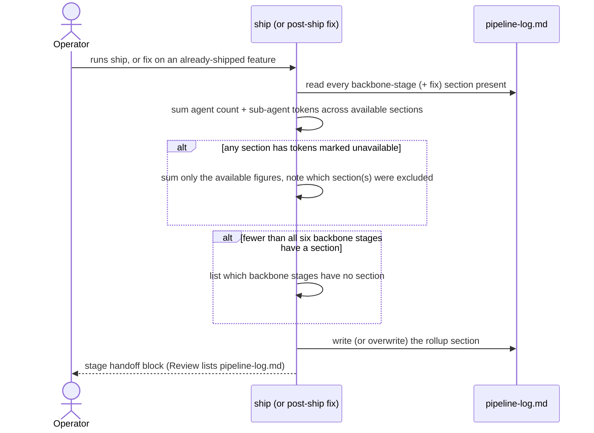
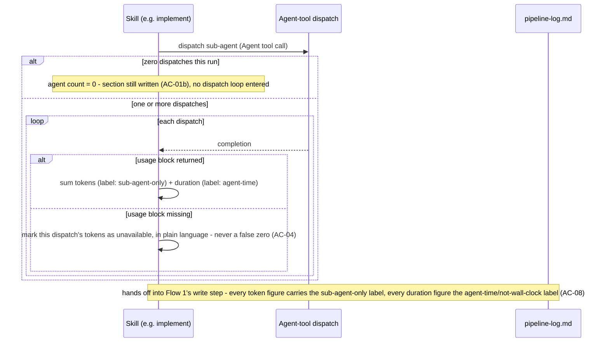

# Software Architecture Document — pipeline-usage-log

<!-- 12 Arc42 sections. Empty section → <!-- N/A: <one-line reason> -->. -->
<!-- C4 Context (L1) lives inline in §3. C4 Container (L2) lives inline in §5. -->
<!-- Numbers in §10 come VERBATIM from spec.md §6 NFR — no inventing, no rounding. -->

## 1. Introduction and goals

**Intent.** Give the pipeline operator a single, per-feature file (`docs/features/{slug}/pipeline-log.md`)
that shows which sub-agents ran at each backbone stage, what approach/mode a stage used, and an
honestly-scoped cost signal — so the operator can look back at a feature's agent/token footprint
without reconstructing it from terminal scrollback.

**Top-3 quality goals (1-liners; full scenarios in §10):**

1. Honesty — every token/duration figure is unambiguously labeled as partial (sub-agent-only,
   agent-time) so it is never misread as the feature's total cost.
2. Accuracy under real usage — retries, mid-pipeline entry, and post-ship fixes never produce a
   duplicate section or a stale rollup.
3. Coverage — every backbone-stage completion (and `fix`) produces or updates its section, with zero
   dispatches, and never a silently missing one.

**Stakeholders.**

| Role | Interest | Sign-off owner? |
|---|---|---|
| Pipeline operator | Reads the log to see agent usage, approach, and cost signal per stage | No |
| Fork maintainer | Keeps the shared pipeline-log template in sync across the seven skill files as the fork evolves | No |
| Tech Lead | SAD approval | Yes |

<!-- Decision overrides (¶4) — populated by the critic resolution loop, empty otherwise. -->

## 2. Constraints

**Technical.**
- TypeScript 5.5 on Bun for `server/`; the pipeline itself is markdown (`skills/*/SKILL.md` +
  `templates/` + `references/`) — this feature is entirely markdown, no `server/` change.
- No datastore — `docs/` filesystem is the only persistence; `pipeline-log.md` follows the same
  markdown-file-per-artifact pattern as `spec.md`/`sad.md`/`tasks.json`.
- Only an `Agent`-tool dispatch's completion is verified to carry a `<usage>` block
  (`subagent_tokens`/`tool_uses`/`duration_ms`); a stage's own (orchestrator) token spend is not
  exposed to skill instructions — hard platform ceiling, not a choice (spec §1 ¶1, idea source §2).

**Organisational.**
- Effort budget: S-sized feature — one architect-driven pass, no dedicated team.
- No hard deadline; ships when the first backbone stage (`specify`) exercises it end to end.
- Team composition: single fork maintainer (Vitalii), same person as the pipeline operator.

**Conventions.**
- `skills/_shared/` is the canonical home for a cross-cutting rule referenced by multiple skill files
  (13 shared protocols today, e.g. `handoff.md`, `size-matrix.md`) — this feature adds a 14th
  (ADR-0001).
- Every stage's final protocol step already ends with "write artifact → propose commit → emit the
  handoff block" (e.g. `specify` step 8, `design` step 7) — the new write step slots into that same
  position.
- Kebab-case slugs, `docs/features/<slug>/` per-feature layout — unchanged.

**Regulatory / external.**
- N/A — internal dev-tooling artifact, no PII, no external compliance surface (spec §6.1).

## 3. Context and scope

This feature is entirely internal to the SDD pipeline itself: it does not talk to any third-party
system. The pipeline operator runs `/sdd:<stage> <slug>` commands; each backbone stage (plus `fix`)
now also appends to or replaces its own section in that feature's `pipeline-log.md`, and `ship`
(or a post-ship `fix`) additionally computes a rollup from the sections present. No new actor and no
external system are introduced — the operator and the filesystem artifact store are the same ones
`architecture-map.md` already documents.

<!-- brownfield: docs/architecture-map.md (reflects_commit 632a262, 6 days / consultant-rollout-only
     drift since) — Skills pipeline (19 markdown protocols) + Shared protocols (skills/_shared/) +
     docs/ artifacts (filesystem) are the containers this feature extends; server/ and dashboard/ are
     untouched. -->

**External systems (in / out):**

| Actor or system | Type | Interaction |
|---|---|---|
| Pipeline operator | Person | Runs `/sdd:<stage> <slug>`; later reads `pipeline-log.md` for the trace |
| SDD dashboard server | System (internal, out of scope) | Read-only, non-persistent — never reads/writes `pipeline-log.md` (spec §3 non-goal: no live view) |
| External systems | — | **None** (deliberate) — this feature is self-contained inside the pipeline's own filesystem artifact store, no third-party call added |

**C4 Context (L1):**



No external system is drawn — this feature adds no third-party dependency; everything happens inside
the pipeline's own filesystem artifact store (§5).

## 4. Solution strategy

**Top strategic choices (the seeds for ADRs):**

1. **Target surface: `cli`.** This repo IS the SDD toolkit — a markdown-driven pipeline invoked by
   slash commands (`architecture-map.md`: "not a conventional application ... a markdown-driven
   pipeline"). The taxonomy's other surfaces (`web-frontend`, `mobile-app`, `desktop-app`,
   `backend-service` in the HTTP-API sense) don't apply — no UI and no network-facing API is added or
   touched; `cli` (commands with no request/response HTTP surface) is the closest fit for a
   pipeline whose unit of interaction is a named command. This decision scored 0–1 of the three
   blast-radius criteria (the alternatives are ruled out by the existing repo shape, not chosen among
   real options) — decided inline, no ADR.
2. **One shared template, not seven copies (ADR-0001).** The section format + the cumulative-replace
   accumulation algorithm (AC-03) is defined once in `skills/_shared/pipeline-log.md`, mirroring the
   existing `handoff.md` precedent; every backbone stage + `fix` points to it instead of re-describing
   it.
3. **Mode-aware usage capture in `implement` (ADR-0002).** `implement`'s three execution modes
   (sequential / `TeamCreate` team / dynamic `Workflow`) don't expose usage the same way — the shared
   template branches per mode instead of forcing one capture path onto all three.
4. **Markdown-only, no sidecar.** Per spec §3 non-goal, the log has no machine-readable companion;
   `ship`/`fix` compute the rollup by parsing `pipeline-log.md`'s own sections directly. This is the
   only mechanism consistent with that non-goal (no real alternative to weigh) — decided inline.

Each tactical decision in §5/§6/§8 traces to one of these four seeds.

## 5. Building block view

The change is additive within the existing layered structure `architecture-map.md` already documents
(Skills pipeline / Shared protocols / docs artifacts) — no new container, one new shared reference
file, one new per-feature artifact type, and one new write-step appended to seven existing skill
files' final protocol step.

**Internal decomposition:**

```
skills/
├── _shared/
│   └── pipeline-log.md          <new — ADR-0001: section format + accumulation algorithm,
│                                   the rollup computation rule, and (ADR-0002) implement's
│                                   mode-aware capture branch>
├── specify/SKILL.md             <existing — final step gains: write pipeline-log.md section>
├── design/SKILL.md              <existing — same>
├── tasks/SKILL.md               <existing — same>
├── implement/SKILL.md           <existing — final step gains: write pipeline-log.md section,
│                                   mode-aware per ADR-0002>
├── review/SKILL.md              <existing — final step gains: write pipeline-log.md section>
├── ship/SKILL.md                <existing — final step gains: write pipeline-log.md section
│                                   PLUS compute + write the rollup section>
└── fix/SKILL.md                 <existing — final step gains: write pipeline-log.md section;
                                    if the feature already has a rollup section, also refresh it>

docs/features/<slug>/
└── pipeline-log.md              <new artifact — one H3 section per stage that has run + an
                                    optional rollup section, created lazily by whichever stage
                                    runs first>
```

**C4 Container (L2):** the feature extends the two existing containers `architecture-map.md` already
draws (`Skills pipeline`, `docs/ artifacts`) plus the existing `Shared protocols` module (now hosting
one more file); no new container is introduced for the `cli` surface.



## 6. Runtime view

**Critical flow 1: a backbone stage writes/replaces its own section**



**Critical flow 2: `ship` computes the rollup; a post-ship `fix` refreshes it**



**Critical flow 3: sub-agent dispatch usage capture (feeds Flow 1's write step)**



The pipeline operator sees no direct step here - this flow zooms into the "runs its normal protocol
(dispatches sub-agents if any)" step already drawn in Flow 1. When a stage makes zero `Agent`-tool
dispatches in a run, it still writes a section with agent count 0 (AC-01b) rather than skipping it.
When it makes one or more, each dispatch's completion either returns a usable `<usage>` block - summed
into the stage's running tokens/duration totals - or doesn't, in which case that dispatch's tokens are
marked unavailable in plain language rather than a false zero or a silent omission (AC-04). Either way,
every token and duration figure that eventually reaches the section write carries its honesty label
(AC-08) - this flow is where that label gets attached, before Flow 1 ever touches the log file.

**Coverage note (US-08 / AC-05 / AC-05b):** rollup-ownership is a structural fact of which protocol a
stage follows, not a runtime branch worth drawing - a non-`ship`, non-`fix` stage's protocol contains no
rollup-write step at all (it only ever runs Flow 1), and a pre-ship `fix` runs Flow 1 alone because no
rollup section exists yet to refresh; only a post-ship `fix` (rollup section present) additionally runs
Flow 2. The discriminator - rollup-section presence - is already implied by Flow 2's actor label ("Ship
(or post-ship fix)"). Marked non-runtime N/A per step 7 of the `sequences` protocol.

## 7. Deployment view

<!-- N/A: this feature ships as markdown protocol files inside the existing SDD fork repo — reuses
     the existing deployment unit (the plugin's markdown + skills/_shared/ tree), no infra change,
     no new process, no new host. -->

## 8. Crosscutting concepts

| Concept | Convention | Where defined |
|---|---|---|
| Section identity | One `### <Stage>` H3 per backbone stage (+ `fix`); "replace in place" (AC-03) = exact-heading match on that H3, block replaced wholesale | `skills/_shared/pipeline-log.md` (ADR-0001) |
| Cumulative accumulation | On re-run, the new section's agent count / tokens / duration = prior section's figures + this run's figures, never the latest run alone | `skills/_shared/pipeline-log.md` (ADR-0001) |
| Token/duration honesty | Every figure carries an inline label — tokens: "sub-agent-only, excludes orchestrator overhead"; duration: "agent-time, not wall-clock" (spec AC-08) | `skills/_shared/pipeline-log.md` |
| Unavailable-data marker | A dispatch whose usage didn't return is marked with an explicit inline text marker (e.g. "tokens: unavailable — dispatch usage not returned"), never a false zero or a silent omission (AC-04) | `skills/_shared/pipeline-log.md` |
| Mode-aware capture (`implement` only) | Sequential/team sum `Agent`-tool `<usage>` dispatches; workflow reads `budget.spent()`; a mode that can't retrieve usage marks it unavailable | `skills/_shared/pipeline-log.md` (ADR-0002) |
| Rollup ownership | Only `ship` and a **post-ship** `fix` (feature already has a rollup section) ever write the rollup; every other stage, and a **pre-ship** `fix`, only ever touches its own section (AC-05, AC-05b) | `skills/_shared/pipeline-log.md` |
| Rollup gaps as prose | Excluded sections (unavailable tokens) and missing backbone stages are listed as plain markdown bullets inside the rollup section — no second machine-readable format (spec §3 non-goal) | `skills/_shared/pipeline-log.md` |
| Write position + commit | The pipeline-log write is the last step before the stage's handoff-block emission, and lands in the **same commit** as the stage's own primary artifact write (no separate commit) | each skill's final protocol step |
| Handoff visibility | Every backbone stage's (+ `fix`'s) handoff-block *Review before continuing* list always includes `docs/features/<slug>/pipeline-log.md` | `skills/_shared/handoff.md` (existing contract, extended per-skill) |
| Lazy creation | Any stage invoked on a feature whose folder has no `pipeline-log.md` yet creates it with its own section, never skips or fails (AC-02, US-05) | `skills/_shared/pipeline-log.md` |
| Internationalisation | N/A — single language (artifact_language: en, per `.claude/sdd.local.md`) | — |
| Observability | N/A — this feature IS the observability mechanism for the pipeline itself; no further tracing added | — |
| Events | N/A — no async/event flow; every write happens synchronously inside a stage's own run | — |

## 9. Architecture decisions

| # | Title | Status | Section |
|---|---|---|---|
| 0001 | Define the pipeline-log section format and accumulation algorithm once, in a shared reference file | Accepted | §5 |
| 0002 | Capture implement's sub-agent usage mode-aware, per its three execution modes | Accepted | §5 |

ADR files live under `docs/features/pipeline-usage-log/adr/NNNN-<title>.md`.

## 10. Quality requirements

**QG-1. Honesty (token/duration labeling)**
- **When:** any section or the rollup reports a token or duration figure.
- **Then:** 100% of token figures (per-section and rollup) carry the sub-agent-only label, and 100% of
  duration figures carry the agent-time/not-wall-clock label (spec §6 "Token-caveat presence" /
  "Duration-caveat presence" targets, verbatim).
- **How verify:** manual audit at `specify`'s critic pass and spot-checked in `review` (spec §6
  Measurement column, verbatim).

**QG-2. Accuracy under real usage (no duplicates, accurate rollup)**
- **When:** a stage re-runs on the same feature, or `ship`/a post-ship `fix` computes the rollup.
- **Then:** 0% duplicate-section rate — no stage ever has more than one section for the same feature;
  the rollup total exactly equals the sum of the available figures across all present backbone-stage
  (and `fix`) sections at write time (spec §6 "Duplicate-section rate" / "Rollup accuracy" targets,
  verbatim).
- **How verify:** manual audit across the first 5 features run post-rollout (duplicates); a
  recompute-and-diff check performed by `ship`/`fix` each time either writes the rollup (rollup
  accuracy) — both verbatim from spec §6.

**QG-3. Coverage (no silently missing sections)**
- **When:** any backbone-stage completion, regardless of sub-agent count.
- **Then:** 100% of backbone-stage completions produce or update a section (spec §6 "Section coverage"
  target, verbatim).
- **How verify:** manual audit across the first 5 features run post-rollout (spec §6, verbatim).

## 11. Risks and technical debt

<!-- Severity literals: Low / Medium / High for regular risks; "Open question" for rows created by
     a Save-as-OQ resolution during the Socratic walk. -->

| Risk / debt | Severity | Mitigation | Owner |
|---|---|---|---|
| `<usage>`-block capture is verified on Claude Code only; behavior under Codex CLI / Cursor (the other two hosts this plugin ships to, per `architecture-map.md`'s multi-host manifests) is unverified | Medium | Note the Claude-Code-specific provenance inline in the shared template (ADR-0001); a host where the block is unavailable falls back to the AC-04 unavailable-marker path, same as any other unretrievable dispatch | Fork maintainer |
| `TeamCreate` team-mode's own usage-availability is unconfirmed (ADR-0002 Negative) — if partial/inconsistent, `implement`'s mode-aware branch for team mode may need its own fallback | Medium | `tasks`/`implement` verify against the current `TeamCreate` contract when this feature is broken into tasks; falls back to the unavailable-marker path (AC-04) if confirmed unavailable | Fork maintainer |
| A crash or early exit before a stage's write step leaves that stage's section silently missing (spec §6.1, accepted) | Low | Shows up as a visible gap against the §6 coverage target and the rollup's "missing stages" list (AC-06c) — never a fabricated entry; no further mitigation this iteration | Fork maintainer |
| Concurrent sub-agent fan-out writing back to shared state could, in principle, race on `pipeline-log.md` (spec §6.1, accepted) | Low | The pipeline's existing single-coordinator write pattern already narrows this to a low-probability edge case; this feature adds no concurrency control on top | Fork maintainer |
| Every figure is self-reported by the stage that wrote it, with no independent reconciliation (spec §6.1, accepted) | Low | Documented limitation; a future SDD change that breaks a stage's append step would drift the log silently and undetected | Fork maintainer |
| Open architectural decision: should a future iteration extend the section contract to optional stages (`clarify`, `sequences`, `data-model`, `api`, `plan-tests`) when they do run? | Open question | Resolve after the MVP proves out on a few real features (spec §8, verbatim) | Vitalii |
| Open architectural decision: should a `fix`-triggered rollup refresh note which fix caused it, or only the refreshed totals? | Open question | Resolve before `tasks` breaks this down; default now is totals only (spec §8, verbatim) | Vitalii |

**Accepted debt (acceptable in v1, plan to fix later):**
- No cross-feature aggregation or portfolio-wide cost dashboard — markdown-only, per-feature (spec §3
  non-goal, explicit "can be revisited later").

## 12. Glossary

<!-- "Pipeline operator" and "Backbone stage" are already canonical in the repo-root CONTEXT.md
     (promoted from design-swift-consultants / swift-consultants-rollout) and used here unchanged —
     not redefined. Only genuinely new, feature-local terms are listed below. -->

| Term | Meaning |
|---|---|
| Section | The one H3 block (`### <Stage>`) a single backbone stage (or `fix`) owns inside `pipeline-log.md` — agent count, sub-agent tokens (labeled), agent-time duration (labeled), free prose on approach/mode. |
| Rollup | The single summary section, written only by `ship` or a post-ship `fix`, totaling agent count and sub-agent tokens across all present backbone-stage (+ `fix`) sections, excluding any optional-stage section and noting any excluded/missing figures. |
| Cumulative total | A section's figures after a stage re-run: the sum across every run of that stage for this feature, never just the latest run's numbers (AC-03). |
| Unavailable marker | The explicit inline text a section uses in place of a dispatch's tokens/duration when that dispatch's usage data didn't return, so it can never be misread as a true zero (AC-04). |
| Pre-ship / post-ship `fix` | A `fix` invoked before the feature's `pipeline-log.md` has a rollup section (writes only its own section) vs. after (also refreshes the rollup) — the discriminator is the rollup section's presence, not a separate flag. |
