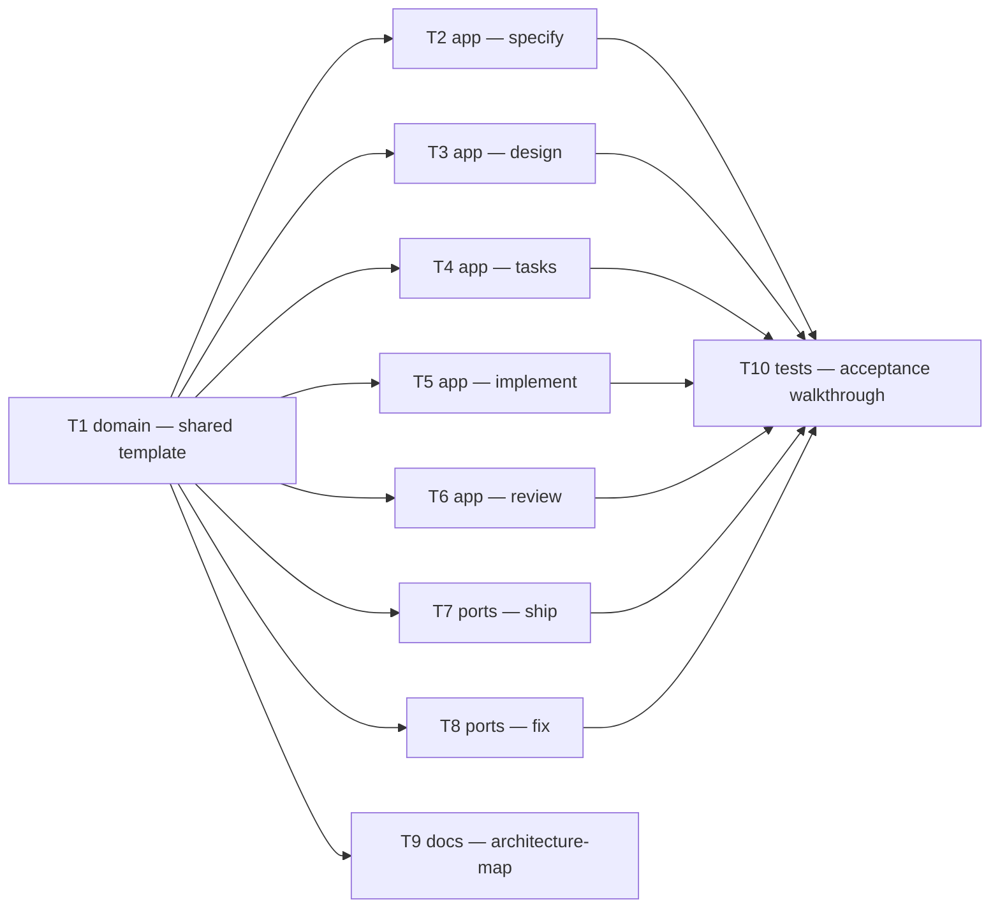

# Epic — pipeline-usage-log

> **Spec:** [spec.md](../spec.md) · **Design:** [sad.md](../sad.md) · **ADRs:** [adr/](../adr/)

## Goal

Give the pipeline operator a single, per-feature file (`docs/features/{slug}/pipeline-log.md`) that
shows which sub-agents ran at each backbone stage, what approach/mode a stage used, and an
honestly-scoped cost signal, ending with a trustworthy rollup at `ship` — without reconstructing any
of it from terminal scrollback (spec §2 Goals).

## Scope

- **In:** one new shared reference file (`skills/_shared/pipeline-log.md`), a one-step addition to the
  final protocol of seven existing skill files (`specify`, `design`, `tasks`, `implement`, `review`,
  `ship`, `fix`), one new per-feature artifact (`pipeline-log.md`), a documentation note in
  `architecture-map.md`.
- **Out:** cross-feature aggregation, a machine-readable companion file, logging for optional
  route-dependent stages (`clarify`, `sequences`, `data-model`, `api`, `plan-tests`), live/real-time
  monitoring (spec §3 Non-goals).

## Task map

## Tasks

See [tracker.md](./tracker.md) for status. Machine contract: [tasks.json](../tasks.json).

| # | Task | Layer | Blocked by | DoD (short) |
|---|---|---|---|---|
| T1 | Shared pipeline-log template (format, accumulation, rollup, mode-aware capture) | domain | — | `skills/_shared/pipeline-log.md` defines the whole contract (ADR-0001, ADR-0002) |
| T2 | Wire `specify`'s final step | app | T1 | writes/replaces its own section |
| T3 | Wire `design`'s final step | app | T1 | writes/replaces its own section |
| T4 | Wire `tasks`'s final step | app | T1 | writes/replaces its own section |
| T5 | Wire `implement`'s final step (mode-aware) | app | T1 | writes/replaces its own section, per running mode |
| T6 | Wire `review`'s final step | app | T1 | writes/replaces its own section |
| T7 | Wire `ship`'s final step + rollup | ports | T1 | writes its section, computes + writes the rollup |
| T8 | Wire `fix`'s final step + conditional rollup refresh | ports | T1 | writes its section; refreshes rollup only post-ship |
| T9 | Document the new shared protocol in `architecture-map.md` | docs | T1 | 13 → 14 shared protocols, new artifact noted |
| T10 | Manual acceptance walkthrough, all ACs | tests | T2–T8 | every AC-01..AC-08 confirmed on a scratch feature |

## Risks / Hard rules

- **Rollup ownership (AC-05, AC-05b):** only `ship` and a *post-ship* `fix` may ever write the rollup
  section — T2–T6 and the pre-ship path of T8 must never touch it (sad §8 "Rollup ownership").
- **One section per stage (AC-03):** a re-run replaces the existing H3 in place with the *cumulative*
  sum across every run — never a duplicate section, never a reset to the latest run alone (ADR-0001).
- **Honesty labeling (AC-08):** every token figure carries the sub-agent-only label, every duration
  figure the agent-time/not-wall-clock label — no exceptions, in T1's template and every consumer.
- **Same-commit write (sad §8):** the pipeline-log write lands in the same commit as the stage's own
  primary artifact write — no separate commit per stage.
- **No sidecar (spec §3 Non-goal):** `ship`/`fix` parse `pipeline-log.md`'s own sections directly for
  the rollup — no new machine-readable format introduced (T7/T8).
