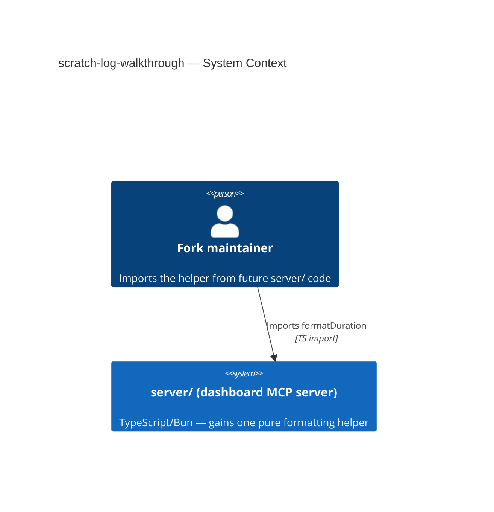
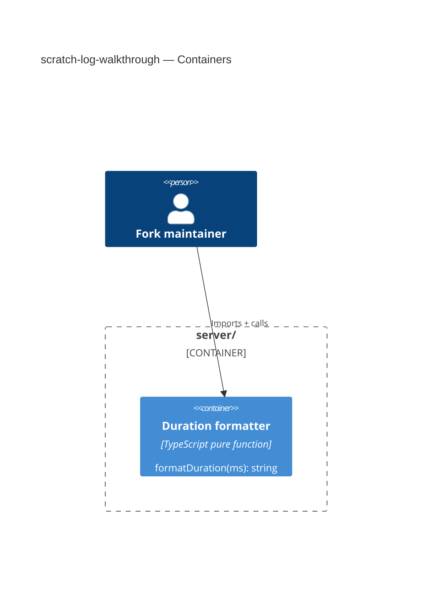

# Software Architecture Document — scratch-log-walkthrough

<!-- brownfield: docs/architecture-map.md (reflects_commit 632a262) — server/ (TypeScript/Bun) is
     the container this feature extends; no explorer re-dispatch needed, the map is current enough
     for a single pure-function addition. -->

## 1. Introduction and goals

**Intent.** Add `formatDuration(ms)` as the one shared `server/` helper for rendering a millisecond
duration as a short human string.

**Top-3 quality goals:**
1. Correctness — every AC-01..AC-06 boundary (ms/s cutoff, zero, negative/NaN) behaves exactly as specified.
2. Single source — no second implementation appears anywhere in `server/`.
3. Simplicity — a pure function, no config, no async.

**Stakeholders:** Fork maintainer (owns `server/`) — sign-off owner.

## 2. Constraints

**Technical.** TypeScript 5.5 on Bun; `server/` is the only container touched; no datastore, no
network call.
**Organisational.** XS, single maintainer, no deadline.
**Conventions.** `server/` unit tests live under `server/tests/` (Bun `describe`/`it`/`expect`, per
`architecture-map.md` §Conventions "Tests").
**Regulatory.** N/A — internal dev utility.

## 3. Context and scope

Entirely internal to `server/`; no external actor, no third-party system.



## 4. Solution strategy

**Target surface: `library-sdk`.** The feature's whole contract is one exported function signature
— `library-sdk` ("the public signatures/types it exposes are the contract") fits exactly; no
request/response surface is added. Decided inline, no ADR (0 of 3 blast-radius criteria — a single
pure function, trivially reversible, no real alternative to weigh).

## 5. Building block view

```
server/
└── <duration formatting module>   <new — exports formatDuration(ms: number): string>
```

**C4 Container (L2):** extends the existing `server/` container only; no new container.



## 6. Runtime view

<!-- N/A: a single synchronous pure-function call — no multi-participant flow to draw; AC-01..AC-06
     are branches inside one function body, not a runtime sequence. Per sequences protocol step 7. -->

## 7. Deployment view

<!-- N/A: ships inside the existing server/ deployment unit, no infra change. -->

## 8. Crosscutting concepts

| Concept | Convention | Where defined |
|---|---|---|
| Formatting boundary | <1000ms → milliseconds; ≥1000ms → seconds, 1 decimal | this function |
| Invalid input | negative or non-finite throws | this function |

## 9. Architecture decisions

<!-- N/A: no decision crossed the blast-radius gate (§4) — 0 ADRs this feature. -->

## 10. Quality requirements

**QG-1. Correctness**
- **When:** `formatDuration` is called with any value from spec §5's AC set.
- **Then:** every AC-01..AC-06 boundary holds exactly.
- **How verify:** unit tests (`server/tests/`), per spec Test plan.

## 11. Risks and technical debt

| Risk / debt | Severity | Mitigation | Owner |
|---|---|---|---|
| None material — XS, single pure function | Low | N/A | Fork maintainer |

## 12. Glossary

<!-- No new domain terms beyond CONTEXT.md's existing "Fork maintainer". -->
