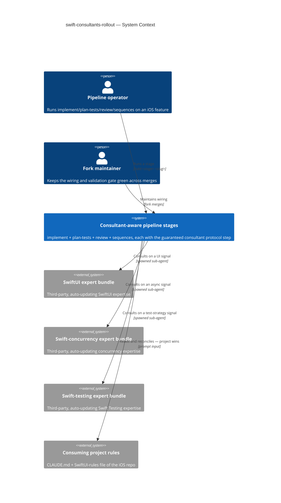
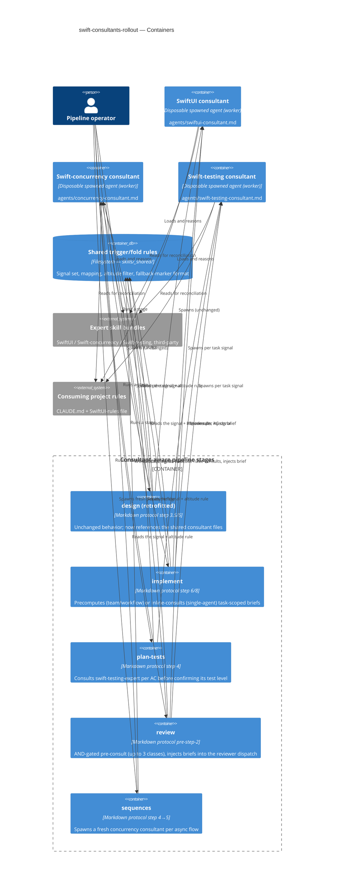
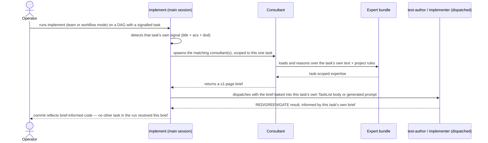
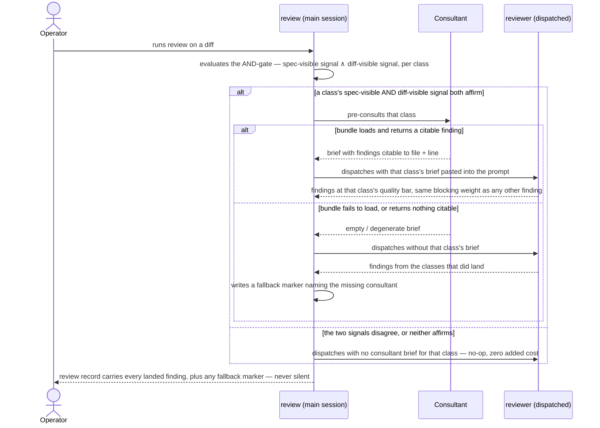

# Software Architecture Document — swift-consultants-rollout

<!-- 12 Arc42 sections. Empty section → <!-- N/A: <one-line reason> -->. -->
<!-- C4 Context (L1) lives inline in §3. C4 Container (L2) lives inline in §5. -->
<!-- Numbers in §10 come VERBATIM from spec.md §6 NFR — no inventing, no rounding. -->

## 1. Introduction and goals

<!-- 🎯 Why: durable memory of «what + the three dominant qualities + who cares». A year from
     now nobody recalls which three qualities were critical for this system.
     📋 Write: 1 ¶ intent + 3 lines of top-3 quality goals + a stakeholders table.
     ¶4 is the override slot — critic `Override` resolutions emit «Decision override: <headline>
     — rationale: <reason>» bullets here so downstream skills see the deliberate choice. -->

**Intent.** Extend the proven **expert-consultant** pattern (a disposable sub-agent loads a heavy third-party Swift-domain skill bundle, returns a ≤1-page brief, the main session altitude-filters it into the artifact) from the one stage it shipped on (`design`) to four more — `implement` (all 3 execution modes), `plan-tests` (a new third consultant class, `swift-testing-expert`), `review` (all three consultant classes via pre-consult injection), `sequences` (a fresh concurrency-consultant spawn) — as the same guaranteed, non-skippable protocol step `design` already has, so SwiftUI/concurrency/testing expertise reaches every stage that ships or tests actual Swift code, not just the architecture document.

**Top-3 quality goals (1-liners; full scenarios in §10):**

1. **Deterministic spawn** — the consultant(s) fire on 100% of runs where that stage's own trigger signal is present, including every signalled consultant firing together (e.g. `review` firing all three at once).
2. **Fallback marker visibility** — 100% of expected-but-didn't-fire cases surface a visible marker on that stage's own output surface, dual-placed (artifact + handoff), and the stage never blocks.
3. **Altitude-correct fold per stage** — a consultant's brief enters the artifact only at the altitude that stage owns (test-matrix shape for `plan-tests`, flow-specific detail for `sequences`, quality-bar findings for `review`, full code for `implement`) — not "bounded cost": spec §3 explicitly leaves token cost uncapped (accepted, monitored only via the KPI in §7).

**Stakeholders.**

| Role | Interest | Sign-off owner? |
|---|---|---|
| Pipeline operator | Runs `implement` / `plan-tests` / `review` / `sequences`; consumes the iOS-aware output from one command per stage | No |
| Fork maintainer | Keeps the wiring + the deterministic validation gate green across upstream merges; owns every §8 open question | No |
| Tech Lead | SAD approval | Yes |

<!-- Decision overrides (¶4) — populated by the critic resolution loop, empty otherwise. -->

## 2. Constraints

<!-- 🎯 Why: §4 strategy only works when §2 has fixed WHAT IS ALREADY FIXED — stack, versions,
     deadline, regulatory. This is an input, not an output.
     📋 Write: four blocks — Technical / Organisational / Conventions / Regulatory.
     📌 Pin versions («<datastore> 18», not «<datastore>»); «Q3 deadline — hard», not «ideally».
     Never N/A — every feature inherits at least Conventions + Technical. -->

**Technical.**
- TypeScript 5.5 on Bun (server) + markdown skill definitions (architecture-map §Stack) — this feature is **markdown-only**: edits confined to `skills/implement/`, `skills/plan-tests/`, `skills/review/`, `skills/sequences/` plus three new consultant definition files under `agents/` (§4/§5). No production code, no server change.
- **No datastore, no migrations** — all state is files under `docs/`; unchanged from the repo baseline.
- Expert skill bundles (`swiftui-expert`, `swift-concurrency`, `swift-testing-expert`) stay **third-party, auto-updating, un-forked** (spec §3, §6.1) — the same contract `design-swift-consultants` already accepted.
- Each consultant runs as a **disposable, clean-isolated sub-agent**; its only channel back is the ≤1-page brief text (unchanged from the shipped precedent).

**Organisational.**
- Effort: L feature, `full` route (`.size` / `.route`).
- One **Fork maintainer** — frequently the same human as the Pipeline operator, but a distinct responsibility (owns every §8 open question + the merge-drift risk in §11).

**Conventions.**
- Skill structure: YAML frontmatter (name/model/effort/agents/description) + numbered markdown protocol + `templates/` + `references/` (architecture-map §Conventions).
- Handoff: every stage ends with the 3-part block — `skills/_shared/handoff.md`.
- **Plugin validation gate:** `scripts/validate_plugin.py` must stay green; manifests kept in lockstep at `1.16.0`.
- **A sharpened version of `design-swift-consultants`' own invariant (ADR-0003 there):** this feature is the first to add real consultant definition files under `agents/` (§4/§5) — but those files are referenced **only in prose** (`subagent_type: "<consultant-name>"` with a `general-purpose` fallback), **never** added to any skill's `agents:` frontmatter list. `validate_plugin.py` only checks that every name *in* `agents:` has a file — it has no reverse check for a stray unreferenced file — so keeping every consultant out of every `agents:` list is the actual, load-bearing guard.

**Regulatory / external.**
- Internal developer tooling; no personal data, no new authZ/authN boundary (spec §6.1) → security review **N/A**.
- Bundle-trust is an **accepted supply-chain surface**: the expert bundles stay auto-updating and un-forked; a wrong/outdated bundle is mitigated by project-rules-win (AC-06) + the independent `review` pass itself, not by pinning — unchanged from the precedent.

## 3. Context and scope

<!-- 🎯 Why: draws the SYSTEM BOUNDARY — who talks to it from outside, where the trust zone ends.
     Without §3, §5 and §8 (authorization) blur — unclear what's «inside» vs «outside».
     📋 Write: 2–3 sentences of business context + an external-systems table + a C4Context block.
     📌 «External: none (deliberate, no third-party in v1)» is itself a decision worth stating.
     Trust boundary — the line past which you don't trust data without checking it.
     Never N/A — greenfield still draws the planned actors + external systems. -->

Four SDD pipeline stages — `implement`, `plan-tests`, `review`, `sequences` — currently produce stack-agnostic output with no iOS awareness, the same gap `design` had before `design-swift-consultants` closed it for one stage. This feature wires the same guaranteed consultant step into all four, so SwiftUI/concurrency/testing expertise reaches `implement`'s generated code, `plan-tests`' AC→test map, `review`'s quality bar, and `sequences`' async-flow detail — with the consuming project's rules winning at fold and a visible marker whenever an expected consultation didn't land.

**Trust boundary.** Each consultant runs **locally, in clean isolated context**, and sees only its own scope for that stage (the task's own text for `implement`, the AC being mapped for `plan-tests`, the diff signal for `review`, the flow being drafted for `sequences`) plus the project rules passed into its prompt. Bundle *content* is trusted (an accepted supply-chain surface, §2); the *brief* it returns is untrusted at the altitude level — every item is re-gated by that stage's own altitude filter before it may enter that stage's artifact.

<!-- brownfield: confirmed directly against the shipped `design-swift-consultants` code (not the stale architecture-map, which predates it by 21 commits) — skills/design/SKILL.md:48 (step 3.5, consultant spawn) and :52 (step 6, altitude fold), skills/design/references/consultant-trigger.md (signal set + mapping), skills/design/references/consultant-fold.md (altitude filter + fallback-marker format). This feature extends that exact mechanism into skills/implement/, skills/plan-tests/, skills/review/, skills/sequences/. -->

**External systems (in / out):**

| Actor or system | Type | Interaction |
|---|---|---|
| Pipeline operator | Person | Runs `/sdd:implement`, `/sdd:plan-tests`, `/sdd:review`, `/sdd:sequences`; reads the iOS-aware output |
| Fork maintainer | Person | Maintains the wiring; keeps `validate_plugin.py` green across merges |
| SwiftUI expert bundle | System (external) | Loaded by a consultant on a UI signal; returns SwiftUI expertise at the calling stage's altitude |
| Swift-concurrency expert bundle | System (external) | Loaded by a consultant on an async signal; returns concurrency expertise at the calling stage's altitude |
| Swift-testing expert bundle | System (external) | Loaded by the new testing consultant on a test-strategy signal (first introduced in this feature, at `plan-tests`) |
| Consuming project rules | System (external) | `CLAUDE.md` + any dedicated SwiftUI-rules file, passed into each consultant's prompt; project wins at fold |

**C4 Context (L1):**



## 4. Solution strategy

<!-- 🎯 Why: the 3–4 STRATEGIC PILLARS every ADR grows from. Without §4 each ADR looks random —
     there's no umbrella. ⭐ The densest section — the blast-radius gate fires almost always here
     (decisions are irreversible + multi-module).
     📋 Write: 3–4 choices; each a heading + 2–3 sentences of rationale.
     📌 «Store content as a table of typed blocks» is a pillar — ADR-0001 grows from it. -->

**Target surface (decided first).** `target_surfaces: [worker]` (frontmatter). Reaffirms the same choice `design-swift-consultants` made: every consultant added by this rollout is the same disposable, request/response-less spawned job — no new UI/CLI/HTTP surface. A repeat of an already-accepted, non-irreversible choice, not a new blast-radius decision.

**Top strategic choices (the ADR seeds):**

1. **Hybrid task-scoped pre-consult for `implement` (ADR-0001).** Team and workflow modes precompute each signalled task's brief in step 6 — the *only* technically viable point, since `test-author`/`implementer` sub-agents and `Workflow` scripts cannot self-consult (they lack `Skill`, and a sub-agent cannot spawn a sub-agent). Single-agent mode consults inline, right before each task's own RED step, mirroring `design`'s own idiom. No task ever receives a brief scoped to a different task (AC-02).
2. **Pre-consult injection for sub-agent-only stages (ADR-0002).** `review`'s `reviewer` and `implement`'s team/workflow workers cannot spawn a consultant themselves, so the main session consults first and pastes the brief text into their dispatch prompt — `reviewer`/`test-author`/`implementer` stay completely unedited (spec §3 non-goal 7), keeping the fork's merge surface on those three files at zero.
3. **Dedicated consultant agent files in the fork's own `agents/`, `design` retrofitted to match (ADR-0003).** Three new files — `agents/swiftui-consultant.md`, `agents/concurrency-consultant.md`, `agents/swift-testing-consultant.md` — become the single source for each consultant's prompt, altitude-filter wording, and project-rules-win instruction, read by all five stages (including `design`, retrofitted from its current ad-hoc prose). Dispatched by name in prose (`subagent_type: "<name>"`, `general-purpose` fallback) — **never** added to any skill's `agents:` frontmatter, or `validate_plugin.py` fails (AC-04).
4. **Shared, three-class consultant-trigger/fold (ADR-0004).** `consultant-trigger.md` and `consultant-fold.md` move from `skills/design/references/` to `skills/_shared/`, extended with a third signal class (test-strategy → `swift-testing-expert`) and a per-stage table of what text each stage runs detection against (`design`: spec prose; `implement`: task text; `plan-tests`: the AC being mapped; `review`: the diff, see seed 5; `sequences`: the flow being drafted). The ≤2-per-run cap becomes ≤3-per-run, still structural (one consultant instance per class, no counter).
5. **`review`'s diff trigger: an AND-gate between spec-visible and diff-visible signal (ADR-0005).** Resolves spec §8's open question directly: a consultant class fires only when the shared spec-prose signal (reused verbatim from `design`'s own mechanism) **and** a diff-visible signal (the same keyword set matched against the diff's added `.swift` lines, plus a second model-inference pass over the diff's code) both affirm it. Targets ≤10% false-fire on a manual sample of non-UI/non-async diffs — the previously-`TBD` NFR row. Accepted cost: a feature that scope-crept into UI/async territory without the spec ever saying so will not trigger the matching consultant (§11 risk).
6. **`plan-tests` and `sequences` each add exactly one new consultant class, not three.** `plan-tests` step 4 (Core mapping) consults `swift-testing-expert` only, right after proposing each AC's default test level and before the user confirms it — per spec's own scope ("introducing *a* third consultant class"), not the older SDD-FORK-PLAN draft that proposed all three there. `sequences` spawns a **fresh** `swift-concurrency` consultant only, between step 4 (Sync vs async classification) and step 5 (Draft each flow) — never reusing `design`'s earlier brief (accepted duplicate spend, spec §3 non-goal 4).

Each tactical decision in later sections traces to one of these six seeds. A tactical decision that contradicts one is a red flag — surface it in §11.

## 5. Building block view

<!-- 🎯 Why: INTERNAL DECOMPOSITION — modules, containers, datastores. The static topology: who
     may talk to whom. Without §5, §6 (the flows) has no vocabulary of participants.
     📋 Write: 1 ¶ on the style (layered / hexagonal / clean / event-driven) + a folder tree + a
     C4Container block.
     📌 Draw ONE Container per declared `target_surface` (frontmatter): a fullstack
     [backend-service, web-frontend] = a backend-API container + a web/SPA container; a
     [backend-service, mobile-app] = the API + the mobile app. The Container(web, …) line below is
     just one surface's container — swap/add per what was declared in §4. → _shared/surfaces.md
     📌 e.g. «web app, content API, media worker, datastore, object store, CDN». -->

**Style: extend five existing skills + add three worker-shaped agent definitions, following the repo's markdown-protocol convention.** This is not a new skill (a separate skill could not be a guaranteed step *of* `implement`/`plan-tests`/`review`/`sequences`) — it is a protocol-step addition to five `SKILL.md` files, plus three new files under the fork's own `agents/`, plus two files relocated + extended under `skills/_shared/` (ADR-0003, ADR-0004). The only new runnable unit type is the consultant (the `worker` surface) — already established by `design-swift-consultants`, now backed by dedicated files instead of ad-hoc prose.

**Internal decomposition:**

```
agents/
├── swiftui-consultant.md            # NEW — dedicated definition (ADR-0003), read by all 5 stages
├── concurrency-consultant.md        # NEW — same
└── swift-testing-consultant.md      # NEW — same, the third consultant class

skills/_shared/
├── consultant-trigger.md            # MOVED from skills/design/references/ (ADR-0004); +test-strategy class,
│                                     #   +per-stage "what text this stage detects against" table
└── consultant-fold.md               # MOVED; altitude filter (reused blast-radius gate) + fallback-marker
                                      #   format — rule unchanged, now shared by 5 stages

skills/design/
└── SKILL.md                         # retrofitted: step 3.5 references agents/swiftui-consultant.md +
                                      #   agents/concurrency-consultant.md instead of inline prose (ADR-0003);
                                      #   references repointed to ../_shared/consultant-{trigger,fold}.md

skills/implement/
├── SKILL.md                         # +delta at step 6: precompute task-scoped briefs for team/workflow (ADR-0001)
├── references/team-exec.md          # +delta: each task's own brief goes into its own TaskList body
├── references/workflow-exec.md      # +delta: generated redPrompt(t) includes that task's own consultant_brief
└── references/tdd-loop.md           # +delta: single-agent SELECT/RED consults inline (ADR-0001, AC-06)

skills/plan-tests/
└── SKILL.md                         # +delta at step 4: swift-testing-consultant, one class only (seed 6)

skills/review/
└── SKILL.md                         # +delta before step 2: pre-consult (up to 3 classes, AND-gated per
                                      #   ADR-0005) + inject into the reviewer's dispatch prompt (ADR-0002)

skills/sequences/
└── SKILL.md                         # +delta between step 4 and step 5: fresh concurrency-consultant only (seed 6)
```

- **Consultant agent files** (`agents/*-consultant.md`) — disposable, `worker`-shaped; dispatched by prose name (`subagent_type: "<name>"`, `general-purpose` fallback), never in any skill's `agents:` frontmatter. Each carries its own prompt template, the altitude-filter wording for *that stage's own altitude* (structural for `design`, test-matrix for `plan-tests`, quality-bar for `review`, full-code for `implement`, flow-detail for `sequences`), and the project-rules-win instruction.
- **Shared trigger/fold** (`skills/_shared/consultant-{trigger,fold}.md`) — the three-class signal set + mapping + ≤3-per-run cap, the altitude filter (reuses each stage's own blast-radius-equivalent gate), project-rules-win reconciliation, and the fallback-marker text template, read by all five stages.
- **Per-stage protocol deltas** — each stage's own `SKILL.md` gets the minimal addition needed to (a) detect its own signal against its own text (task/AC/diff/flow — never re-reading `spec.md` prose the way `design` does, except `review`'s AND-gate, which reads both), (b) spawn/pre-consult the matching consultant(s), (c) fold the brief at that stage's own altitude, (d) write the fallback marker on its own output surface when expected-but-missing.

**C4 Container (L2):**



## 6. Runtime view

<!-- 🎯 Why: the RUNTIME FLOW of 1–2 critical scenarios — who talks to whom, when, in what order.
     Without §6, §5 is just boxes with no life.
     📋 Write: a Mermaid sequenceDiagram. Participants are names from §5 (don't invent new ones).
     Messages are semantic («saves a draft»), NO HTTP verbs / paths / status codes — endpoint-level
     sequences arrive at the `api` stage.
     📌 e.g. «author → web: composes draft → web → content API: save». Seed the primary flow(s) here;
     the `sequences` stage then covers every §5 AC (no cap). Never N/A for M+; XS/S keeps ≥1 happy-path flow. -->

**Critical flow 1: implement's hybrid task-scoped pre-consult, team/workflow mode (happy path, AC-02)**



**Critical flow 2: review's AND-gated trigger, pre-consult, and fallback (AC-03, AC-05, AC-07, AC-09)**



Flows 3–N (`plan-tests`' single-class consult, `sequences`' fresh spawn, single-agent `implement`'s inline consult, and the AC→flow coverage across every remaining acceptance criterion) are the `sequences` stage's job — the size matrix's `full` route forwards there next; design seeds the two highest-novelty mechanisms above.

## 7. Deployment view

<!-- 🎯 Why: the TOPOLOGY DevOps must know without reading the deploy charts — how many replicas,
     where the background worker lives, AT WHAT NUMBERS we scale.
     📋 Write: 2–3 sentences on topology + monitoring + concrete threshold numbers.
     📌 e.g. «500 authors → partition by quarter» (not «we'll think about scale later»).
     🎯 N/A allowed for XS/S that reuses an existing deployment unit with no change.
     Deployment-diagram scaffold → templates/deployment.md. -->

<!-- N/A: markdown-only skill edits inside the existing SDD plugin — no server, replica, or datastore to deploy. -->

The only operational envelope is the **per-run token / latency budget across five stages**, monitor-only per spec §6 (none of the rows below block a run):

- **Token cost:** ≤ ~40k per triggered `plan-tests`/`sequences` run (one consultant), ≤ ~40k per triggered `implement` task, up to ~120k worst case on `review` (3 consultants, AND-gated, no cap).
- **Latency:** `design`'s consultant(s) still run concurrently with its step-3 explorer (unchanged). Every other stage's pre-consult is **sequential**, not concurrent (ADR-0002) — `review` and `implement` team/workflow modes pay one consultant call's latency before dispatching their sub-agent/worker, since none of those has an equivalent parallel step to hide behind.
- **Watched by:** the Review gate churn KPI (spec §7) — if `review`'s uncapped worst case starts driving operators to skip/downgrade/bypass review, that's the trigger to revisit the no-cap policy (spec §8 OQ 2).

## 8. Crosscutting concepts

<!-- 🎯 Why: CROSS-CUTTING PATTERNS spanning several modules: logging, errors, authorization, ID
     strategy, events, caching. ⭐ The second-densest section. A pattern inside one module is NOT
     here; a project-wide convention belongs in the convention file.
     📋 Write: a table — concept / convention / where defined. One row per concept.
     📌 e.g. «sortable time-based IDs generated in the app layer» as a default from the convention file. -->

| Concept | Convention | Where defined |
|---|---|---|
| Failure handling | Graceful fallback + dual visible marker (that stage's own artifact + its handoff); never a hard gate | ADR-0004, §4, spec §6 |
| Content admission (altitude) | Each stage filters an admitted brief item to *its own* altitude — structural (`design`), test-matrix (`plan-tests`), quality-bar (`review`), full-code (`implement`), flow-detail (`sequences`); never another stage's altitude | AC-10, AC-10b, §4, §5 |
| Rule reconciliation | Project-rules-win at fold — the consultant is never trusted to have honoured passed-in rules on its own | AC-06, unchanged from `design-swift-consultants` |
| Consultant dispatch pattern | Concurrent with the step-3 explorer only at `design` (unchanged); every other stage's pre-consult is sequential, ahead of its own dispatch/execution | ADR-0001, ADR-0002, §6 |
| Cost / observability | Token-usage log per stage per run (spec §6); `review`'s worst case additionally watched by the gate-churn KPI (spec §7) | spec §6 NFR, §7 KPI, §10 |
| Determinism boundary | The *spawn* is deterministic per stage (`review`'s AND-gate; keyword+model-inference elsewhere); the consultant's own reasoning stays model-driven everywhere | ADR-0005, unchanged determinism split from ADR-0001 in `design-swift-consultants` |
| Plugin-validation invariant | Three new `agents/*-consultant.md` files exist but are referenced only in prose — never added to any skill's `agents:` frontmatter | ADR-0003, AC-04 |
| Artifact language | Every stage's own artifact (task commit message, `test-plan.md`, review record, `sad.md` §6) follows `artifact_language`; headings + machine tokens stay English | `_shared/artifact-language.md` |
| ID strategy / persistence | N/A — no datastore, no IDs; each stage's own existing artifact file is the only state touched | architecture-map §Datastores |
| Internationalisation | N/A — single-language tooling output (per `artifact_language`) | — |

## 9. Architecture decisions

<!-- 🎯 Why: the REVERSE INDEX onto the adr/ folder. `ls adr/` gives the files; §9 gives the
     semantics — why they exist, which SAD section they attach to, what status.
     📋 Write: a 4-column table, one row per ADR. Mixed status is fine.
     📌 e.g. «0001 | Store content as a table of typed blocks | Accepted | §4». -->

| # | Title | Status | Section |
|---|---|---|---|
| 0001 | Precompute task-scoped consultant briefs for team/workflow modes, consult inline for single-agent | Accepted | §4 |
| 0002 | Pre-consult from the main session and paste the brief into the sub-agent's dispatch prompt | Accepted | §4 |
| 0003 | Ship dedicated consultant agent files in the fork's own `agents/`, retrofit `design` to reference them | Accepted | §4, §5 |
| 0004 | Move consultant-trigger and consultant-fold to `skills/_shared/`, extend to a third signal class | Accepted | §4, §5 |
| 0005 | Fire a review consultant only when spec-visible AND diff-visible signal agree | Accepted | §4, §6, §10 |

ADR files live under `docs/features/<slug>/adr/NNNN-<title>.md`.

## 10. Quality requirements

<!-- 🎯 Why: the QUALITY TREE — take a goal from §1 and break it into concrete leaves: tests,
     metrics, configs, drills. ⭐ Without §10, §1 is a manifesto. With §10 each declaration maps
     to something PROVABLE.
     📋 Write: per §1 goal — When / Then / How-verify. Numbers from spec §6 NFR VERBATIM (don't
     round ≤250ms to ≤300ms — that's a critic F6 hit).
     📌 e.g. «p95 ≤ 500 ms on a block update, verified by a 100 req/s load test». -->

Each top-3 goal from §1 expanded into a full scenario:

**QG-1. Deterministic spawn**
- **When:** a stage's own trigger signal is present — the task's own text (`implement`), the AC being mapped (`plan-tests`), the flow being drafted (`sequences`), or `review`'s AND-gate (spec-visible ∧ diff-visible).
- **Then:** the matching consultant(s) fire on **100% of runs where that stage's own trigger signal is present**, including every signalled consultant when more than one fires together (e.g. `review` firing all three at once) (spec §6 NFR). `review`'s own AND-gate additionally holds **≤10% false-fire rate** on a manual sample of non-UI/non-async diffs (ADR-0005 — the previously-`TBD` NFR row, now fixed).
- **How verify:** eval / manual over fixture specs, tasks, ACs, and diffs, per stage (spec §6 measurement); `review`'s ceiling verified by a manual sample of non-UI/non-async diffs post-wiring (spec §6 measurement).

**QG-2. Fallback marker visibility**
- **When:** an expected consultant cannot be consulted (bundle unavailable), or fires but returns a degenerate brief — stage-relative: no structural/test-matrix/flow decision survives the altitude filter for `design`/`plan-tests`/`sequences`/`implement`, or zero findings citable to a file and line for `review`.
- **Then:** **100% of expected-but-didn't-fire (or empty-brief) cases surface a visible marker** on that stage's own output surface, dual-placed (the artifact + the handoff or review record), and the stage **never blocks** (spec §6 NFR).
- **How verify:** bundle-unavailable fixture run per stage (spec §6 measurement).

**QG-3. Altitude-correct fold, bounded per-stage token cost (monitor-only)**
- **When:** a consultant brief is folded into a stage's own artifact.
- **Then:** only items at that stage's own altitude are admitted (AC-10, AC-10b) — a code-level item is denied entry to `plan-tests`/`sequences`, a structural item is denied entry to `review` as a citable finding. Token cost stays **≤ ~40k tokens** per triggered `plan-tests` run, per triggered `sequences` run, and per triggered `implement` task; **up to ~120k tokens worst case** on `review` (3 consultants × ~40k, no cap) — spec §6 NFR verbatim. All four cost rows are **monitor-only**; none blocks a run on its own (spec §3 non-goal 3).
- **How verify:** manual inspection of each folded item's altitude, per stage; token-usage log per run (spec §6 measurement).

## 11. Risks and technical debt

<!-- 🎯 Why: ⭐ collects EVERYTHING that can break — not only the technical. Without §11 risks get
     discussed at standups and lost; debt lives only in the head of whoever accepted it.
     📋 Write: a risk/debt table — severity — mitigation — owner. Accepted debt in its own block.
     📌 The first risk is often a product risk, not a technical one. That's normal. -->

<!-- Severity literals: Low / Medium / High for regular risks; "Open question" for rows created by
     a Save-as-OQ resolution during the Socratic walk (see references/socratic.md). -->

| Risk / debt | Severity | Mitigation | Owner |
|---|---|---|---|
| <e.g. Worker lag may reach hours during a downstream outage> | Medium | <alert >10 min, on-call playbook, retry backoff> | <DevOps> |
| <e.g. No event-schema versioning in v1> | Medium | <ADR-NNNN planned for v2, tolerate unknown fields> | <Backend> |
| Open architectural decision: <decision-headline> | Open question | Resolve before <stage trigger or YYYY-MM-DD>; <inline rationale from the Save-as-OQ> | <owner> |

**Accepted debt (acceptable in v1, plan to fix later):**
- <e.g. the entity is immutable / unversioned — OK for v1, may need audit versioning in v2>

## 12. Glossary

<!-- 🎯 Why: ⭐ the DOMAIN GLOSSARY that ends arguments a year later («checkpoint — weekly or
     biweekly? quarter — calendar or fiscal?»).
     📋 Write: a term / meaning table. Business + technical terms mixed.
     📌 e.g. «Lesson | a unit inside a course made of blocks (text, video)». -->

| Term | Meaning |
|---|---|
| <e.g. domain object A> | <its meaning in this domain> |
| <e.g. domain object B> | <its meaning> |
| <e.g. domain invariant name> | <the rule, in plain language> |
