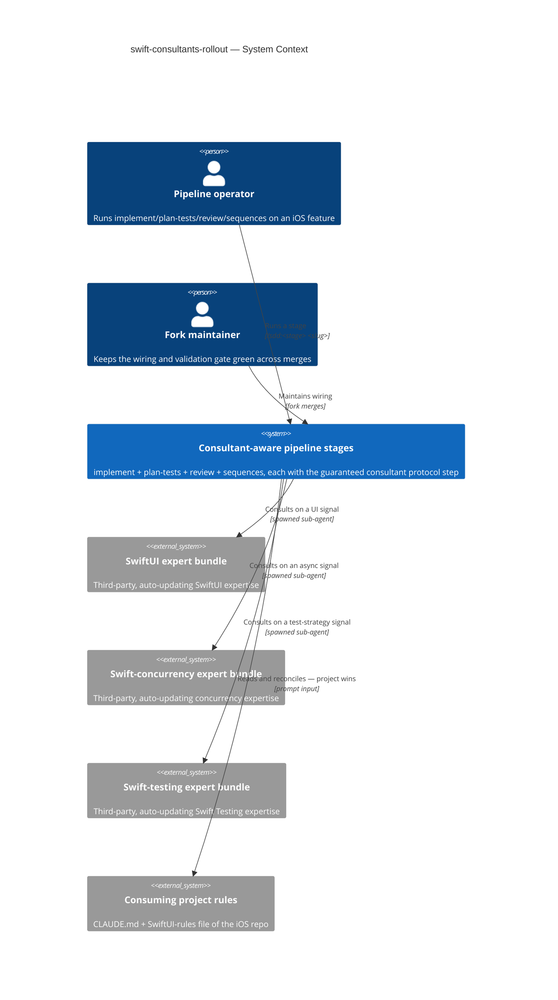
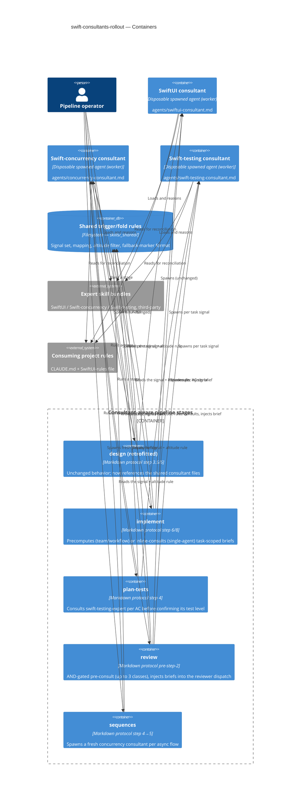
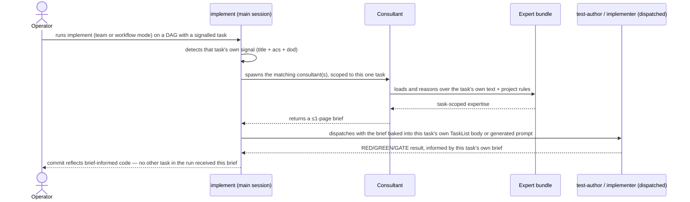
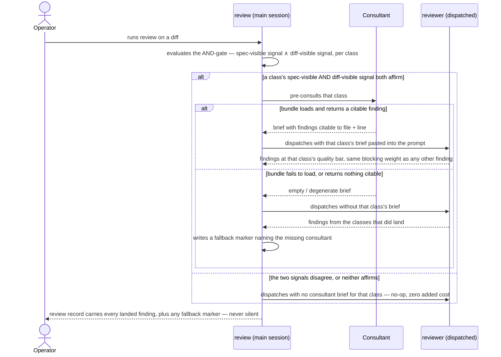
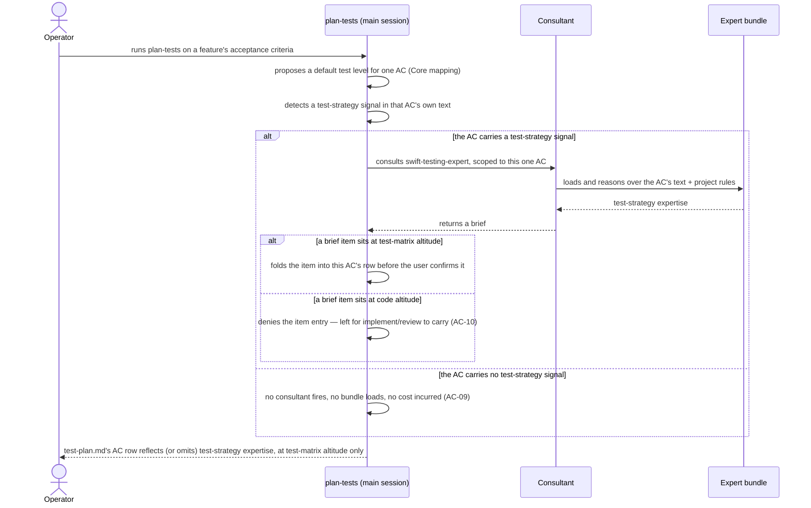
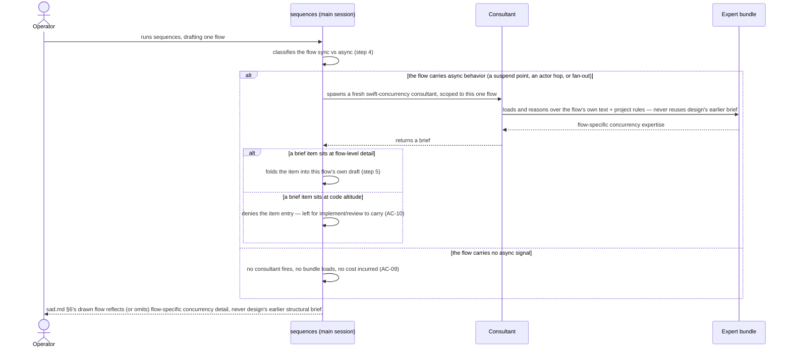
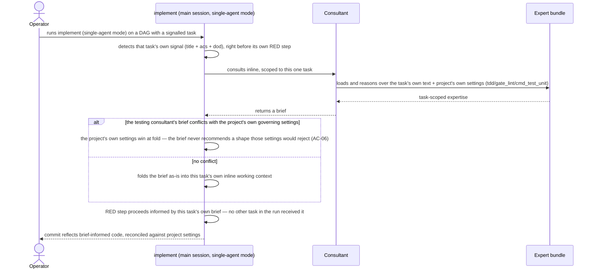

# Software Architecture Document — swift-consultants-rollout

<!-- 12 Arc42 sections. Empty section → <!-- N/A: <one-line reason> -->. -->
<!-- C4 Context (L1) lives inline in §3. C4 Container (L2) lives inline in §5. -->
<!-- Numbers in §10 come VERBATIM from spec.md §6 NFR — no inventing, no rounding. -->

## 1. Introduction and goals

**Intent.** Extend the proven **expert-consultant** pattern (a disposable sub-agent loads a heavy third-party Swift-domain skill bundle, returns a ≤1-page brief, the main session altitude-filters it into the artifact) from the one stage it shipped on (`design`) to four more — `implement` (all 3 execution modes), `plan-tests` (a new third consultant class, `swift-testing-expert`), `review` (all three consultant classes via pre-consult injection), `sequences` (a fresh concurrency-consultant spawn) — as the same guaranteed, non-skippable protocol step `design` already has, so SwiftUI/concurrency/testing expertise reaches every stage that ships or tests actual Swift code, not just the architecture document.

**Top-3 quality goals (1-liners; full scenarios in §10):**

1. **Deterministic spawn** — the consultant(s) fire on 100% of runs where that stage's own trigger signal is present, including every signalled consultant firing together (e.g. `review` firing all three at once).
2. **Fallback marker visibility** — 100% of expected-but-didn't-fire cases surface a visible marker on that stage's own output surface, dual-placed (artifact + handoff), and the stage never blocks.
3. **Altitude-correct fold per stage** — a consultant's brief enters the artifact only at the altitude that stage owns (test-matrix shape for `plan-tests`, flow-specific detail for `sequences`, quality-bar findings for `review`, full code for `implement`) — not "bounded cost": spec §3 explicitly leaves token cost uncapped (accepted; monitored via the per-run token-usage log, spec §6, with `review`'s worst case additionally watched by the §7 KPI).

**Stakeholders.**

| Role | Interest | Sign-off owner? |
|---|---|---|
| Pipeline operator | Runs `implement` / `plan-tests` / `review` / `sequences`; consumes the iOS-aware output from one command per stage | No |
| Fork maintainer | Keeps the wiring + the deterministic validation gate green across upstream merges; owns every §8 open question | No |
| Tech Lead | SAD approval | Yes |

<!-- Decision overrides (¶4) — populated by the critic resolution loop, empty otherwise. -->

## 2. Constraints

**Technical.**
- TypeScript 5.5 on Bun (server) + markdown skill definitions (architecture-map §Stack) — this feature is **markdown-only**: edits confined to `skills/implement/`, `skills/plan-tests/`, `skills/review/`, `skills/sequences/` plus three new consultant definition files under `agents/` (§4/§5). No production code, no server change.
- **No datastore, no migrations** — all state is files under `docs/`; unchanged from the repo baseline.
- Expert skill bundles (`swiftui-expert`, `swift-concurrency`, `swift-testing-expert`) stay **third-party, auto-updating, un-forked** (spec §3, §6.1) — the same contract `design-swift-consultants` already accepted.
- Each consultant runs as a **disposable, clean-isolated sub-agent**; its only channel back is the ≤1-page brief text (unchanged from the shipped precedent).

**Organisational.**
- Effort: L feature, `full` route (`.size` / `.route`).
- One **Fork maintainer** — frequently the same human as the Pipeline operator, but a distinct responsibility (owns every §8 open question + the merge-drift risk in §11).

**Conventions.**
- Skill structure: YAML frontmatter (name/model/effort/agents/description) + numbered markdown protocol + `templates/` + `references/` (architecture-map §Conventions).
- Handoff: every stage ends with the 3-part block — `skills/_shared/handoff.md`.
- **Plugin validation gate:** `scripts/validate_plugin.py` must stay green; manifests kept in lockstep at `1.16.0`.
- **A sharpened version of `design-swift-consultants`' own invariant (ADR-0003 there):** this feature is the first to add real consultant definition files under `agents/` (§4/§5) — but those files are referenced **only in prose** (`subagent_type: "<consultant-name>"` with a `general-purpose` fallback), **never** added to any skill's `agents:` frontmatter list. `validate_plugin.py` only checks that every name *in* `agents:` has a file — it has no reverse check for a stray unreferenced file — so keeping every consultant out of every `agents:` list is the actual, load-bearing guard.

**Regulatory / external.**
- Internal developer tooling; no personal data, no new authZ/authN boundary (spec §6.1) → security review **N/A**.
- Bundle-trust is an **accepted supply-chain surface**: the expert bundles stay auto-updating and un-forked; a wrong/outdated bundle is mitigated by project-rules-win (AC-06) + the independent `review` pass itself, not by pinning — unchanged from the precedent.

## 3. Context and scope

Four SDD pipeline stages — `implement`, `plan-tests`, `review`, `sequences` — currently produce stack-agnostic output with no iOS awareness, the same gap `design` had before `design-swift-consultants` closed it for one stage. This feature wires the same guaranteed consultant step into all four, so SwiftUI/concurrency/testing expertise reaches `implement`'s generated code, `plan-tests`' AC→test map, `review`'s quality bar, and `sequences`' async-flow detail — with the consuming project's rules winning at fold and a visible marker whenever an expected consultation didn't land.

**Trust boundary.** Each consultant runs **locally, in clean isolated context**, and sees only its own scope for that stage (the task's own text for `implement`, the AC being mapped for `plan-tests`, the diff signal for `review`, the flow being drafted for `sequences`) plus the project rules passed into its prompt. Bundle *content* is trusted (an accepted supply-chain surface, §2); the *brief* it returns is untrusted at the altitude level — every item is re-gated by that stage's own altitude filter before it may enter that stage's artifact.

<!-- brownfield: confirmed directly against the shipped `design-swift-consultants` code (not the stale architecture-map, which predates it by 21 commits) — skills/design/SKILL.md:48 (step 3.5, consultant spawn) and :52 (step 6, altitude fold), skills/design/references/consultant-trigger.md (signal set + mapping), skills/design/references/consultant-fold.md (altitude filter + fallback-marker format). This feature extends that exact mechanism into skills/implement/, skills/plan-tests/, skills/review/, skills/sequences/. -->

**External systems (in / out):**

| Actor or system | Type | Interaction |
|---|---|---|
| Pipeline operator | Person | Runs `/sdd:implement`, `/sdd:plan-tests`, `/sdd:review`, `/sdd:sequences`; reads the iOS-aware output |
| Fork maintainer | Person | Maintains the wiring; keeps `validate_plugin.py` green across merges |
| SwiftUI expert bundle | System (external) | Loaded by a consultant on a UI signal; returns SwiftUI expertise at the calling stage's altitude |
| Swift-concurrency expert bundle | System (external) | Loaded by a consultant on an async signal; returns concurrency expertise at the calling stage's altitude |
| Swift-testing expert bundle | System (external) | Loaded by the new testing consultant on a test-strategy signal (first introduced in this feature, at `plan-tests`) |
| Consuming project rules | System (external) | `CLAUDE.md` + any dedicated SwiftUI-rules file, passed into each consultant's prompt; project wins at fold |

**C4 Context (L1):**



## 4. Solution strategy

**Target surface (decided first).** `target_surfaces: [worker]` (frontmatter). Reaffirms the same choice `design-swift-consultants` made: every consultant added by this rollout is the same disposable, request/response-less spawned job — no new UI/CLI/HTTP surface. A repeat of an already-accepted, non-irreversible choice, not a new blast-radius decision.

**Top strategic choices (the ADR seeds):**

1. **Hybrid task-scoped pre-consult for `implement` (ADR-0001).** Team and workflow modes precompute each signalled task's brief in step 6 — the *only* technically viable point, since `test-author`/`implementer` sub-agents and `Workflow` scripts cannot self-consult (they lack `Skill`, and a sub-agent cannot spawn a sub-agent). Single-agent mode consults inline, right before each task's own RED step, mirroring `design`'s own idiom. No task ever receives a brief scoped to a different task (AC-02).
2. **Pre-consult injection for sub-agent-only stages (ADR-0002).** `review`'s `reviewer` and `implement`'s team/workflow workers cannot spawn a consultant themselves, so the main session consults first and pastes the brief text into their dispatch prompt — `reviewer`/`test-author`/`implementer` stay completely unedited (spec §3 non-goal 7), keeping the fork's merge surface on those three files at zero.
3. **Dedicated consultant agent files in the fork's own `agents/`, `design` retrofitted to match (ADR-0003).** Three new files — `agents/swiftui-consultant.md`, `agents/concurrency-consultant.md`, `agents/swift-testing-consultant.md` — become the single source for each consultant's prompt, altitude-filter wording, and project-rules-win instruction, read by all five stages (including `design`, retrofitted from its current ad-hoc prose). Dispatched by name in prose (`subagent_type: "<name>"`, `general-purpose` fallback) — **never** added to any skill's `agents:` frontmatter, or `validate_plugin.py` fails (AC-04).
4. **Shared, three-class consultant-trigger/fold (ADR-0004).** `consultant-trigger.md` and `consultant-fold.md` move from `skills/design/references/` to `skills/_shared/`, extended with a third signal class (test-strategy → `swift-testing-expert`) and a per-stage table of what text each stage runs detection against (`design`: spec prose; `implement`: task text; `plan-tests`: the AC being mapped; `review`: the diff, see seed 5; `sequences`: the flow being drafted). The ≤2-per-run cap becomes ≤3-per-run, still structural (one consultant instance per class, no counter).
5. **`review`'s diff trigger: an AND-gate between spec-visible and diff-visible signal (ADR-0005).** Resolves spec §8's open question directly: a consultant class fires only when the shared spec-prose signal (reused verbatim from `design`'s own mechanism) **and** a diff-visible signal (the same keyword set matched against the diff's added `.swift` lines, plus a second model-inference pass over the diff's code) both affirm it. Targets ≤10% false-fire on a manual sample of non-UI/non-async diffs — the previously-`TBD` NFR row. Accepted cost: a feature that scope-crept into UI/async territory without the spec ever saying so will not trigger the matching consultant (§11 risk).
6. **`plan-tests` and `sequences` each add exactly one new consultant class, not three.** `plan-tests` step 4 (Core mapping) consults `swift-testing-expert` only, right after proposing each AC's default test level and before the user confirms it — per spec's own scope ("introducing *a* third consultant class"), not the older SDD-FORK-PLAN draft that proposed all three there. `sequences` spawns a **fresh** `swift-concurrency` consultant only, between step 4 (Sync vs async classification) and step 5 (Draft each flow) — never reusing `design`'s earlier brief (accepted duplicate spend, spec §3 non-goal 4).

Each tactical decision in later sections traces to one of these six seeds. A tactical decision that contradicts one is a red flag — surface it in §11.

## 5. Building block view

**Style: extend five existing skills + add three worker-shaped agent definitions, following the repo's markdown-protocol convention.** This is not a new skill (a separate skill could not be a guaranteed step *of* `implement`/`plan-tests`/`review`/`sequences`) — it is a protocol-step addition to five `SKILL.md` files, plus three new files under the fork's own `agents/`, plus two files relocated + extended under `skills/_shared/` (ADR-0003, ADR-0004). The only new runnable unit type is the consultant (the `worker` surface) — already established by `design-swift-consultants`, now backed by dedicated files instead of ad-hoc prose.

**Internal decomposition:**

```
agents/
├── swiftui-consultant.md            # NEW — dedicated definition (ADR-0003), read by all 5 stages
├── concurrency-consultant.md        # NEW — same
└── swift-testing-consultant.md      # NEW — same, the third consultant class

skills/_shared/
├── consultant-trigger.md            # MOVED from skills/design/references/ (ADR-0004); +test-strategy class,
│                                     #   +per-stage "what text this stage detects against" table
└── consultant-fold.md               # MOVED; altitude filter (reused blast-radius gate) + fallback-marker
                                      #   format — rule unchanged, now shared by 5 stages

skills/design/
└── SKILL.md                         # retrofitted: step 3.5 references agents/swiftui-consultant.md +
                                      #   agents/concurrency-consultant.md instead of inline prose (ADR-0003);
                                      #   references repointed to ../_shared/consultant-{trigger,fold}.md

skills/implement/
├── SKILL.md                         # +delta at step 6: precompute task-scoped briefs for team/workflow (ADR-0001)
├── references/team-exec.md          # +delta: each task's own brief goes into its own TaskList body
├── references/workflow-exec.md      # +delta: generated redPrompt(t) includes that task's own consultant_brief
└── references/tdd-loop.md           # +delta: single-agent SELECT/RED consults inline (ADR-0001, AC-06)

skills/plan-tests/
└── SKILL.md                         # +delta at step 4: swift-testing-consultant, one class only (seed 6)

skills/review/
└── SKILL.md                         # +delta before step 2: pre-consult (up to 3 classes, AND-gated per
                                      #   ADR-0005) + inject into the reviewer's dispatch prompt (ADR-0002)

skills/sequences/
└── SKILL.md                         # +delta between step 4 and step 5: fresh concurrency-consultant only (seed 6)
```

- **Consultant agent files** (`agents/*-consultant.md`) — disposable, `worker`-shaped; dispatched by prose name (`subagent_type: "<name>"`, `general-purpose` fallback), never in any skill's `agents:` frontmatter. Each carries its own prompt template, the altitude-filter wording for *that stage's own altitude* (structural for `design`, test-matrix for `plan-tests`, quality-bar for `review`, full-code for `implement`, flow-detail for `sequences`), and the project-rules-win instruction.
- **Shared trigger/fold** (`skills/_shared/consultant-{trigger,fold}.md`) — the three-class signal set + mapping + ≤3-per-run cap, the altitude filter (reuses each stage's own blast-radius-equivalent gate), project-rules-win reconciliation, and the fallback-marker text template, read by all five stages.
- **Per-stage protocol deltas** — each stage's own `SKILL.md` gets the minimal addition needed to (a) detect its own signal against its own text (task/AC/diff/flow — never re-reading `spec.md` prose the way `design` does, except `review`'s AND-gate, which reads both), (b) spawn/pre-consult the matching consultant(s), (c) fold the brief at that stage's own altitude, (d) write the fallback marker on its own output surface when expected-but-missing.

**C4 Container (L2):**



## 6. Runtime view

**Critical flow 1: implement's hybrid task-scoped pre-consult, team/workflow mode (happy path, AC-02)**



**Critical flow 2: review's AND-gated trigger, pre-consult, and fallback (AC-03, AC-05, AC-07, AC-09)**



**Critical flow 3: plan-tests' single-class consult, altitude filter, and no-signal case (AC-01, AC-09, AC-10)**



**Critical flow 4: sequences' fresh concurrency spawn, altitude filter, and no-signal case (AC-08, AC-09, AC-10)**



**Critical flow 5: implement's single-agent inline consult with settings reconciliation (AC-02 single-agent path, AC-06)**



**Cross-cutting: review's altitude filter denies a structural-level item (AC-10b)**

```mermaid
sequenceDiagram
    actor Operator
    participant Review as review (main session)
    participant Reviewer as reviewer (dispatched)
    Operator->>Review: runs review on a diff (a consultant class has already pre-consulted, per flow 2)
    Review->>Reviewer: dispatches with a class's brief pasted into the prompt
    Reviewer->>Reviewer: reads a brief item that sits above review's own quality-bar altitude (a structural/architectural decision)
    Reviewer->>Reviewer: denies the item entry as a finding — not cited to a file and line (AC-10b)
    Reviewer-->>Review: findings stay at quality-bar altitude only; the denied item is left for design to carry instead
    Review-->>Operator: review record carries no structural-altitude finding
```

Coverage note: AC-04/US-06 (consultant definitions live in the fork's own `agents/`, resolve identically wherever installed, and are excluded from every skill's `agents:` roster) is a static, build-time/plugin-validation property — not a runtime flow. <!-- N/A: AC-04/US-06 verified by scripts/validate_plugin.py at merge time, not by a request/response flow (§2 Constraints, ADR-0003) -->


## 7. Deployment view

<!-- N/A: markdown-only skill edits inside the existing SDD plugin — no server, replica, or datastore to deploy. -->

The only operational envelope is the **per-run token / latency budget across five stages**, monitor-only per spec §6 (none of the rows below block a run):

- **Token cost:** ≤ ~40k per triggered `plan-tests`/`sequences` run (one consultant), ≤ ~40k per triggered `implement` task, up to ~120k worst case on `review` (3 consultants, AND-gated, no cap).
- **Latency:** `design`'s consultant(s) still run concurrently with its step-3 explorer (unchanged). Every other stage's pre-consult is **sequential**, not concurrent (ADR-0002) — `review` and `implement` team/workflow modes pay one consultant call's latency before dispatching their sub-agent/worker, since none of those has an equivalent parallel step to hide behind.
- **Watched by:** the Review gate churn KPI (spec §7) — if `review`'s uncapped worst case starts driving operators to skip/downgrade/bypass review, that's the trigger to revisit the no-cap policy (spec §8 OQ 2).

## 8. Crosscutting concepts

| Concept | Convention | Where defined |
|---|---|---|
| Failure handling | Graceful fallback + dual visible marker (that stage's own artifact + its handoff); never a hard gate | ADR-0004, §4, spec §6 |
| Content admission (altitude) | Each stage filters an admitted brief item to *its own* altitude — structural (`design`), test-matrix (`plan-tests`), quality-bar (`review`), full-code (`implement`), flow-detail (`sequences`); never another stage's altitude | AC-10, AC-10b, §4, §5 |
| Rule reconciliation | Project-rules-win at fold — the consultant is never trusted to have honoured passed-in rules on its own | AC-06, unchanged from `design-swift-consultants` |
| Consultant dispatch pattern | Concurrent with the step-3 explorer only at `design` (unchanged); every other stage's pre-consult is sequential, ahead of its own dispatch/execution | ADR-0001, ADR-0002, §6 |
| Cost / observability | Token-usage log per stage per run (spec §6); `review`'s worst case additionally watched by the gate-churn KPI (spec §7) | spec §6 NFR, §7 KPI, §10 |
| Determinism boundary | The *spawn* is deterministic per stage (`review`'s AND-gate; keyword+model-inference elsewhere); the consultant's own reasoning stays model-driven everywhere | ADR-0005, unchanged determinism split from ADR-0001 in `design-swift-consultants` |
| Plugin-validation invariant | Three new `agents/*-consultant.md` files exist but are referenced only in prose — never added to any skill's `agents:` frontmatter | ADR-0003, AC-04 |
| Artifact language | Every stage's own artifact (task commit message, `test-plan.md`, review record, `sad.md` §6) follows `artifact_language`; headings + machine tokens stay English | `_shared/artifact-language.md` |
| ID strategy / persistence | N/A — no datastore, no IDs; each stage's own existing artifact file is the only state touched | architecture-map §Datastores |
| Internationalisation | N/A — single-language tooling output (per `artifact_language`) | — |

## 9. Architecture decisions

| # | Title | Status | Section |
|---|---|---|---|
| 0001 | Precompute task-scoped consultant briefs for team/workflow modes, consult inline for single-agent | Accepted | §4 |
| 0002 | Pre-consult from the main session and paste the brief into the sub-agent's dispatch prompt | Accepted | §4 |
| 0003 | Ship dedicated consultant agent files in the fork's own `agents/`, retrofit `design` to reference them | Accepted | §4, §5 |
| 0004 | Move consultant-trigger and consultant-fold to `skills/_shared/`, extend to a third signal class | Accepted | §4, §5 |
| 0005 | Fire a review consultant only when spec-visible AND diff-visible signal agree | Accepted | §4, §6, §10 |

ADR files live under `docs/features/<slug>/adr/NNNN-<title>.md`.

## 10. Quality requirements

Each top-3 goal from §1 expanded into a full scenario:

**QG-1. Deterministic spawn**
- **When:** a stage's own trigger signal is present — the task's own text (`implement`), the AC being mapped (`plan-tests`), the flow being drafted (`sequences`), or `review`'s AND-gate (spec-visible ∧ diff-visible).
- **Then:** the matching consultant(s) fire on **100% of runs where that stage's own trigger signal is present**, including every signalled consultant when more than one fires together (e.g. `review` firing all three at once) (spec §6 NFR). `review`'s own AND-gate additionally holds **≤10% false-fire rate** on a manual sample of non-UI/non-async diffs (ADR-0005 — the previously-`TBD` NFR row, now fixed).
- **How verify:** eval / manual over fixture specs, tasks, ACs, and diffs, per stage (spec §6 measurement); `review`'s ceiling verified by a manual sample of non-UI/non-async diffs post-wiring (spec §6 measurement).

**QG-2. Fallback marker visibility**
- **When:** an expected consultant cannot be consulted (bundle unavailable), or fires but returns a degenerate brief — stage-relative: no structural/test-matrix/flow decision survives the altitude filter for `design`/`plan-tests`/`sequences`/`implement`, or zero findings citable to a file and line for `review`.
- **Then:** **100% of expected-but-didn't-fire (or empty-brief) cases surface a visible marker** on that stage's own output surface, dual-placed (the artifact + the handoff or review record), and the stage **never blocks** (spec §6 NFR).
- **How verify:** bundle-unavailable fixture run per stage (spec §6 measurement).

**QG-3. Altitude-correct fold; monitor-only per-stage token cost**
- **When:** a consultant brief is folded into a stage's own artifact.
- **Then:** only items at that stage's own altitude are admitted (AC-10, AC-10b) — a code-level item is denied entry to `plan-tests`/`sequences`, a structural item is denied entry to `review` as a citable finding. Token cost stays **≤ ~40k tokens** per triggered `plan-tests` run, per triggered `sequences` run, and per triggered `implement` task; **up to ~120k tokens worst case** on `review` (3 consultants × ~40k, no cap) — spec §6 NFR verbatim. All four cost rows are **monitor-only**; none blocks a run on its own (spec §3 non-goal 3).
- **How verify:** manual inspection of each folded item's altitude, per stage; token-usage log per run (spec §6 measurement).

## 11. Risks and technical debt

<!-- Severity literals: Low / Medium / High for regular risks; "Open question" for rows created by
     a Save-as-OQ resolution during the Socratic walk (see references/socratic.md). -->

**Two of spec §8's open questions close in this design pass** (their own stated due condition — "before this feature's own design stage finalizes the four stages' wiring" — is now):

- **`plan-tests`' and `sequences`' own fallback-marker surface (spec §8 OQ):** `plan-tests` writes the marker as an HTML comment adjacent to the AC→test coverage table in `test-plan.md` (or the inline `## Test plan` section for XS/S); `sequences` writes it exactly as `design` already does — an HTML comment in `sad.md` §6 next to the relevant flow. Both reuse `consultant-fold.md`'s existing wording template, mirroring `review`'s dual-placement pattern (AC-02 in spec §8's framing).
- **Testing consultant's reconciliation channel against `.claude/sdd.local.md` (spec §8 OQ):** the `tdd` / `gate_lint` / `cmd_test_unit` settings are passed into the consultant's prompt as project rules, the same channel `CLAUDE.md` already uses (spec's own stated default) — this simply widens what "project rules" means for `implement`'s project-rules-win reconciliation (ADR-0002), not a new mechanism.

| Risk / debt | Severity | Mitigation | Owner |
|---|---|---|---|
| Wrong / outdated bundle version injects confident-but-bad advice into any of the 5 stages' output | Medium | Project-rules-win reconciliation (ADR-0002/0004) + the independent `review` pass itself; mitigation is limited (no bundle pinning), unchanged from `design-swift-consultants` | Fork maintainer |
| Enlarged merge surface: 5 `SKILL.md` edits (`design` retrofitted + 4 new) + 3 new `agents/*-consultant.md` files + 2 relocated `_shared/` files raises upstream-merge-conflict odds on the next SDD release | Medium | Every consultant file stays out of every `agents:` frontmatter (ADR-0003); `validate_plugin.py` run before each merge; changes isolated to markdown, no server touched | Fork maintainer |
| `review`'s AND-gate accepts a false-negative: a diff that scope-crept into UI/async/test-strategy territory the spec never mentioned won't trigger the matching consultant (ADR-0005) | Low | Independent `review` pass still runs its own quality-bar check without the consultant's brief; the false-negative only removes the *consultant-informed* layer, not the review itself | Pipeline operator |
| `implement` team/workflow batch-precomputes a brief for every signalled task at step 6 — a task later dropped/blocked still spent its consultant call (ADR-0001) | Low | Accepted; the alternative (lazy per-task consult) is technically infeasible for these two modes (ADR-0001) | Fork maintainer |
| Redundant spawn: `sequences` always re-consults concurrency fresh, even when `design` already spent one on the same feature | Low | Accepted, unchanged from spec §3 non-goal 4 — deduping is a later optimization (OQ below) | Fork maintainer |
| Open architectural decision: revisit the no-cap policy on `review`/`implement` consultant cost if the Review gate churn KPI (spec §7) actually rises | Open question | Resolve after the first 5 post-wiring `review` runs; default now: no cap, monitor only | Fork maintainer |
| Open architectural decision: dedupe or cache the concurrency-expert bundle load across `design` → `sequences` on the same feature | Open question | Resolve in a later optimization pass, not this rollout; default now: pay for both spawns independently | Fork maintainer |
| Open architectural decision: exact surface for `implement`'s own fallback marker (a per-task stage-handoff line vs a `tracker.md` column) | Open question | Resolve before `implement`'s testing-consultant wiring is implemented; default now: a per-task line in the stage-handoff's *What I did* | Fork maintainer |

**Accepted debt (acceptable in v1, plan to fix later):**
- **Bundle-trust supply-chain surface** — the expert bundles stay auto-updating and un-forked; a compromised/outdated bundle is an accepted risk mitigated only by project-rules-win + the independent review pass, unchanged from `design-swift-consultants`.
- **No bundle-load dedupe** between `design` and `sequences` — only the structural ≤3-per-run cap per stage; deduping repeated bundle loads across stages is deferred (OQ above).
- **Sequential, not concurrent, pre-consult latency** on `review` and `implement` team/workflow (ADR-0002) — unlike `design`'s step 3.5, these stages pay one consultant call's latency before dispatching, since none has an equivalent parallel step to hide behind; accepted per spec's uncapped-cost NFR.

## 12. Glossary

Canonical definitions live in [`../../../CONTEXT.md`](../../../CONTEXT.md) `## Glossary` (repo-root — no feature-scoped `CONTEXT.md` exists for this feature, per spec §1's traceability note). The terms used across this SAD:

| Term | Meaning |
|---|---|
| Pipeline operator | The engineer who runs an SDD stage command on the forked pipeline; the human whose one command should yield iOS-aware output. |
| Fork maintainer | Owns the SDD fork's wiring — merges each upstream release, keeps the deterministic validation gate green. |
| Expert consultant | A disposable sub-agent that loads a third-party expert bundle, reasons over the feature (or its own narrower scope — a task, an AC, a diff, a flow), and returns a ≤1-page brief. |
| Expert skill bundle | A third-party SwiftUI / Swift-concurrency / Swift-testing knowledge skill invoked by a consultant; auto-updating, un-forked. |
| Trigger signal | A signal read from that stage's own text (spec prose for `design`; task text for `implement`; the AC for `plan-tests`; the diff for `review`; the flow for `sequences`) that decides whether — and which — consultant fires. |
| Structural altitude | The SAD §4/§5 level at which a decision is expensive to reverse — one of five per-stage altitudes this feature now spans (structural / test-matrix / quality-bar / full-code / flow-detail). |
| Blast-radius gate | The criterion classifying a decision as structural-altitude; reused by every stage's own altitude filter. |
| Altitude filter | The rule that a consultant's brief may enter an artifact only at *that stage's own* altitude — never another stage's. |
| Observable trace | A detectable manifestation that a consultant fired and its brief was folded in, at each stage's own altitude. |
| Fallback marker | A visible note, on that stage's own output surface, that a consultant was expected but did not fire or returned a degenerate brief — dual-placed (artifact + handoff/review record), never silent. |
| Project rules | The consuming repo's own conventions passed into a consultant's prompt — `CLAUDE.md` + any dedicated rules file, and (for the testing consultant) `.claude/sdd.local.md`'s `tdd`/`gate_lint`/`cmd_test_unit` settings. Project rules win at fold. |
| Pre-consult injection | The wiring pattern for a sub-agent-only stage (`review`; `implement` team/workflow): the main session spawns the consultant and pastes the resulting brief into the sub-agent's own dispatch prompt, before dispatch. |
| Sub-agent-only stage | An SDD stage whose work runs entirely inside a restricted sub-agent dispatch, with no main-session step of its own to host a consultant spawn — requires pre-consult injection. |
| **Task-scoped brief** *(new this feature)* | A consultant brief computed specifically for one dispatched task — never one brief generically shared across every worker in a run (US-02). |
| **Consultant class** *(new this feature)* | The taxonomy unit a consultant belongs to — SwiftUI / Swift-concurrency / Swift-testing; now three, up from `design-swift-consultants`' two. |
| **AND-gate** *(new this feature)* | `review`'s own trigger discriminator: a consultant class fires only when its spec-visible signal *and* its diff-visible signal both affirm it (ADR-0005) — never either alone. |

New terms (bolded above) are not yet in root `CONTEXT.md` — flagged for a `/sdd:glossary` follow-up rather than promoted silently here.
