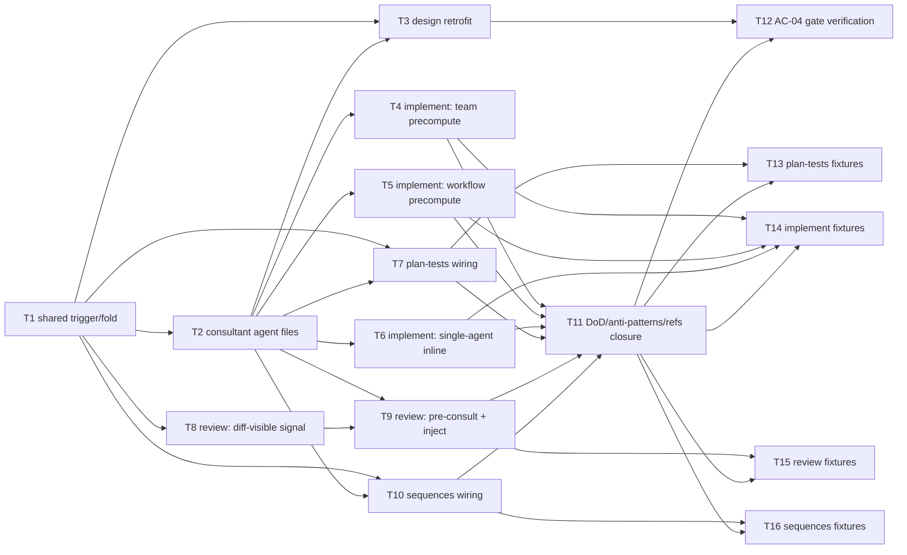

# Epic — swift-consultants-rollout

> **Spec:** [spec.md](../spec.md) · **Design:** [sad.md](../sad.md) · **ADRs:** [adr/](../adr/)

## Goal

Extend the proven expert-consultant pattern (`design-swift-consultants`) from the one stage it shipped on to four more — `implement` (all 3 execution modes), `plan-tests` (new `swift-testing-expert` class), `review` (all 3 classes via pre-consult injection, AND-gated trigger), `sequences` (a fresh concurrency spawn) — as the same guaranteed, non-skippable protocol step `design` already has (spec §2 Goals).

## Scope

- **In:** relocating + extending `consultant-trigger.md`/`consultant-fold.md` to `skills/_shared/`; three new `agents/*-consultant.md` files; `design`'s retrofit to reference them; protocol deltas in `skills/implement/`, `skills/plan-tests/`, `skills/review/`, `skills/sequences/`; the AC-04 plugin-validation-gate check; fixture verification per stage.
- **Out (spec §3 non-goals):** wiring `survey`/`specify`/`clarify`/`api`/`ship`/`tasks`/`data-model`; designing `review`'s trigger *mechanism* beyond ADR-0005's AND-gate (already fixed by this feature's own design pass); capping consultant count/cost; deduping the concurrency-bundle load between `design` and `sequences`; bundle-version pinning; editing the AvdLee bundles themselves; altering `reviewer`/`test-author`/`implementer` beyond the pasted brief.

## Task map

## Tasks

See [tracker.md](./tracker.md) for status. Machine contract: [tasks.json](../tasks.json).

| # | Task | Layer | Blocked by | DoD (short) |
|---|---|---|---|---|
| T1 | Relocate + extend consultant-trigger.md / consultant-fold.md to `_shared/` | infra | — | 3-class signal table + per-stage detection-text table live under `skills/_shared/` |
| T2 | Write the 3 dedicated consultant agent files | domain | T1 | `agents/swiftui-consultant.md`, `concurrency-consultant.md`, `swift-testing-consultant.md` exist, prose-dispatched only |
| T3 | Retrofit `design` to reference the shared files + agent files | app | T1, T2 | `design`'s step 3.5/6 behavior unchanged; references repointed |
| T4 | `implement`: team-mode task-scoped precompute | app | T2 | each signalled task's own brief lands in its own TaskList body |
| T5 | `implement`: workflow-mode task-scoped precompute | app | T2 | generated `redPrompt(t)` carries that task's own `consultant_brief` |
| T6 | `implement`: single-agent inline consult + settings reconciliation | app | T2 | inline consult before RED; project's own settings win on conflict (AC-06) |
| T7 | `plan-tests`: swift-testing-consultant wiring at step 4 | app | T1, T2 | AC row folds only test-matrix-altitude items; marker in `test-plan.md` on miss |
| T8 | `review`: diff-visible signal detection (ADR-0005) | app | T1 | keyword+model-inference pass over added `.swift` diff lines, per class |
| T9 | `review`: AND-gated pre-consult + dispatch injection + fallback marker | app | T2, T8 | brief pasted into `reviewer`'s prompt; marker in review record on miss/degenerate |
| T10 | `sequences`: fresh concurrency-consultant spawn | app | T1, T2 | fresh spawn between step 4/5; marker in `sad.md` §6 on miss |
| T11 | Close DoD/anti-patterns/References across the 4 stages | docs | T4, T5, T6, T7, T9, T10 | each `SKILL.md` documents the new wiring, citing the AC/ADR |
| T12 | Verify AC-04 — plugin-validation roster invariant, all 5 stages | tests | T3, T11 | `validate_plugin.py` green; a throwaway roster violation demonstrably fails it |
| T13 | Verify `plan-tests` fixtures (AC-01, AC-09, AC-10) | tests | T7, T11 | signal / no-signal / code-altitude-denied fixtures behave per AC |
| T14 | Verify `implement` fixtures (AC-02, AC-05, AC-06) | tests | T4, T5, T6, T11 | task-scoped brief across all 3 modes; settings-reconciliation fixture |
| T15 | Verify `review` fixtures (AC-03, AC-05, AC-07, AC-09, AC-10b) | tests | T9, T11 | AND-gate + injection + marker + structural-denial fixtures behave per AC |
| T16 | Verify `sequences` fixtures (AC-08, AC-09, AC-10) | tests | T10, T11 | fresh-spawn / no-signal / code-altitude-denied fixtures behave per AC |

**Total:** 16 tasks.

## Risks / Hard rules

- **AC-04 domain invariant (spec §5, ADR-0003, sad §2 Constraints):** none of the 3 consultant files may ever be added to any skill's `agents:` frontmatter — prose dispatch only. T2, T3, T4–T10, T12 must not violate this.
- **Non-blocking (spec §6 NFR, ADR-0004):** no task may turn a consultant failure into a hard gate — always graceful fallback + dual visible marker (artifact + handoff/review record).
- **No cap on consultant count/cost (spec §3 non-goal 3, §6 NFR):** T4–T10's spawn logic stays structural (one instance per signalled class) — never add a counter or a budget check.
- **`review`'s AND-gate (ADR-0005):** T8/T9 must require *both* spec-visible and diff-visible signal per class — never OR, never diff-only.
- **Zero edits to `agents/reviewer.md` / `test-author.md` / `implementer.md` (spec §3 non-goal 7, ADR-0002):** T4–T6, T9 inject the brief into the dispatch *prompt*, never into the agent definition files themselves.
