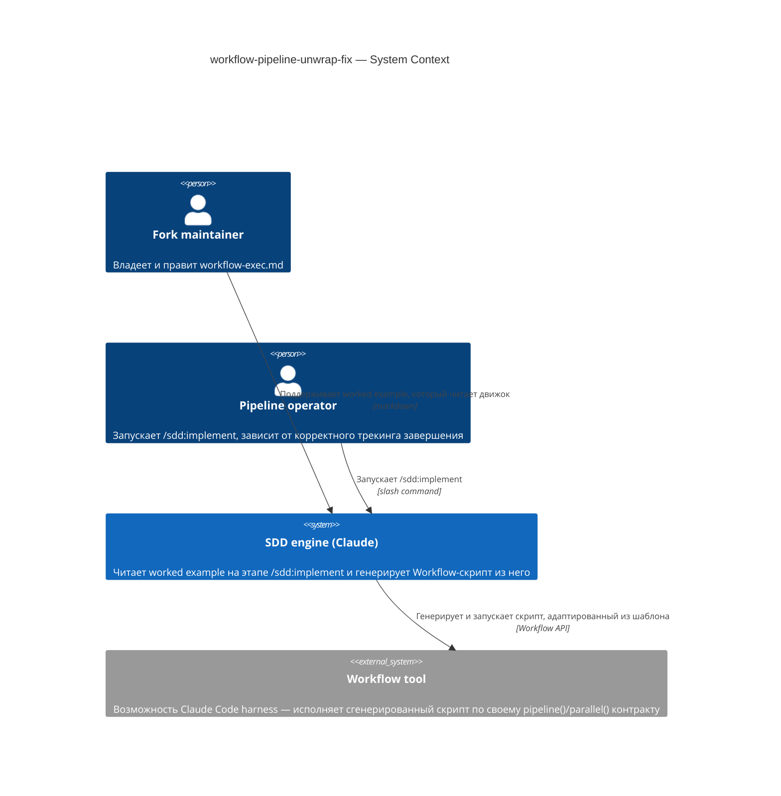
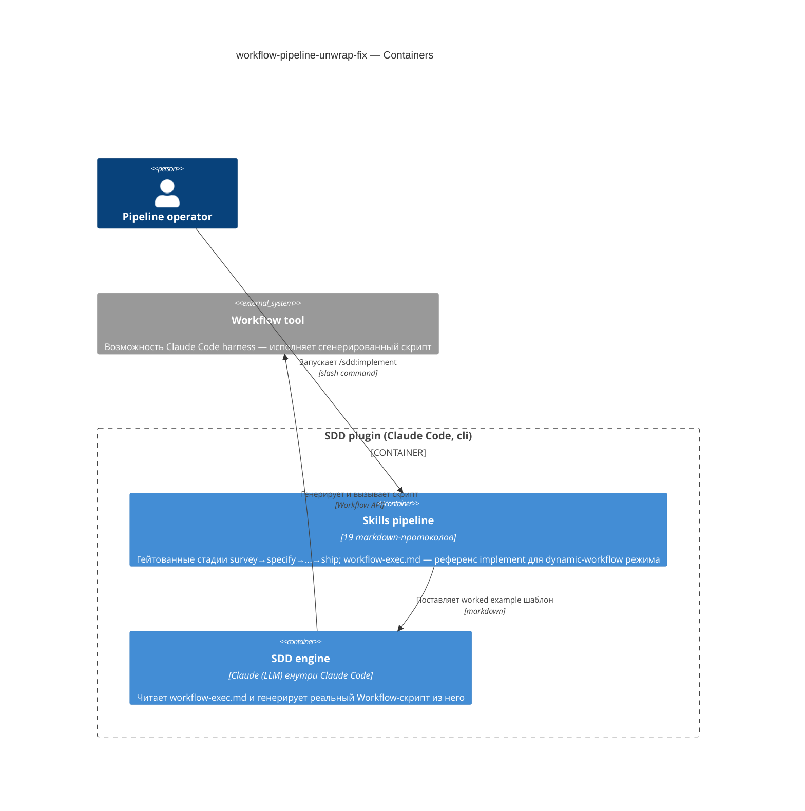

# Software Architecture Document — workflow-pipeline-unwrap-fix

<!-- 12 Arc42 sections. Empty section → <!-- N/A: <one-line reason> -->. -->
<!-- C4 Context (L1) lives inline in §3. C4 Container (L2) lives inline in §5. -->
<!-- Numbers in §10 come VERBATIM from spec.md §6 NFR — no inventing, no rounding. -->

## 1. Introduction and goals

**Intent.** Исправляем worked-example «Generated script shape» в `skills/implement/references/workflow-exec.md`: движок SDD (Claude на этапе `/sdd:implement`) читает этот пример и адаптирует его в реальный `Workflow`-скрипт всякий раз, когда DAG задач фичи маршрутизируется в dynamic-workflow режим. Сейчас пример неверно разворачивает результат `pipeline()` (всегда массив, даже для одного элемента) и проверяет поле (`gate_green`), которого нет на финальной стадии (`review` возвращает `REVIEW_VERDICT` с `ac_satisfied`), поэтому трекинг `done` молча никогда не срабатывает, а падение на позднем шаге агрегации уже реально ломало прод-прогон (`elf`, 13 задач, 2026-08-19). Фикс адресован Fork maintainer, который владеет этим шаблоном, и Pipeline operator, чей прогон `/sdd:implement` зависит от корректного трекинга завершения и безаварийного финального summary-шага.

**Top-3 quality goals (1-liners; full scenarios in §10):**

1. Корректность трекинга завершения — `done` отражает реальный вердикт финальной review-стадии, а не значение прочитанное с неверно развёрнутого массива.
2. Устойчивость к падению на позднем шаге агрегации — сброшенная задача остаётся безопасно `null`-совместимой с `filter(Boolean)`, а не бросает исключение при обращении к полю.
3. Предотвратимость повторного внесения бага — будущий автор (человек или движок), копирующий паттерн, предупреждён об инварианте «pipeline всегда массив» непосредственно в точке копирования.

**Stakeholders.**

| Role | Interest | Sign-off owner? |
|---|---|---|
| Fork maintainer | владеет `workflow-exec.md`, вносит и ревьюит фикс | Yes |
| Pipeline operator | запускает `/sdd:implement`, зависит от корректного трекинга завершения и безаварийного summary-шага | No |

<!-- Decision overrides (¶4) — populated by the critic resolution loop, empty otherwise. -->

## 2. Constraints

<!-- 🎯 Why: §4 strategy only works when §2 has fixed WHAT IS ALREADY FIXED — stack, versions,
     deadline, regulatory. This is an input, not an output.
     📋 Write: four blocks — Technical / Organisational / Conventions / Regulatory.
     📌 Pin versions («<datastore> 18», not «<datastore>»); «Q3 deadline — hard», not «ideally».
     Never N/A — every feature inherits at least Conventions + Technical. -->

**Technical.**
- Markdown-встроенный JavaScript внутри `skills/implement/references/workflow-exec.md`, исполняемый в песочнице инструмента `Workflow` (глобалы `agent()`/`parallel()`/`pipeline()`) — новый язык/рантайм не вводится.
- Датастор/фреймворк отсутствуют — правка ограничена одним markdown-файлом, без компилируемого кода.
- Архитектурная конвенция: правка обязана сохранить существующие схемы вердиктов `RED_VERDICT` / `GATE_VERDICT` / `REVIEW_VERDICT` и 4-стадийную форму `red → green → verify → review` из текущего файла — они не меняются, меняется только то, как их результат читается.

**Organisational.**
- Effort budget: XS — правка одного файла, без нового модуля; часы, не дни.
- Deadline: жёсткого срока нет (spec §1 не называет дедлайн); ship по готовности Fork maintainer.
- Team: Fork maintainer в одиночку.

**Conventions.**
- Глоссарий: корневой `CONTEXT.md` (роли `Fork maintainer`, `Pipeline operator`) — используется как есть, новых терминов не вводится.
- Null-propagation: сброшенная (dropped) задача пайплайна должна возвращать `null`-совместимый элемент массива (не `{t, res: null}`), чтобы `results.filter(Boolean)` ниже по цепочке продолжал работать как единственный контракт различения «сброшено» vs «дошло до review».

**Regulatory / external.**
- N/A — внутренняя инженерная документация; нет данных, нет границы авторизации, нет compliance-поверхности (spec §6.1).

## 3. Context and scope

<!-- 🎯 Why: draws the SYSTEM BOUNDARY — who talks to it from outside, where the trust zone ends.
     Without §3, §5 and §8 (authorization) blur — unclear what's «inside» vs «outside».
     📋 Write: 2–3 sentences of business context + an external-systems table + a C4Context block.
     📌 «External: none (deliberate, no third-party in v1)» is itself a decision worth stating.
     Trust boundary — the line past which you don't trust data without checking it.
     Never N/A — greenfield still draws the planned actors + external systems. -->

Этап `/sdd:implement` плагина SDD, когда DAG задач маршрутизируется в dynamic-workflow режим, заставляет движок (Claude) прочитать этот worked example и адаптировать его в реальный `Workflow`-скрипт. Сейчас пример неверно разворачивает результат `pipeline()` и проверяет несуществующее на финальной стадии поле, поэтому сгенерированный трекинг `done` не отражает реальность, а поздний шаг агрегации может упасть. Фикс правит именно этот worked example — так, чтобы каждый будущий сгенерированный скрипт (и любой hand-rolled вариант, который движок пишет на лету) получал форму верно.

<!-- brownfield: правка внутри существующего контейнера "Skills pipeline" (docs/architecture-map.md) — новый модуль не вводится; карта устарела (reflects_commit 632a262, 2026-07-17) относительно текущего HEAD, но фича не затрагивает код приложения, только один markdown-референс внутри уже описанного контейнера, поэтому повторное сканирование Explore не требуется -->

**External systems (in / out):**

| Actor or system | Type | Interaction |
|---|---|---|
| Fork maintainer | Person | правит и ревьюит `workflow-exec.md` |
| Pipeline operator | Person | запускает `/sdd:implement`, зависит от корректного трекинга завершения |
| SDD engine (Claude at `/sdd:implement` time) | System (internal) | читает worked example и генерирует/адаптирует реальный `Workflow`-скрипт из него |
| Workflow tool | System (internal, Claude Code harness) | исполняет сгенерированный скрипт по своему документированному контракту `pipeline()`/`parallel()`, который этот фикс обязан соблюдать |

**C4 Context (L1):**



## 4. Solution strategy

<!-- 🎯 Why: the 3–4 STRATEGIC PILLARS every ADR grows from. Without §4 each ADR looks random —
     there's no umbrella. ⭐ The densest section — the blast-radius gate fires almost always here
     (decisions are irreversible + multi-module).
     📋 Write: 3–4 choices; each a heading + 2–3 sentences of rationale.
     📌 «Store content as a table of typed blocks» is a pillar — ADR-0001 grows from it. -->

**Top strategic choices (the seeds for ADRs):**

1. **Target surface — `cli`.** Правка живёт внутри контейнера «Skills pipeline» (docs/architecture-map.md) — набора markdown-протоколов, вызываемых через slash-команды Claude Code, что и есть CLI-поверхность репозитория. Фикс не добавляет ни новой команды, ни флага, ни exit-кода — классификация лишь фиксирует, какой C4-контейнер владеет правленым артефактом. Решение самоочевидно обратимо (один файл, нет реальной альтернативной поверхности), поэтому blast-radius gate не сработал и ADR не порождается.
2. **Разворачивать одноэлементный массив в точке вызова, не менять контракт `pipeline()`.** `.then(([res]) => ...)` вместо переработки возвращаемой формы самого инструмента `Workflow` — это прямо исключено spec §3 non-goal 2 (переработка контракта `pipeline()`/`parallel()` меняла бы сам инструмент, а не этот шаблон).
3. **Авторизующее поле — `res?.ac_satisfied` с финальной review-стадии, не `res?.gate_green` с промежуточной.** Только последняя стадия пайплайна (`REVIEW_VERDICT`) может помечать задачу выполненной; более ранний `GATE_VERDICT.gate_green` — необходимое, но не достаточное условие (spec AC-03).
4. **Null-safe пропагация для сброшенной задачи.** Сброшенная (past-retries) задача возвращает `null`, а не `{t, res: null}`, сохраняя `results.filter(Boolean)` рабочим контрактом различения «сброшено» (AC-02) от «review дошёл, но `ac_satisfied: false`» (AC-03b, сохраняется, не обнуляется).
5. **Предупреждение — Gotcha-блоквот прямо над блоком кода**, называющий обе известные композиции разворачивания массива (голый `pipeline([t],...).then()` и `parallel(...).map(() => pipeline([t],...))` → flat-spread) — до, а не после блока кода.

Ни одно из решений не пересекает blast-radius gate: все — тривиально обратимые правки одного файла с уже полностью специфицированным в spec корректным ответом и без реальных альтернатив. ADR из §4 не порождается.

## 5. Building block view

<!-- 🎯 Why: INTERNAL DECOMPOSITION — modules, containers, datastores. The static topology: who
     may talk to whom. Without §5, §6 (the flows) has no vocabulary of participants.
     📋 Write: 1 ¶ on the style (layered / hexagonal / clean / event-driven) + a folder tree + a
     C4Container block.
     📌 Draw ONE Container per declared `target_surface` (frontmatter): a fullstack
     [backend-service, web-frontend] = a backend-API container + a web/SPA container; a
     [backend-service, mobile-app] = the API + the mobile app. The Container(web, …) line below is
     just one surface's container — swap/add per what was declared in §4. → _shared/surfaces.md
     📌 e.g. «web app, content API, media worker, datastore, object store, CDN». -->

Не layered/hexagonal/clean/event-driven в обычном смысле — «система» здесь markdown-референс, читаемый LLM-движком, а не скомпилированный модуль. Единственный затронутый контейнер — «Skills pipeline» (уже описан в docs/architecture-map.md); фикс — точечная правка одного файла внутри него, новая внутренняя декомпозиция не вводится.

**Internal decomposition:**

```
skills/implement/references/
├── workflow-exec.md   <- этот фикс: секция "Generated script shape" + Gotcha-блоквот
├── tdd-loop.md
└── inputs.md
```

**C4 Container (L2):** ONE Container per declared target_surface — `cli`.



## 6. Runtime view

<!-- 🎯 Why: the RUNTIME FLOW of 1–2 critical scenarios — who talks to whom, when, in what order.
     Without §6, §5 is just boxes with no life.
     📋 Write: a Mermaid sequenceDiagram. Participants are names from §5 (don't invent new ones).
     Messages are semantic («saves a draft»), NO HTTP verbs / paths / status codes — endpoint-level
     sequences arrive at the `api` stage.
     📌 e.g. «author → web: composes draft → web → content API: save». Seed the primary flow(s) here;
     the `sequences` stage then covers every §5 AC (no cap). Never N/A for M+; XS/S keeps ≥1 happy-path flow. -->

**Critical flow 1: <flow name>**

```mermaid
sequenceDiagram
    actor Actor
    participant Web
    participant Service
    participant Store
    Actor->>Web: <action>
    Web->>Service: <call>
    Service->>Store: <write>
    Store-->>Service: ok
    Service-->>Web: result
    Web-->>Actor: confirmation
```

**Critical flow 2: <e.g. async event propagation>** — <if applicable, otherwise N/A>.

## 7. Deployment view

<!-- 🎯 Why: the TOPOLOGY DevOps must know without reading the deploy charts — how many replicas,
     where the background worker lives, AT WHAT NUMBERS we scale.
     📋 Write: 2–3 sentences on topology + monitoring + concrete threshold numbers.
     📌 e.g. «500 authors → partition by quarter» (not «we'll think about scale later»).
     🎯 N/A allowed for XS/S that reuses an existing deployment unit with no change.
     Deployment-diagram scaffold → templates/deployment.md. -->

<Topology in 2–3 sentences. Where it runs, replicas, scaling thresholds.>

**Monitoring:**
- <Metrics — e.g. `<metric_name>`>
- <Alerts — e.g. «worker lag > 10 min → page on-call»>
- <Tracing — e.g. spans on the request boundary>

**Scaling thresholds:**
- <e.g. comfortable in one table up to N rows/year>
- <e.g. partition by quarter above N rows/year>

<!-- For XS/S with no deployment change: <!-- N/A: reuses existing deployment unit, no infra change --> -->

## 8. Crosscutting concepts

<!-- 🎯 Why: CROSS-CUTTING PATTERNS spanning several modules: logging, errors, authorization, ID
     strategy, events, caching. ⭐ The second-densest section. A pattern inside one module is NOT
     here; a project-wide convention belongs in the convention file.
     📋 Write: a table — concept / convention / where defined. One row per concept.
     📌 e.g. «sortable time-based IDs generated in the app layer» as a default from the convention file. -->

| Concept | Convention | Where defined |
|---|---|---|
| Logging | <e.g. structured, fields `module=<name>`> | <convention file §X or here> |
| Authentication | <e.g. token-based via middleware> | <convention file §X> |
| Error handling | <e.g. domain sentinel → ports error mapping → JSON> | <convention file §X> |
| ID strategy | <e.g. sortable time-based ID in the app layer> | <convention file §X> |
| Internationalisation | <e.g. N/A, single language> | — |
| Observability | <e.g. tracing on the request boundary> | — |
| Events | <module-specific patterns, if any> | <here> |

## 9. Architecture decisions

<!-- 🎯 Why: the REVERSE INDEX onto the adr/ folder. `ls adr/` gives the files; §9 gives the
     semantics — why they exist, which SAD section they attach to, what status.
     📋 Write: a 4-column table, one row per ADR. Mixed status is fine.
     📌 e.g. «0001 | Store content as a table of typed blocks | Accepted | §4». -->

| # | Title | Status | Section |
|---|---|---|---|
| <NNNN> | <imperative — e.g. "Use a sliding-window counter for rate limiting"> | Accepted | §<N> |
| <NNNN> | <imperative — e.g. "Co-locate the worker in the API process"> | Accepted | §<N> |

ADR files live under `docs/features/<slug>/adr/NNNN-<title>.md`.

## 10. Quality requirements

<!-- 🎯 Why: the QUALITY TREE — take a goal from §1 and break it into concrete leaves: tests,
     metrics, configs, drills. ⭐ Without §10, §1 is a manifesto. With §10 each declaration maps
     to something PROVABLE.
     📋 Write: per §1 goal — When / Then / How-verify. Numbers from spec §6 NFR VERBATIM (don't
     round ≤250ms to ≤300ms — that's a critic F6 hit).
     📌 e.g. «p95 ≤ 500 ms on a block update, verified by a 100 req/s load test». -->

Each top-3 goal from §1 expanded into a full scenario:

**QG-1. <quality attribute>**
- **When:** <trigger condition>
- **Then:** <expected behaviour with numbers from spec §6 NFR>
- **How verify:** <test / chaos drill / load test / metric>

**QG-2. <quality attribute>**
- **When:** <trigger>
- **Then:** <expected>
- **How verify:** <how>

**QG-3. <quality attribute>**
- **When:** <trigger>
- **Then:** <expected>
- **How verify:** <how>

## 11. Risks and technical debt

<!-- 🎯 Why: ⭐ collects EVERYTHING that can break — not only the technical. Without §11 risks get
     discussed at standups and lost; debt lives only in the head of whoever accepted it.
     📋 Write: a risk/debt table — severity — mitigation — owner. Accepted debt in its own block.
     📌 The first risk is often a product risk, not a technical one. That's normal. -->

<!-- Severity literals: Low / Medium / High for regular risks; "Open question" for rows created by
     a Save-as-OQ resolution during the Socratic walk (see references/socratic.md). -->

| Risk / debt | Severity | Mitigation | Owner |
|---|---|---|---|
| <e.g. Worker lag may reach hours during a downstream outage> | Medium | <alert >10 min, on-call playbook, retry backoff> | <DevOps> |
| <e.g. No event-schema versioning in v1> | Medium | <ADR-NNNN planned for v2, tolerate unknown fields> | <Backend> |
| Open architectural decision: <decision-headline> | Open question | Resolve before <stage trigger or YYYY-MM-DD>; <inline rationale from the Save-as-OQ> | <owner> |

**Accepted debt (acceptable in v1, plan to fix later):**
- <e.g. the entity is immutable / unversioned — OK for v1, may need audit versioning in v2>

## 12. Glossary

<!-- 🎯 Why: ⭐ the DOMAIN GLOSSARY that ends arguments a year later («checkpoint — weekly or
     biweekly? quarter — calendar or fiscal?»).
     📋 Write: a term / meaning table. Business + technical terms mixed.
     📌 e.g. «Lesson | a unit inside a course made of blocks (text, video)». -->

| Term | Meaning |
|---|---|
| <e.g. domain object A> | <its meaning in this domain> |
| <e.g. domain object B> | <its meaning> |
| <e.g. domain invariant name> | <the rule, in plain language> |
