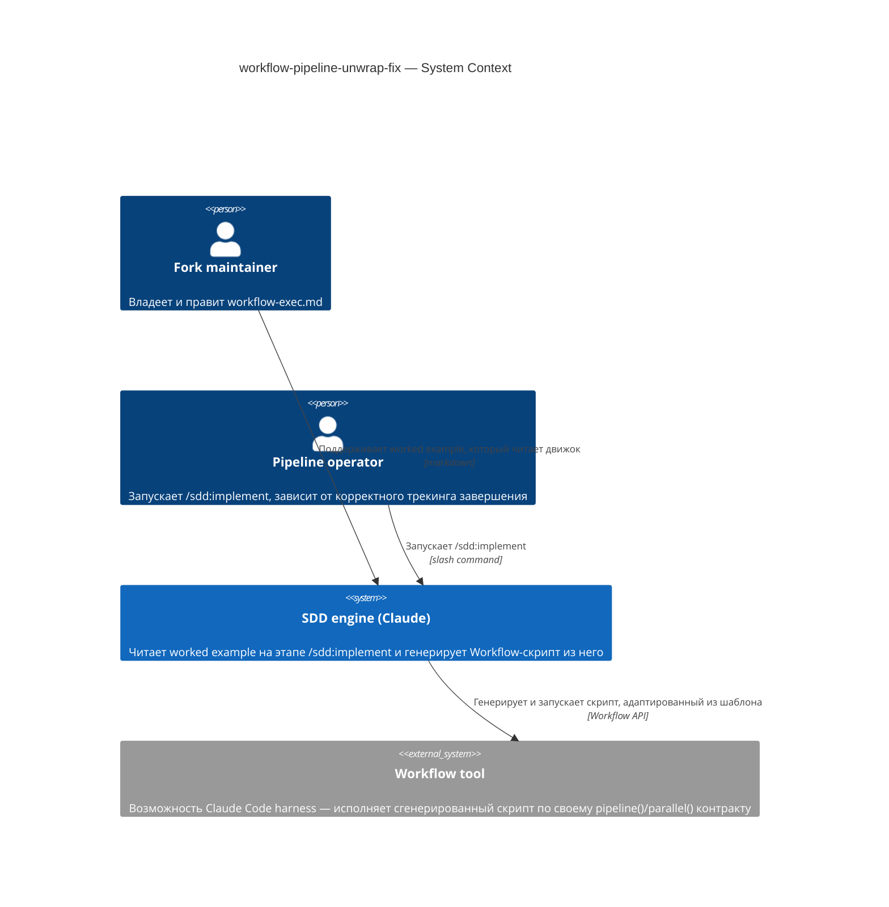
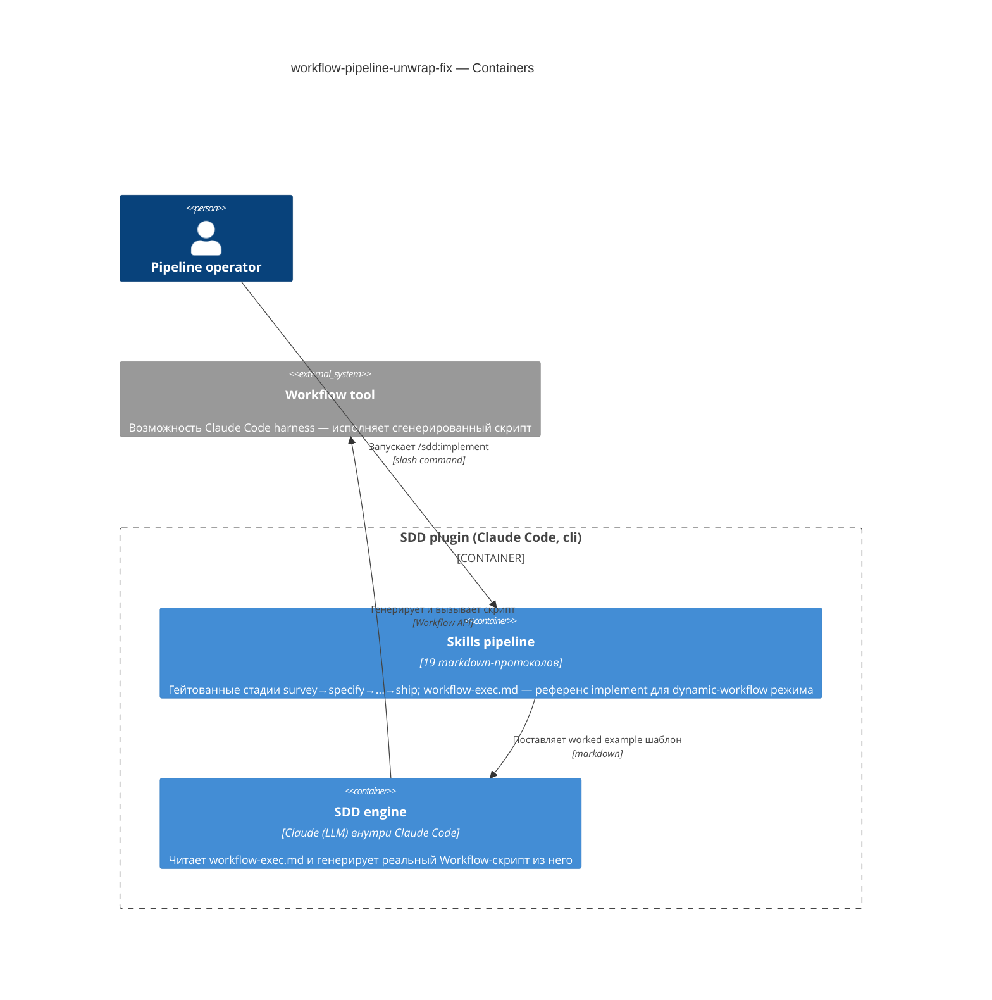
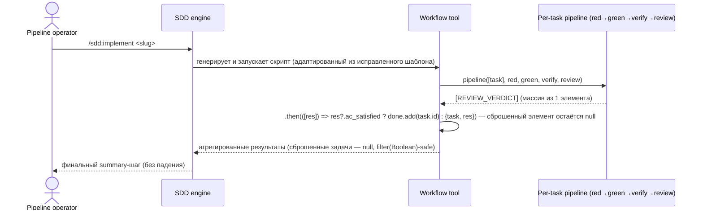

# Software Architecture Document — workflow-pipeline-unwrap-fix

<!-- 12 Arc42 sections. Empty section → <!-- N/A: <one-line reason> -->. -->
<!-- C4 Context (L1) lives inline in §3. C4 Container (L2) lives inline in §5. -->
<!-- Numbers in §10 come VERBATIM from spec.md §6 NFR — no inventing, no rounding. -->

## 1. Introduction and goals

**Intent.** Исправляем worked-example «Generated script shape» в `skills/implement/references/workflow-exec.md`: движок SDD (Claude на этапе `/sdd:implement`) читает этот пример и адаптирует его в реальный `Workflow`-скрипт всякий раз, когда DAG задач фичи маршрутизируется в dynamic-workflow режим. Сейчас пример неверно разворачивает результат `pipeline()` (всегда массив, даже для одного элемента) и проверяет поле (`gate_green`), которого нет на финальной стадии (`review` возвращает `REVIEW_VERDICT` с `ac_satisfied`), поэтому трекинг `done` молча никогда не срабатывает, а падение на позднем шаге агрегации уже реально ломало прод-прогон (`elf`, 13 задач, 2026-08-19). Фикс адресован Fork maintainer, который владеет этим шаблоном, и Pipeline operator, чей прогон `/sdd:implement` зависит от корректного трекинга завершения и безаварийного финального summary-шага.

**Top-3 quality goals (1-liners; full scenarios in §10):**

1. Корректность трекинга завершения — `done` отражает реальный вердикт финальной review-стадии, а не значение прочитанное с неверно развёрнутого массива.
2. Устойчивость к падению на позднем шаге агрегации — сброшенная задача остаётся безопасно `null`-совместимой с `filter(Boolean)`, а не бросает исключение при обращении к полю.
3. Предотвратимость повторного внесения бага — будущий автор (человек или движок), копирующий паттерн, предупреждён об инварианте «pipeline всегда массив» непосредственно в точке копирования.

**Stakeholders.**

| Role | Interest | Sign-off owner? |
|---|---|---|
| Fork maintainer | владеет `workflow-exec.md`, вносит и ревьюит фикс | Yes |
| Pipeline operator | запускает `/sdd:implement`, зависит от корректного трекинга завершения и безаварийного summary-шага | No |

<!-- Decision overrides (¶4) — populated by the critic resolution loop, empty otherwise. -->

## 2. Constraints

**Technical.**
- Markdown-встроенный JavaScript внутри `skills/implement/references/workflow-exec.md`, исполняемый в песочнице инструмента `Workflow` (глобалы `agent()`/`parallel()`/`pipeline()`) — новый язык/рантайм не вводится.
- Датастор/фреймворк отсутствуют — правка ограничена одним markdown-файлом, без компилируемого кода.
- Архитектурная конвенция: правка обязана сохранить существующие схемы вердиктов `RED_VERDICT` / `GATE_VERDICT` / `REVIEW_VERDICT` и 4-стадийную форму `red → green → verify → review` из текущего файла — они не меняются, меняется только то, как их результат читается.

**Organisational.**
- Effort budget: XS — правка одного файла, без нового модуля; часы, не дни.
- Deadline: жёсткого срока нет (spec §1 не называет дедлайн); ship по готовности Fork maintainer.
- Team: Fork maintainer в одиночку.

**Conventions.**
- Глоссарий: корневой `CONTEXT.md` (роли `Fork maintainer`, `Pipeline operator`) — используется как есть, новых терминов не вводится.
- Null-propagation: сброшенная (dropped) задача пайплайна должна возвращать `null`-совместимый элемент массива (не `{t, res: null}`), чтобы `results.filter(Boolean)` ниже по цепочке продолжал работать как единственный контракт различения «сброшено» vs «дошло до review».

**Regulatory / external.**
- N/A — внутренняя инженерная документация; нет данных, нет границы авторизации, нет compliance-поверхности (spec §6.1).

## 3. Context and scope

Этап `/sdd:implement` плагина SDD, когда DAG задач маршрутизируется в dynamic-workflow режим, заставляет движок (Claude) прочитать этот worked example и адаптировать его в реальный `Workflow`-скрипт. Сейчас пример неверно разворачивает результат `pipeline()` и проверяет несуществующее на финальной стадии поле, поэтому сгенерированный трекинг `done` не отражает реальность, а поздний шаг агрегации может упасть. Фикс правит именно этот worked example — так, чтобы каждый будущий сгенерированный скрипт (и любой hand-rolled вариант, который движок пишет на лету) получал форму верно.

<!-- brownfield: правка внутри существующего контейнера "Skills pipeline" (docs/architecture-map.md) — новый модуль не вводится; карта устарела (reflects_commit 632a262, 2026-07-17) относительно текущего HEAD, но фича не затрагивает код приложения, только один markdown-референс внутри уже описанного контейнера, поэтому повторное сканирование Explore не требуется -->

**External systems (in / out):**

| Actor or system | Type | Interaction |
|---|---|---|
| Fork maintainer | Person | правит и ревьюит `workflow-exec.md` |
| Pipeline operator | Person | запускает `/sdd:implement`, зависит от корректного трекинга завершения |
| SDD engine (Claude at `/sdd:implement` time) | System (internal) | читает worked example и генерирует/адаптирует реальный `Workflow`-скрипт из него |
| Workflow tool | System (internal, Claude Code harness) | исполняет сгенерированный скрипт по своему документированному контракту `pipeline()`/`parallel()`, который этот фикс обязан соблюдать |

**C4 Context (L1):**



## 4. Solution strategy

**Top strategic choices (the seeds for ADRs):**

1. **Target surface — `cli`.** Правка живёт внутри контейнера «Skills pipeline» (docs/architecture-map.md) — набора markdown-протоколов, вызываемых через slash-команды Claude Code, что и есть CLI-поверхность репозитория. Фикс не добавляет ни новой команды, ни флага, ни exit-кода — классификация лишь фиксирует, какой C4-контейнер владеет правленым артефактом. Решение самоочевидно обратимо (один файл, нет реальной альтернативной поверхности), поэтому blast-radius gate не сработал и ADR не порождается.
2. **Разворачивать одноэлементный массив в точке вызова, не менять контракт `pipeline()`.** `.then(([res]) => ...)` вместо переработки возвращаемой формы самого инструмента `Workflow` — это прямо исключено spec §3 non-goal 2 (переработка контракта `pipeline()`/`parallel()` меняла бы сам инструмент, а не этот шаблон).
3. **Авторизующее поле — `res?.ac_satisfied` с финальной review-стадии, не `res?.gate_green` с промежуточной.** Только последняя стадия пайплайна (`REVIEW_VERDICT`) может помечать задачу выполненной; более ранний `GATE_VERDICT.gate_green` — необходимое, но не достаточное условие (spec AC-03).
4. **Null-safe пропагация для сброшенной задачи.** Сброшенная (past-retries) задача возвращает `null`, а не `{t, res: null}`, сохраняя `results.filter(Boolean)` рабочим контрактом различения «сброшено» (AC-02) от «review дошёл, но `ac_satisfied: false`» (AC-03b, сохраняется, не обнуляется).
5. **Предупреждение — Gotcha-блоквот прямо над блоком кода**, называющий обе известные композиции разворачивания массива (голый `pipeline([t],...).then()` и `parallel(...).map(() => pipeline([t],...))` → flat-spread) — до, а не после блока кода.

Ни одно из решений не пересекает blast-radius gate: все — тривиально обратимые правки одного файла с уже полностью специфицированным в spec корректным ответом и без реальных альтернатив. ADR из §4 не порождается.

## 5. Building block view

Не layered/hexagonal/clean/event-driven в обычном смысле — «система» здесь markdown-референс, читаемый LLM-движком, а не скомпилированный модуль. Единственный затронутый контейнер — «Skills pipeline» (уже описан в docs/architecture-map.md); фикс — точечная правка одного файла внутри него, новая внутренняя декомпозиция не вводится.

**Internal decomposition:**

```
skills/implement/references/
├── workflow-exec.md   <- этот фикс: секция "Generated script shape" + Gotcha-блоквот
├── tdd-loop.md
└── inputs.md
```

**C4 Container (L2):** ONE Container per declared target_surface — `cli`.



## 6. Runtime view

**Critical flow 1: корректный трекинг завершения per-task пайплайна**



**Critical flow 2** — N/A: для XS-фикса без нового рантайм-поведения достаточно одного happy-path потока, покрывающего AC-01/AC-02/AC-03/AC-03b целиком (различие между ветками — внутри одного `.then()`, не отдельный поток).

## 7. Deployment view

<!-- N/A: XS-фикс переиспользует существующий deployment unit (markdown внутри репозитория/плагина); инфраструктура не меняется, новых точек развёртывания нет -->

## 8. Crosscutting concepts

| Concept | Convention | Where defined |
|---|---|---|
| Schema-validated verdicts | `RED_VERDICT`/`GATE_VERDICT`/`REVIEW_VERDICT` — не меняются этим фиксом, меняется только то, какое поле `REVIEW_VERDICT` читается | `workflow-exec.md` (без изменений формы) |
| Null-propagation для сброшенной работы | Сброшенный элемент пайплайна резолвится в falsy-элемент массива, не в rejected promise — `filter(Boolean)` есть контракт потребления | Контракт самого инструмента `Workflow`; закреплён Gotcha-блоквотом этого фикса |
| Документация-как-код: место предупреждений | Gotcha/invariant-блоквоты — прямо над блоком кода, к которому относятся, а не после | Конвенция `workflow-exec.md`, введена/закреплена этим фиксом |
| Error handling | N/A — рантайм-обработка ошибок не меняется, это правка корректности worked example | — |
| Authentication | N/A | — |
| ID strategy | N/A — `t.id` задач берётся из `tasks.json` (upstream), не меняется | `tasks.json` (upstream) |
| Internationalisation | N/A, единый язык (английская проза шаблона) | — |

## 9. Architecture decisions

<!-- N/A: ни одно решение §4 не пересекло blast-radius gate — все пять пунктов тривиально обратимы, ограничены одним файлом и не имеют реальных альтернатив (корректный ответ уже полностью специфицирован в spec §1 после адверсариального прохода). ADR не порождены. -->

ADR files live under `docs/features/<slug>/adr/NNNN-<title>.md` (пусто для этой фичи).

## 10. Quality requirements

Each top-3 goal from §1 expanded into a full scenario:

**QG-1. Корректность трекинга завершения**
- **When:** per-task шаг пайплайна вычисляет исход разрешённого review.
- **Then:** `done.add(t.id)` срабатывает тогда и только тогда, когда `res?.ac_satisfied === true` (никогда — по `gate_green` более ранней стадии); соответствует AC-01, AC-03 spec verbatim.
- **How verify:** code-review reasoning над исправленным шаблоном (spec §3 non-goal 3 — автоматического харнесса нет); сверка с AC-01 и AC-03.

**QG-2. Устойчивость к падению на позднем шаге агрегации**
- **When:** пайплайн задачи сброшен после исчерпания retry-лимита.
- **Then:** элемент массива — `null`, и любой последующий `results.filter(Boolean)` исключает его; соответствует AC-02. Post-ship метрика (не ship-gate): 0 повторений этого класса бага за следующие 3 dynamic-workflow прогона `/sdd:implement` (spec §6, строка 1).
- **How verify:** code review на этапе фикса (ship gate); ручной обзор финального summary-шага каждого из следующих 3 прогонов (post-ship мониторинг, spec §6 строка 1).

**QG-3. Предотвратимость — предупреждение в точке копирования**
- **When:** Fork maintainer или движок инспектирует per-task пример шаблона, чтобы адаптировать паттерн.
- **Then:** 2 из 2 известных композиций разворачивания массива названы в блоквоте прямо над блоком кода; соответствует spec §6, строка 2, verbatim (2 из 2).
- **How verify:** code review на этапе фикса.

## 11. Risks and technical debt

<!-- Severity literals: Low / Medium / High for regular risks; "Open question" for rows created by
     a Save-as-OQ resolution during the Socratic walk (see references/socratic.md). -->

| Risk / debt | Severity | Mitigation | Owner |
|---|---|---|---|
| Проза шаблона (строка 63) описывает skip-cascade поведение, которого нет ни в форке, ни в upstream | Medium | AC-04b добавляет видимую not-yet-implemented оговорку прямо у этого предложения; сама каскадная логика не строится этим фиксом | Fork maintainer |
| Отсутствует автоматический бэкстоп для формы результата генерируемого скрипта | Low | Верификация остаётся code-review-only для этого XS-фикса; расширение `evals/` — будущая работа | Fork maintainer |
| Upstream SDD-плагин (v1.17.0) несёт идентичный неисправленный паттерн | Low | Только fork-local фикс сейчас; апстриму не предлагается этим спеком | Fork maintainer |
| Open architectural decision: должен ли `evals/` проверять форму результата генерируемого скрипта? | Open question | Resolve before the next edit to this template's pipeline/`done` block | Fork maintainer |
| Open architectural decision: строить ли skip-cascade поведение (удаление зависимых задач из `done`)? | Open question | Resolve before the next revision of `workflow-exec.md`'s execution-mode section | Fork maintainer |
| Open architectural decision: предлагать ли фикс апстриму (канонический SDD-плагин, идентичный неисправленный паттерн подтверждён против v1.17.0)? | Open question | Resolve before the next upstream SDD release is merged into this fork | Fork maintainer |

**Accepted debt (acceptable in v1, plan to fix later):**
- `done` Set остаётся write-only за пределами `done.add` — этот фикс не добавляет новой эмиссии/логирования `done`, как и было найдено в spec §1 (никакого чтения/потребления `done` в шаблоне не показано).

## 12. Glossary

| Term | Meaning |
|---|---|
| Singleton-array-unwrap invariant | `pipeline(items, ...)` всегда резолвится в массив — по одному элементу на item — даже когда `items` содержит один элемент; потребляющий код обязан деструктурировать/индексировать в него, а не трактовать как «голый» объект |
| `GATE_VERDICT` | Структурированный вердикт `{unit, integration, lint, vet, gate_green}`, который возвращают стадии `green`/`verify` пайплайна |
| `REVIEW_VERDICT` | Структурированный вердикт `{ac_satisfied, issues[]}`, который возвращает финальная стадия `review` пайплайна — единственная стадия, чей исход может авторизовать пометку задачи выполненной |
| `done` Set | Внутритрекинг сгенерированного скрипта, какие id задач завершились чисто; write-only в текущем шаблоне (чтение/потребление не показано) |
| Gotcha-блоквот | Блоквот, размещённый прямо над блоком кода, называющий неочевидный инвариант, чтобы он был увиден до копирования паттерна |
