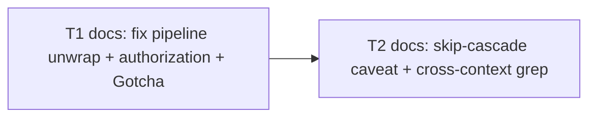

# Epic — workflow-pipeline-unwrap-fix

> **Spec:** [spec.md](../spec.md) · **Design:** [sad.md](../sad.md) · **Data model:** N/A (no schema change) · **API:** N/A (no external interface — see [api-sync-report.md](../contracts/api-sync-report.md)) · **ADRs:** N/A (no decision crossed the blast-radius gate — [sad §9](../sad.md#9-architecture-decisions))

## Goal

Fix the "Generated script shape" worked example in `skills/implement/references/workflow-exec.md` so the per-task `pipeline()` result is consumed with its real (array) shape and the field that actually authorizes completion (`ac_satisfied` from the final `review` stage, not `gate_green` from an earlier stage), and warn a future author — human or engine — about the array-always invariant at the point they'd copy the pattern ([spec §2](../spec.md)).

## Scope

- **In:** the "Generated script shape" code block and its immediately surrounding prose in `skills/implement/references/workflow-exec.md` — the `.then()` unwrap/check, the Gotcha blockquote, the skip-cascade caveat, and the confirmatory repo-wide grep.
- **Out:** implementing the skip-cascade behavior itself, reworking `pipeline()`/`parallel()`'s own return-shape contract, adding automated test/lint coverage for the embedded JS, proposing the fix upstream — all [spec §3](../spec.md) non-goals.

## Task map

## Tasks

See [tracker.md](./tracker.md) for status. Machine contract: [tasks.json](../tasks.json).

| # | Task | Layer | Blocked by | DoD (short) |
|---|---|---|---|---|
| T1 | Fix per-task pipeline unwrap, authorization field, and null-propagation; add Gotcha blockquote | docs | — | Code block destructures `[res]`, checks `res?.ac_satisfied`, propagates `null` for a dropped task and `{t,res}` otherwise; Gotcha blockquote above the code names both known unwrap compositions |
| T2 | Add not-yet-implemented caveat to skip-cascade prose; confirm cross-context uniqueness | docs | T1 | The "Fail drops the subtree" bullet's skip-cascade sentence carries a visible not-yet-implemented caveat (cross-ref spec §8 OQ-1); a repo-wide grep for `pipeline(` in `skills/**/*.md` confirms this file is still the only occurrence |

## Risks / Hard rules

- The fix must preserve the existing `RED_VERDICT`/`GATE_VERDICT`/`REVIEW_VERDICT` schemas and the 4-stage `red → green → verify → review` shape unchanged — only how the result is *read* changes ([sad §2](../sad.md)).
- A dropped task must resolve to a `null`-compatible array element (not `{t, res: null}`) so `results.filter(Boolean)` keeps working as the sole "dropped vs. resolved" distinction ([sad §2](../sad.md), AC-02/AC-03b).
- The Gotcha blockquote goes directly above the code block, not appended after the existing bullet list below it ([spec §1](../spec.md)).
- Verification is code-review-only for this XS fix — no automated harness exists for the embedded JS ([spec §3](../spec.md) non-goal).
