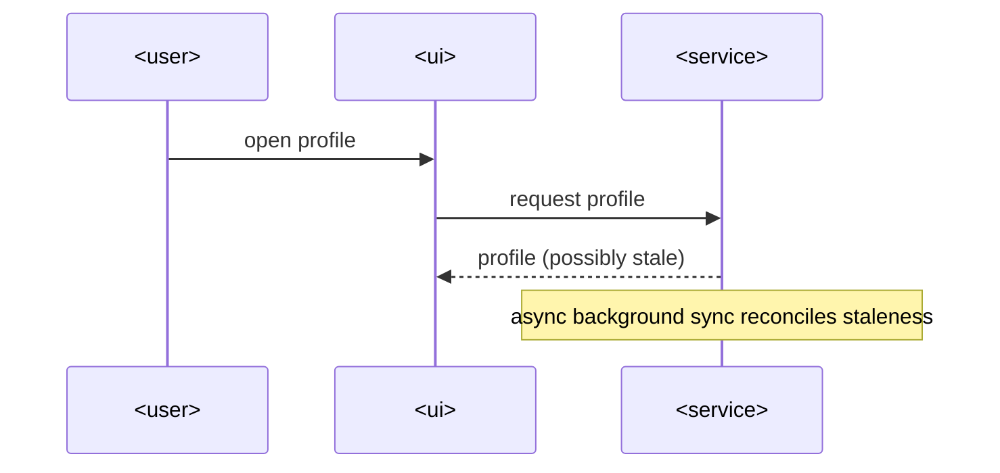

# SAD — profile-sync-widget

## 1. Introduction and goals

A SwiftUI profile screen with a background async sync task. See spec.md §1/§2.

## 4. Solution strategy

- SwiftUI view + navigation for the profile screen.
- An async background task reconciles profile data without blocking the UI.

## 5. Building block view

- `ProfileView` (SwiftUI `View`) — renders the profile screen.
- `ProfileSyncCoordinator` (actor) — runs the background async sync.

## 6. Runtime view

### Profile sync

## 9. Architecture decisions

No ADRs — fixture only, size S.

## 12. Glossary

- **Profile** — the user's own profile record.
