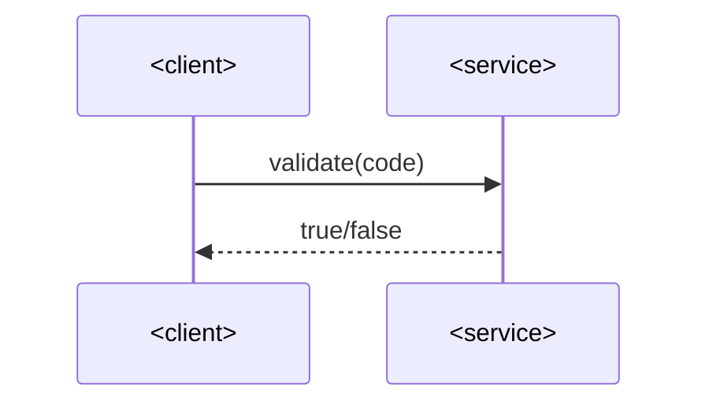

# SAD — discount-code-validator

## 1. Introduction and goals

Pure-logic discount-code validation against a fixed rule set. See spec.md §1/§2.

## 4. Solution strategy

- A single synchronous validator function, no I/O, no concurrency.

## 5. Building block view

- `DiscountCodeValidator` — pure synchronous rule evaluator.

## 6. Runtime view

### Validate discount code

## 9. Architecture decisions

No ADRs — fixture only, size S.

## 12. Glossary

- **Discount code** — a string checked against a fixed rule set.
